A visual reference for Jason Taylor's **Clean Architecture Solution Template** for ASP.NET Core.
This document maps every layer, class, and runtime flow using UML and Mermaid diagrams.

**Source:** <https://github.com/jasontaylordev/CleanArchitecture>

---

## Table of Contents

- [Table of Contents](#table-of-contents)
- [1. High-Level Architecture Overview](#1-high-level-architecture-overview)
- [2. Project References (Package Diagram)](#2-project-references-package-diagram)
- [3. Domain Layer Class Diagram](#3-domain-layer-class-diagram)
  - [DDD Concepts in Practice](#ddd-concepts-in-practice)
- [4. Application Layer](#4-application-layer)
  - [4a. Interfaces (Ports)](#4a-interfaces-ports)
  - [4b. CQRS Pattern](#4b-cqrs-pattern)
  - [CQRS Commands and Queries Summary](#cqrs-commands-and-queries-summary)
  - [4c. Pipeline Behaviors](#4c-pipeline-behaviors)
  - [4d. DTOs, Exceptions, Security](#4d-dtos-exceptions-security)
- [5. Infrastructure Layer Class Diagram](#5-infrastructure-layer-class-diagram)
  - [Interceptor Execution Order](#interceptor-execution-order)
- [6. Web Layer Class Diagram](#6-web-layer-class-diagram)
  - [Endpoint Auto-Discovery](#endpoint-auto-discovery)
- [7. Dependency Injection Wiring](#7-dependency-injection-wiring)
  - [Service Lifetimes](#service-lifetimes)
- [8. Full Request Flow Sequence Diagram](#8-full-request-flow-sequence-diagram)
- [9. Domain Event Lifecycle](#9-domain-event-lifecycle)
- [10. Error Handling Flow](#10-error-handling-flow)
  - [Scenario A: Validation Failure (400 Bad Request)](#scenario-a-validation-failure-400-bad-request)
  - [Scenario B: Not Found (404)](#scenario-b-not-found-404)
  - [Exception-to-HTTP Mapping](#exception-to-http-mapping)
- [11. Design Patterns Summary](#11-design-patterns-summary)

---

## 1. High-Level Architecture Overview

The **Dependency Rule** is the core invariant: source code dependencies point **inward** only.
Outer layers know about inner layers, but inner layers have zero knowledge of the outer ones.

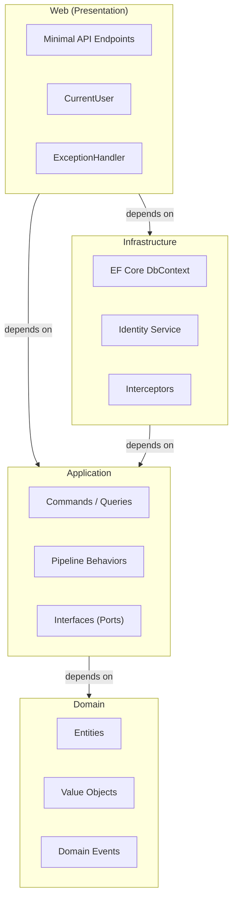

**Key principle:** Domain has zero project references. Application defines interfaces ("ports").
Infrastructure and Web provide implementations ("adapters").

---

## 2. Project References (Package Diagram)

This diagram shows the actual `.csproj` `ProjectReference` links -- the compile-time dependency graph.

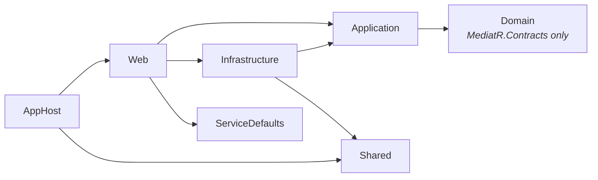

- **Domain** is the innermost layer -- it only depends on `MediatR.Contracts` (for `INotification`).
- **Application** references Domain for entities/events and defines all abstractions.
- **Infrastructure** implements Application abstractions using EF Core, Identity, etc.
- **Web** is the **Composition Root** -- it wires everything together via DI.
- **Shared** holds service naming constants for .NET Aspire orchestration.
- **AppHost** is the .NET Aspire host that orchestrates services.

---

## 3. Domain Layer Class Diagram

The Domain layer contains entities, value objects, domain events, and base classes.
It has **no dependency** on any framework except `MediatR.Contracts`.

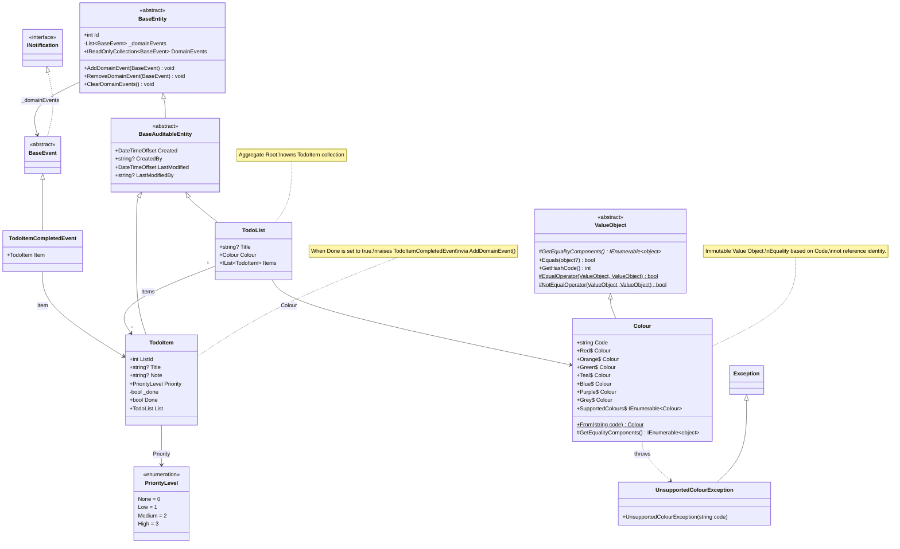

### DDD Concepts in Practice

| Concept | Implementation | Purpose |
|---------|---------------|---------|
| **Entity** | `BaseEntity` with `int Id` | Identity-based equality |
| **Auditable Entity** | `BaseAuditableEntity` | Automatic Created/Modified tracking |
| **Aggregate Root** | `TodoList` (owns `TodoItem`) | Transaction boundary |
| **Value Object** | `Colour` (structural equality) | Immutable, replaceable values |
| **Domain Event** | `TodoItemCompletedEvent` | Decouple side effects from entity logic |
| **Enum** | `PriorityLevel` | Constrained set of values |

---

## 4. Application Layer

The Application layer is split into four diagrams for readability:
interfaces, CQRS, pipeline behaviors, and DTOs/exceptions.

### 4a. Interfaces (Ports)

These interfaces define **what** the Application needs without specifying **how**.
Infrastructure and Web layers provide the implementations.

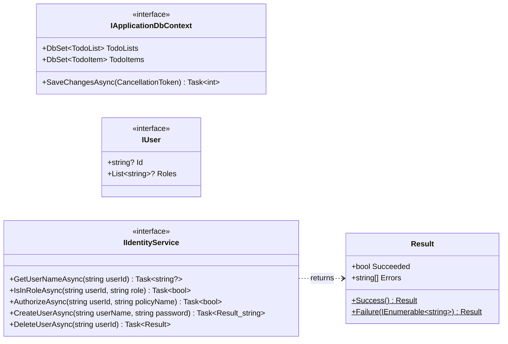

> **Hexagonal Architecture (Ports & Adapters):** These interfaces are the "ports".
> `ApplicationDbContext` (Infrastructure) and `CurrentUser` (Web) are the "adapters".

---

### 4b. CQRS Pattern

**C**ommand **Q**uery **R**esponsibility **S**egregation separates writes (Commands) from reads (Queries).
MediatR decouples the sender (endpoint) from the handler -- endpoints never reference handlers directly.

```mermaid
classDiagram
    direction TB

    class IRequest {
        <<interface>>
    }

    class IRequest_T["IRequest~T~"] {
        <<interface>>
    }

    class IRequestHandler_T["IRequestHandler~TRequest~"] {
        <<interface>>
        +Handle(TRequest, CancellationToken) Task
    }

    class IRequestHandler_T_R["IRequestHandler~TRequest, TResponse~"] {
        <<interface>>
        +Handle(TRequest, CancellationToken) Task~TResponse~
    }

    class UpdateTodoItemCommand {
        <<record>>
        +int Id
        +string? Title
        +bool Done
    }

    class UpdateTodoItemCommandHandler {
        -IApplicationDbContext _context
        +Handle(UpdateTodoItemCommand, CancellationToken) Task
    }

    class GetTodosQuery {
        <<record>>
        &#171;Authorize&#187;
    }

    class GetTodosQueryHandler {
        -IApplicationDbContext _context
        -IMapper _mapper
        +Handle(GetTodosQuery, CancellationToken) Task~TodosVm~
    }

    IRequest <|.. UpdateTodoItemCommand
    IRequest_T <|.. GetTodosQuery
    IRequestHandler_T <|.. UpdateTodoItemCommandHandler
    IRequestHandler_T_R <|.. GetTodosQueryHandler

    UpdateTodoItemCommandHandler ..> IApplicationDbContext : depends on
    GetTodosQueryHandler ..> IApplicationDbContext : depends on

    note for UpdateTodoItemCommand "Command = write operation.\nReturns void (IRequest)."
    note for GetTodosQuery "Query = read operation.\nReturns TodosVm.\nDecorated with [Authorize]."
```

### CQRS Commands and Queries Summary

| Type | Class | Returns | Auth |
|------|-------|---------|------|
| **Command** | `CreateTodoListCommand` | `int` (new ID) | No |
| **Command** | `UpdateTodoListCommand` | void | No |
| **Command** | `DeleteTodoListCommand` | void | No |
| **Command** | `CreateTodoItemCommand` | `int` (new ID) | No |
| **Command** | `UpdateTodoItemCommand` | void | No |
| **Command** | `UpdateTodoItemDetailCommand` | void | No |
| **Command** | `DeleteTodoItemCommand` | void | No |
| **Query** | `GetTodosQuery` | `TodosVm` | `[Authorize]` |
| **Query** | `GetWeatherForecastsQuery` | `IEnumerable<WeatherForecast>` | No |

---

### 4c. Pipeline Behaviors

MediatR pipeline behaviors implement the **Chain of Responsibility** pattern.
Each behavior wraps the next delegate, forming a Russian-nesting-doll pipeline.
Registration order in `AddApplicationServices()` determines execution order.

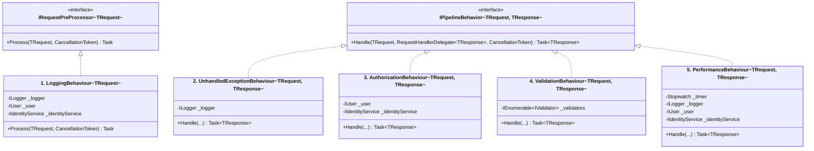

**Pipeline execution order** (registered in `Application/DependencyInjection.cs`):

```
Request arrives
  |
  v
[1] LoggingBehaviour        -- Pre-processor: logs request name, userId, userName
  |
  v
[2] UnhandledExceptionBehaviour -- try/catch wrapper, logs + re-throws
  |
  v
[3] AuthorizationBehaviour   -- checks [Authorize] attribute: roles & policies
  |
  v
[4] ValidationBehaviour      -- runs all FluentValidation validators in parallel
  |
  v
[5] PerformanceBehaviour     -- starts Stopwatch, warns if > 500ms
  |
  v
[Handler]                    -- actual business logic
  |
  v
Response unwinds back through [5] -> [4] -> [3] -> [2] -> [1]
```

---

### 4d. DTOs, Exceptions, Security

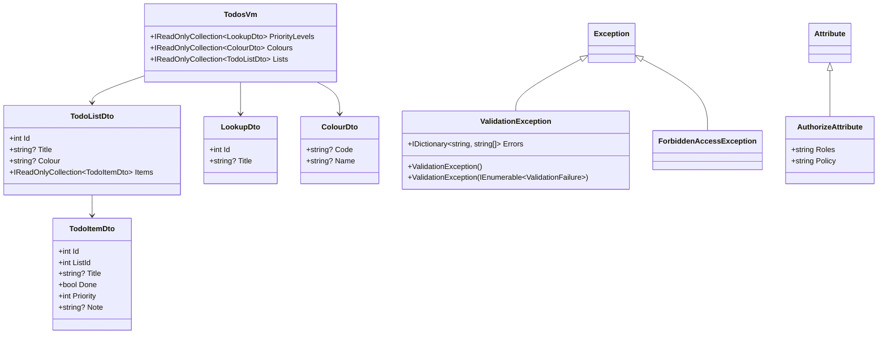

---

## 5. Infrastructure Layer Class Diagram

Infrastructure provides the concrete implementations for Application interfaces.
It depends on Application (for interfaces) and Domain (for entities), but neither layer knows Infrastructure exists.

```mermaid
classDiagram
    direction TB

    class IApplicationDbContext {
        <<interface>>
    }

    class ApplicationDbContext {
        +DbSet~TodoList~ TodoLists
        +DbSet~TodoItem~ TodoItems
        #OnModelCreating(ModelBuilder) void
    }

    class IdentityDbContext_T["IdentityDbContext~ApplicationUser~"] {
        <<framework>>
    }

    class ApplicationUser {
        &#171;extends IdentityUser&#187;
    }

    class IIdentityService {
        <<interface>>
    }

    class IdentityService {
        -UserManager~ApplicationUser~ _userManager
        -IUserClaimsPrincipalFactory _claimsPrincipalFactory
        -IAuthorizationService _authorizationService
        +GetUserNameAsync(string) Task~string?~
        +IsInRoleAsync(string, string) Task~bool~
        +AuthorizeAsync(string, string) Task~bool~
        +CreateUserAsync(string, string) Task~Result_string~
        +DeleteUserAsync(string) Task~Result~
    }

    class SaveChangesInterceptor {
        <<framework>>
    }

    class AuditableEntityInterceptor {
        -IUser _user
        -TimeProvider _dateTime
        +SavingChanges(...) InterceptionResult~int~
        +SavingChangesAsync(...) ValueTask
        +UpdateEntities(DbContext?) void
    }

    class DispatchDomainEventsInterceptor {
        -IMediator _mediator
        +SavingChanges(...) InterceptionResult~int~
        +SavingChangesAsync(...) ValueTask
        +DispatchDomainEvents(DbContext?) Task
    }

    class TodoListConfiguration {
        <<IEntityTypeConfiguration>>
    }
    class TodoItemConfiguration {
        <<IEntityTypeConfiguration>>
    }

    class ApplicationDbContextInitialiser {
        +InitialiseAsync() Task
        +SeedAsync() Task
    }

    IdentityDbContext_T <|-- ApplicationDbContext
    IApplicationDbContext <|.. ApplicationDbContext : implements

    IIdentityService <|.. IdentityService : implements

    SaveChangesInterceptor <|-- AuditableEntityInterceptor
    SaveChangesInterceptor <|-- DispatchDomainEventsInterceptor

    ApplicationDbContext ..> TodoListConfiguration : applies
    ApplicationDbContext ..> TodoItemConfiguration : applies
    ApplicationDbContextInitialiser ..> ApplicationDbContext : seeds

    note for AuditableEntityInterceptor "On Added: sets CreatedBy, Created\nOn Modified: sets LastModifiedBy, LastModified\nUses IUser and TimeProvider"
    note for DispatchDomainEventsInterceptor "Before SaveChanges:\n1. Collect DomainEvents from entities\n2. Clear events from entities\n3. Publish each via IMediator"
```

### Interceptor Execution Order

Both interceptors hook into `SavingChanges` / `SavingChangesAsync`:

```
Handler calls SaveChangesAsync()
  |
  v
AuditableEntityInterceptor
  - Stamps Created/CreatedBy (new entities)
  - Stamps LastModified/LastModifiedBy (modified entities)
  |
  v
DispatchDomainEventsInterceptor
  - Collects domain events from changed entities
  - Clears events from entities
  - Publishes each event via IMediator.Publish()
  |
  v
Database commit
```

---

## 6. Web Layer Class Diagram

The Web layer is the **Composition Root** and the outermost layer.
It uses Minimal APIs (no MVC controllers) with convention-based endpoint discovery.

```mermaid
classDiagram
    direction TB

    class IEndpointGroup {
        <<interface>>
        +RoutePrefix$ string?
        +Map(RouteGroupBuilder)$ void*
    }

    class TodoLists {
        +Map(RouteGroupBuilder)$ void
        +GetTodoLists(ISender)$ Task
        +CreateTodoList(ISender, CreateTodoListCommand)$ Task
        +UpdateTodoList(ISender, int, UpdateTodoListCommand)$ Task
        +DeleteTodoList(ISender, int)$ Task
    }

    class TodoItems {
        +Map(RouteGroupBuilder)$ void
        +CreateTodoItem(ISender, CreateTodoItemCommand)$ Task
        +UpdateTodoItem(ISender, int, UpdateTodoItemCommand)$ Task
        +UpdateTodoItemDetail(ISender, int, UpdateTodoItemDetailCommand)$ Task
        +DeleteTodoItem(ISender, int)$ Task
    }

    class Users {
        +Map(RouteGroupBuilder)$ void
    }

    class WeatherForecasts {
        +Map(RouteGroupBuilder)$ void
        +GetWeatherForecasts(ISender)$ Task
    }

    class IUser {
        <<interface>>
    }

    class CurrentUser {
        -IHttpContextAccessor _httpContextAccessor
        +string? Id
        +List~string~? Roles
    }

    class IExceptionHandler {
        <<interface>>
    }

    class ProblemDetailsExceptionHandler {
        +TryHandleAsync(HttpContext, Exception, CancellationToken) ValueTask~bool~
    }

    IEndpointGroup <|.. TodoLists
    IEndpointGroup <|.. TodoItems
    IEndpointGroup <|.. Users
    IEndpointGroup <|.. WeatherForecasts
    IUser <|.. CurrentUser : implements

    IExceptionHandler <|.. ProblemDetailsExceptionHandler : implements

    note for CurrentUser "Adapter pattern:\nExtracts user claims from\nHttpContext.User (ClaimsPrincipal)\ninto Application's IUser interface"

    note for ProblemDetailsExceptionHandler "Maps exceptions to HTTP status:\nValidationException -> 400\nUnauthorizedAccess -> 401\nForbiddenAccess -> 403\nNotFound -> 404"
```

### Endpoint Auto-Discovery

`WebApplicationExtensions.MapEndpoints()` uses **reflection** to find all `IEndpointGroup` implementations:

```
Program.cs calls: app.MapEndpoints(typeof(Program).Assembly)
  |
  v
Scans assembly for classes implementing IEndpointGroup
  |
  v
For each class:
  - Reads RoutePrefix (default: /api/{ClassName})
  - Creates RouteGroup with OpenAPI tag
  - Calls static Map(RouteGroupBuilder) method
  |
  v
Result:
  /api/TodoLists    -> TodoLists.Map()
  /api/TodoItems    -> TodoItems.Map()
  /api/Users        -> Users.Map()
  /api/WeatherForecasts -> WeatherForecasts.Map()
```

---

## 7. Dependency Injection Wiring

`Program.cs` is the **Composition Root** -- all dependency wiring happens here, delegated to per-layer extension methods.

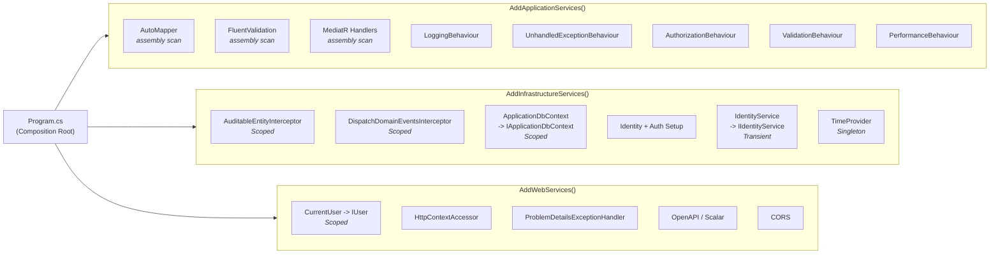

### Service Lifetimes

| Service | Lifetime | Why |
|---------|----------|-----|
| `ApplicationDbContext` / `IApplicationDbContext` | **Scoped** | One DB context per HTTP request |
| `AuditableEntityInterceptor` | **Scoped** | Matches DbContext lifecycle |
| `DispatchDomainEventsInterceptor` | **Scoped** | Matches DbContext lifecycle |
| `CurrentUser` / `IUser` | **Scoped** | Tied to HTTP request's claims |
| `IIdentityService` | **Transient** | Stateless; new instance per injection |
| `TimeProvider` | **Singleton** | System clock, shared globally |
| MediatR Handlers | **Transient** | Stateless; new per request |
| AutoMapper | **Singleton** | Configuration is immutable |

---

## 8. Full Request Flow Sequence Diagram

**Scenario:** `PUT /api/TodoItems/{id}` with `{ Done: true }`

This is the richest single request path -- it exercises all 5 pipeline behaviors,
triggers a domain event, fires both EF Core interceptors, and dispatches a notification.

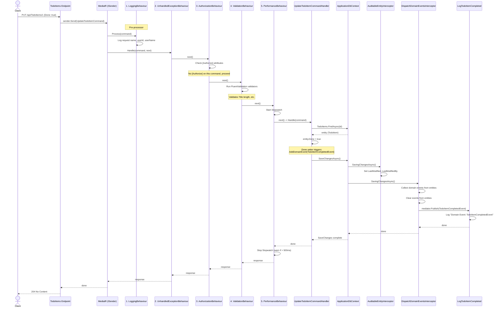

---

## 9. Domain Event Lifecycle

A focused view of how domain events flow from entity property setter to event handler.

```mermaid
sequenceDiagram
    participant TI as TodoItem Entity
    participant BE as BaseEntity
    participant DB as ApplicationDbContext
    participant DI as DispatchDomainEventsInterceptor
    participant MR as IMediator
    participant EH as LogTodoItemCompleted

    Note over TI: Handler sets entity.Done = true

    TI->>TI: Done setter detects false -> true
    TI->>BE: AddDomainEvent(new TodoItemCompletedEvent(this))
    BE->>BE: _domainEvents.Add(event)

    Note over BE: Event stored in memory (not persisted).<br/>[NotMapped] keeps it out of EF Core.

    TI->>DB: SaveChangesAsync()

    DB->>DI: SavingChangesAsync()
    DI->>DI: ChangeTracker.Entries&lt;BaseEntity&gt;()<br/>where DomainEvents.Any()
    DI->>DI: Collect all events into local list
    DI->>BE: ClearDomainEvents()

    loop For each domain event
        DI->>MR: Publish(TodoItemCompletedEvent)
        MR->>EH: Handle(TodoItemCompletedEvent)
        EH->>EH: _logger.LogInformation(...)
        EH-->>MR: done
    end

    DI-->>DB: done
    Note over DB: Database commit happens AFTER<br/>domain events are dispatched
```

> **Design choice:** Domain events are dispatched **before** the database commit
> (inside `SavingChangesAsync`). This means event handlers run in the **same transaction**.
> If a handler fails, the entire save is rolled back.

---

## 10. Error Handling Flow

### Scenario A: Validation Failure (400 Bad Request)

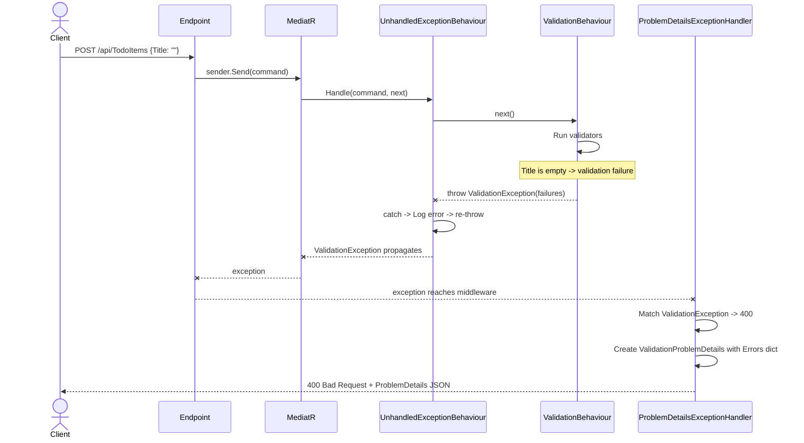

### Scenario B: Not Found (404)

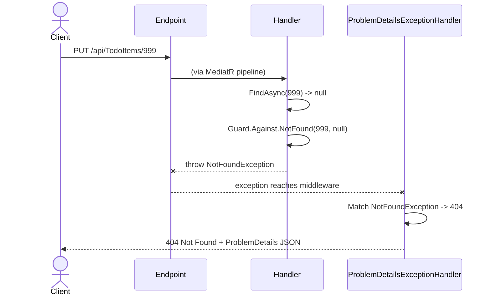

### Exception-to-HTTP Mapping

| Exception | HTTP Status | Source |
|-----------|-------------|--------|
| `ValidationException` | 400 Bad Request | `ValidationBehaviour` (FluentValidation failures) |
| `UnauthorizedAccessException` | 401 Unauthorized | `AuthorizationBehaviour` (user not authenticated) |
| `ForbiddenAccessException` | 403 Forbidden | `AuthorizationBehaviour` (user lacks role/policy) |
| `NotFoundException` | 404 Not Found | `Guard.Against.NotFound()` in handlers |

---

## 11. Design Patterns Summary

| Pattern | Implementation | Location |
|---------|---------------|----------|
| **Dependency Inversion** | Application defines interfaces; Infrastructure/Web implement them | `Application/Common/Interfaces/` |
| **CQRS** | Commands (writes) and Queries (reads) as separate MediatR requests | `Application/TodoItems/Commands/`, `Application/TodoLists/Queries/` |
| **Mediator** | MediatR dispatches requests to handlers without direct coupling | `ISender.Send()` in endpoints |
| **Chain of Responsibility** | Pipeline behaviors wrap the next delegate in sequence | `Application/Common/Behaviours/` |
| **Observer** | Domain events published via `IMediator.Publish()` to notification handlers | `Domain/Events/`, `Application/TodoItems/EventHandlers/` |
| **Value Object** | `Colour` with structural equality via `GetEqualityComponents()` | `Domain/ValueObjects/Colour.cs` |
| **Aggregate Root** | `TodoList` owns `TodoItem` collection as a consistency boundary | `Domain/Entities/TodoList.cs` |
| **Factory Method** | `Colour.From(string)` validates and creates colour instances | `Domain/ValueObjects/Colour.cs` |
| **Adapter** | `CurrentUser` adapts `HttpContext.User` claims to `IUser` interface | `Web/Services/CurrentUser.cs` |
| **Interceptor** | EF Core `SaveChangesInterceptor` for audit trails and event dispatch | `Infrastructure/Data/Interceptors/` |
| **Composition Root** | `Program.cs` wires all dependencies via three extension methods | `Web/Program.cs` |
| **Convention over Configuration** | Reflection-based auto-discovery of endpoints, handlers, validators | `WebApplicationExtensions.MapEndpoints()`, MediatR assembly scan |
| **Strategy** | Validators injected as `IEnumerable<IValidator<T>>` -- swappable per request type | `ValidationBehaviour` |
| **Decorator** | Each pipeline behavior decorates the next handler delegate | `IPipelineBehavior<TRequest, TResponse>` |
