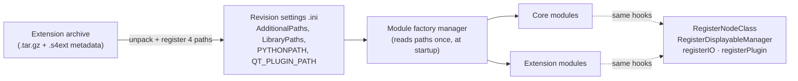
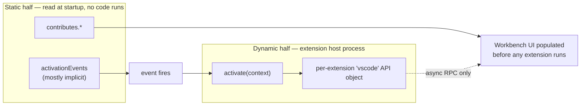
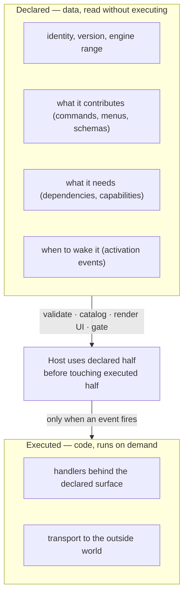

> Prerequisite concept: [Microkernel / Plugin Architecture](/concepts/architecture/microkernel-plugin-architecture/) · Next: [The Mutability Ladder](/concepts/architecture/mutability-ladder/) (should there be a plugin system at all?) · Sibling: [Self-Modifying Software](/concepts/architecture/self-modifying-software/)
> Distilled from four case studies: [3D Slicer Extensions](/case-studies/patterns-in-the-wild/slicer-extension-mechanism/) · [VS Code Extensions](/case-studies/patterns-in-the-wild/vscode-extension-mechanism/) · [OpenClaw Channels](/case-studies/systems/openclaw_messaging_channels_integration/) · [MONAI Deploy Informatics Gateway](/case-studies/patterns-in-the-wild/monai-deploy-plugin-architecture/) · Date: 2026-09-04

## The Core Idea

The [microkernel chapter](/concepts/architecture/microkernel-plugin-architecture/) ends where most textbooks end: a core, a contract, plugins that implement it. That is the *shape* of the pattern. It is not a mechanism.

Read the source of any real extensible system and the contract turns out to be the smallest part. The bulk of the code answers questions the pattern diagram never asks: what can be known about a plugin *before running it*? Where does its code execute? When is it loaded? How does an install take effect? What happens when the host upgrades? Who ships the binary? What stops a plugin from lying?

This chapter names those questions and shows how four systems answered them differently:

| System | Domain | Plugin unit | One-line design |
|---|---|---|---|
| **3D Slicer** | Medical imaging desktop app (C++/Qt/Python) | Extension = package of modules | *No plugin API is the plugin API.* Extensions are merged into the ordinary module factory; compatibility by nightly rebuild. |
| **VS Code** | Code editor (TypeScript/Electron) | Extension = manifest + `activate()` | *Split every extension in half.* Static half is JSON read before any code runs; dynamic half runs out of process behind async RPC. |
| **OpenClaw** | AI-agent gateway integrating 20+ messaging platforms (TypeScript) | Channel plugin = package implementing `ChannelPlugin` | *Bag of optional adapters.* Manifest-first loader, central registry, cross-channel policy stays in core. |
| **MONAI Deploy IG** | DICOM ingestion gateway (C#/.NET) | Plugin = class implementing one interface | *Reflection load + chain of responsibility.* Assemblies dropped in a folder, resolved by type name, run in sequence. |

Together they span the whole design space. The most useful way to see it is as **three archetypes on a coupling spectrum**, then **nine decisions** every mechanism must make.

```
  TIGHT ◄──────────────── plugin ↔ host coupling ────────────────► LOOSE

     MERGED                  REGISTERED                    HOSTED
     ──────                  ──────────                    ──────
   Slicer                  OpenClaw · MONAI Deploy        VS Code

   plugin becomes          plugin lives in-process        plugin runs in a
   indistinguishable       but only through a registry    separate process,
   from core: same         and a typed contract; core     reaches the host only
   factory, same hooks,    reads the registry, never      via async RPC; static
   same process            the plugin                     half declared as data

   power:   maximal        power:   what the contract      power:   what the API
   safety:  none           safety:  by convention + tests  safety:  process wall
   change:  restart        change:  process restart         change:  live delta
```

Coupling buys power and costs safety, laziness, and hot reload. Every decision below is a point on that trade.

## The Three Archetypes

### Merged — Slicer

Slicer's own definition of an extension is "a delivery package that bundles one or more modules. Once installed, the associated modules appear just like built-in ones." Both halves of that sentence are architectural.

*Delivery package*: an extension is not a runtime concept. There is no `Extension` base class, no lifecycle callback, no sandbox. The class that manages extensions is a **package manager**, not a plugin host. Once unpacked, an extension is four path lists appended to a settings file: module search paths, library paths, `PYTHONPATH`, Qt plugin paths.

*Just like built-in ones*: there is exactly one loading path. The module factory scans directories and instantiates what it finds. It cannot tell a core module from an extension module, and nothing asks.



The consequence is symmetric. An extension can do **anything a core module can** — register a new data node type, a new renderer, a new file format, a new tree-view plugin, a new settings panel — because core modules use nothing else. And an extension can **break anything a core module can**, because there is no wall. Lifecycle is restart-driven: registration only edits an INI file, the factory reads it once, so install, update, and uninstall are *scheduled* and applied at the next startup, before any module has loaded a file that might be locked.

### Registered — OpenClaw and MONAI Deploy

Here the plugin runs in the host's process, but the host never touches it directly. Loading goes through a **registry**; the rest of the system reads only the registry. One-way flow:

```
   plugin module ──register(api)──►  REGISTRY  ◄──reads──  core runtime
```

OpenClaw's contract is a single type, `ChannelPlugin`, with roughly twenty-five **optional** adapter slots (config, security, outbound, gateway, threading, directory, mentions, commands, heartbeat, ...) plus a `capabilities` flag set. A channel implements only what its platform supports; everything else is `undefined` and core falls back to shared behavior. Adding the twenty-fourth messaging platform touches zero core dispatch code.

MONAI Deploy is the same archetype at its simplest: one C# interface, assemblies discovered by reflection from a folder, plugins resolved by fully qualified type name and executed as a chain of responsibility. Same registry shape, one adapter instead of twenty-five.

What "registered" buys over "merged" is a **single integration point**. Core has one place to look. What it costs is that the process wall is still absent: a channel plugin that loops forever loops the gateway.

### Hosted — VS Code

VS Code solved a problem that killed a generation of extensible editors: let third parties change everything, while guaranteeing they cannot make the editor slow or unresponsive. Two decisions do the work.

1. **Split every extension in half.** Everything static (commands, menus, languages, themes, views, settings) is JSON under `contributes` in `package.json`, read without executing a line of extension code. Everything dynamic lives in `activate()`, which runs only when needed.
2. **Run the dynamic half somewhere it cannot hurt anyone.** Extension code never runs on the UI thread. It lives in a separate process, Web Worker, or remote machine, and reaches the editor only through an asynchronous, typed RPC channel. No DOM, no window handle, no synchronous path in.



The command palette being fully populated on a cold start with zero extensions activated is not an optimization. It is the architecture.

## The Nine Decisions

Each subsection is one question a plugin mechanism must answer, with the four answers side by side.

### 1. What is the contract?

| System | Contract | Shape |
|---|---|---|
| Slicer | None specific to extensions. The module base classes and registration hooks core modules already use. | Implicit, maximal |
| OpenClaw | One type, `ChannelPlugin`, of ~25 optional adapters + capability flags | Explicit, wide, optional-by-default |
| MONAI Deploy | One interface with one method | Explicit, narrow |
| VS Code | Manifest JSON schema (59 extension points) + the `vscode` API `.d.ts` | Explicit, two-layered (data + code) |

The microkernel chapter warns that the contract is the expensive part: once public, changing it breaks every plugin. The four systems show three ways to pay that bill.

- **Refuse to define one** (Slicer). Reuse the internal API. Extensions are exactly as capable as core and exactly as exposed to core's churn. The bill is paid by rebuilding, see decision 6.
- **Make it wide but optional** (OpenClaw). Interface segregation taken to its limit: a minimum viable channel is an `id` and a `setup` adapter; everything else is added slot by slot. The type system cannot then enforce consistency across channels, so contract tests do, see decision 9.
- **Make it two-layered** (VS Code). A data contract for what can be declared, a code contract for what can be done. The data layer is what makes decisions 2 and 4 possible.

### 2. What is knowable without running plugin code?

This is the single most consequential decision after the archetype, and it is the one the textbook diagram omits entirely. Call it the **manifest split**: the boundary between what a plugin *declares* and what it *does*.



| System | Declared half | What the host does with it before running code |
|---|---|---|
| VS Code | `package.json`: `engines`, `extensionKind`, `contributes.*`, `activationEvents`, `enabledApiProposals` | Populates the entire UI, validates against a published JSON schema, derives activation events, decides which process will host it |
| OpenClaw | `openclaw.plugin.json` + the `openclaw` block of `package.json`: id, channels, config schema, catalog metadata | Validates config, renders setup and onboarding UI, explains disabled plugins, runs path-safety gates (entry escaping plugin root, world-writable paths rejected) |
| Slicer | `.s4ext` file and catalog JSON: scm URL, revision, dependencies, category, tier, a DICOM-support rule | Drives the **distribution** layer only: build farm ordering, catalog filtering, dependency install. Nothing about the runtime UI is declared. |
| MONAI Deploy | Fully qualified type name in a REST-configured list | Resolves the type; nothing else is declared |

The payoffs of a rich declared half compound:

- **Startup cost stops scaling with plugin count.** Reading JSON is cheap; loading a platform SDK is not.
- **Validation is attributable.** VS Code tags every schema complaint with the extension id and extension point, so a malformed manifest names its author instead of producing an anonymous parse error.
- **Untrusted code has a control plane.** OpenClaw can reject a plugin on manifest evidence before its entry file is ever imported.
- **The catalog is free.** Anything declared can be listed, searched, and filtered server-side.

The cost is a design constraint: contributions must be *expressible as data*. Anything a plugin wants to do that cannot be declared must wait for activation. Slicer's placement of all runtime behavior in code is why the UI cannot know about an extension's module until the module has been instantiated.

### 3. Where does plugin code run?

| System | Where | Isolation from the host |
|---|---|---|
| Slicer | Same process, same thread, same address space | None. A C++ ABI mismatch crashes the application. |
| OpenClaw | Same process, loaded via `jiti` | None at the process level; the registry is the only architectural wall |
| MONAI Deploy | Same process, loaded via reflection | None; exceptions are caught per plugin in the chain |
| VS Code | Separate **extension host**: Node utility process, Web Worker, or remote machine, chosen per extension | Process wall. An infinite loop in an extension cannot freeze the window. |

VS Code goes further than "out of process": a single window can run **three kinds of host at once**, and each extension declares a placement preference, `ui`, `workspace`, or `web`, that decides which machine's process its code enters. Heavy or crash-prone extensions can be isolated into their own process by an affinity number without touching anything else. This is why "install this extension in the remote" is a real prompt and not a UI quirk.

The honest limit, stated in VS Code's own design: **inside its host, an extension is not sandboxed.** A Node extension has the user's filesystem and network. The process wall protects the *editor's* stability and the *UI's* integrity, not the machine from a malicious extension. That is what signing, workspace trust, and enterprise allow-lists are for, and those controls are administrative rather than technical.

Out-of-process has one non-negotiable cost: **no synchronous API, ever.** VS Code turns that cost into a compile-time guarantee. Every RPC proxy is typed through a mapped type that rewrites every method to return a `Promise`, so a synchronous cross-process call is a type error. A second mapped type strips functions and enforces serializability. The API surface is generated from a contract and checked by the compiler, not hand-marshalled.

The exception proves the rule: reading a document does *not* cross the wire. The host keeps a mirror text model synchronized by deltas, so `getText()` is a local memory read and only mutations are sent back. Without that, every completion provider would be a round trip per keystroke.

### 4. When does plugin code load?

| System | Trigger | Granularity |
|---|---|---|
| Slicer | Application startup, after a restart | All or nothing: every registered module is instantiated |
| MONAI Deploy | Service startup, or on configuration change | Per plugin, eagerly |
| OpenClaw | Startup, but in one of four **registration modes**: `full`, `setup-runtime`, `setup-only`, `cli-metadata` | Per plugin, per mode |
| VS Code | **Activation events**, mostly derived from the manifest | Per extension, lazily, idempotently |

OpenClaw's registration modes are a laziness seam on the *plugin side*: an unconfigured channel loads a slim `setup-entry.ts` that still appears in onboarding pickers and CLI help, without paying for its platform SDK. A dual registry keeps the two apart: `channelSetups` is always populated; `channels` only for full loads.

VS Code's activation events are a laziness seam on the *host side*, and the trick that makes them ergonomic is **implicit derivation**. Each extension point may declare a generator that yields activation events from its contributions: contributing a command implies `onCommand:<id>`, contributing a language implies `onLanguage:<id>`. Modern extensions ship an empty `activationEvents` array and still wake at exactly the right moment. Activation is a small state machine (not activated, resolving dependencies, loading, activating, activated, failed), dependencies activate first and transitively, a missing dependency is a typed error that names the missing extension, and every stage is timed and reported. **Slow activation is measured and attributed by design**; that timing powers the startup-performance table that shows a user which extension cost them 400 ms.

### 5. How does a change take effect?

| System | Install / enable | Update / uninstall | Why |
|---|---|---|---|
| Slicer | Restart | Scheduled, applied at next startup before any module loads | The factory reads paths once; files may be locked in use |
| MONAI Deploy | Reload configuration; assemblies loaded once per process | Process restart | .NET cannot unload an assembly from the default load context |
| OpenClaw | Process restart (gateway), some deferred loads after listen | Process restart | Plugins are ordinary in-process modules |
| VS Code | **Live**, no restart | Live, except removing an already-activated extension | Registries are delta-based; JavaScript cannot truly unload a module |

VS Code's live behavior is not a feature bolted on; it follows from decision 2. Every extension point handler receives `added` and `removed` sets, not a full list, and the registry takes a lock around a delta so no activation can observe a half-applied change. Each extension host receives only the extensions it is responsible for while learning the full set, so cross-host lookups still resolve. The reload prompt appears only when the runtime genuinely cannot do it safely.

Slicer's restart-driven lifecycle is the honest answer for a merged architecture, and it has one elegant consequence: because mutations are deferred to the next startup, the update and uninstall operations run at the one moment when nothing has a file open. The five states an installed extension can occupy (installed, disabled, scheduled for update, scheduled for uninstall, incompatible, plus a cross-version bookmark) are all bookkeeping on top of that single rule.

### 6. How is compatibility maintained as the host evolves?

This is where the contract bill from decision 1 comes due.

| System | Strategy | Mechanism |
|---|---|---|
| Slicer | **Rebuild everything, nightly, per host revision** | Package filename encodes `revision-os-arch`; install dir is revision-suffixed; catalog filtered by the same triple; an extension for another Slicer version is simply invisible |
| VS Code | **Freeze a versioned API, evolve additively, gate the unstable part** | `engines.vscode` range is validated (and `*` is rejected); `vscode.d.ts` only grows; 179 `vscode.proposed.*.d.ts` files are usable only by extensions granted them, enforced per extension object |
| OpenClaw | **Import boundary + machine-checked API surface** | Plugins may import only `openclaw/plugin-sdk/*` subpaths, enforced by CI guards; an API-check script detects drift |
| MONAI Deploy | Shared interface assembly, semantic versioning | Conventional .NET versioning |

Slicer's answer is worth dwelling on because it inverts the textbook advice. Instead of a stable ABI, it accepts that a C++ extension is valid for exactly one host build on exactly one platform, and makes that acceptable by automating the rebuild: the index stores git URLs and revisions, a nightly farm turns each pointer into per-platform packages, and the catalog serves only matches. Two Slicer versions on one machine share no extensions and cannot corrupt each other. The cost is latency (a day at best from push to installable) and a hard dependency on the farm's toolchains, which is why the developer guide discourages newer C++ standards in extensions.

VS Code's proposed-API gate is the mechanism that lets a monthly stable API coexist with a dozen unstable ones in public. Because every extension receives **its own `vscode` API object** (decision 9), a proposed property simply does not exist for an extension not granted it. Marketplace extensions cannot use proposed API at all.

### 7. What stays in core, and what moves to the plugin?

The microkernel chapter says the core "knows nothing about specific features." Real systems refine that: the core knows nothing about specific *providers*, but it owns everything that must be uniform across them.

OpenClaw states the rule most cleanly: **plugin = ownership boundary, capability = core contract.** Transport lives in plugins. Policy lives in core.

| Concern | Where | Why |
|---|---|---|
| Talking to Telegram, Slack, WhatsApp | Plugin | Platform-specific by nature |
| Inbound pipeline (webhook, socket, long-poll) | Plugin, end to end | Each platform's delivery model differs; uniformity comes from shared SDK helpers and contract tests, not a single entry point |
| Allow-lists, DM policy, pairing, command gating | **Core** | Security-critical; written once, enforced uniformly, cannot be forgotten by a plugin author |
| Session routing, the agent loop, the shared `message` tool | **Core** | One implementation, N channels |

Two techniques keep the seam from leaking:

- **Capability flags over type switching.** Core never branches on channel id. It reads `capabilities.polls`, `capabilities.threads`, `capabilities.reactions` and degrades gracefully. Outbound delivery tries the richest adapter the channel implements and falls back down to plain `sendText`, the only mandatory one.
- **Schemas and dispatch returned together.** The agent-facing `message` tool asks the current channel's plugin what actions and schema fragments to expose, then executes through the same plugin. They cannot drift apart.

VS Code draws the same line differently: the **workbench** owns UI population (from declared contributions) and the extension supplies handlers behind it. Slicer draws no line at all, which is the merged archetype's defining property.

### 8. Who builds and ships the binary?

| System | Distribution model | Trust |
|---|---|---|
| Slicer | **Pointer, not artifact.** The index is a git repo of JSON files naming a URL and revision. A nightly farm builds; a Girder catalog serves. | Rests on the catalog server and HTTPS; no signature check observed at install |
| VS Code | Marketplace serves packaged `.vsix`; open-source build ships no gallery at all | Signature verification before extraction; workspace trust; enterprise allow-list policy |
| OpenClaw | Workspace packages under `extensions/`, npm-style installs | Manifest path-safety gates |
| MONAI Deploy | Copy a DLL into the plugins folder | Operator-controlled filesystem |

Slicer's pointer model has a property worth naming: extension authors keep full ownership of their code and history, Slicer owns only the build and the catalog. A hospital-internal or vendor-specific catalog is therefore **a configuration change, not a fork**: the server API is a single enum member with an environment-variable override, an explicit seam for organizations running their own catalog.

It also has a policy consequence: packaging success, not test success, gates upload. Test failures are visible on the dashboard but do not stop distribution. The catalog's `tier` field (1 experimental to 5 core-supported) is what conveys reliability to users, not the test suite.

### 9. What keeps plugins honest?

A contract nobody enforces is documentation. Each system enforces at a different layer.

| Layer | System | Mechanism |
|---|---|---|
| **Type system** | VS Code | Async-only RPC and serializability enforced by mapped types; the compiler rejects a synchronous cross-process call |
| **Per-plugin identity** | VS Code | `require('vscode')` is intercepted and returns a distinct API object per calling extension, keyed by file path. Telemetry, deprecation warnings, proposed-API gating, and error attribution all hang off that identity without the extension ever passing its id. |
| **Contract test suites** | OpenClaw | Because nearly every adapter is optional, types cannot enforce cross-channel consistency. Installable test suites (actions, setup, status, outbound, messaging, threading, directory, gateway) do; each plugin ships a six-line test invoking them. |
| **Import boundary** | OpenClaw | CI guards reject any import outside `openclaw/plugin-sdk/*` |
| **Build farm** | Slicer | An extension that does not compile against tonight's revision does not ship for it |
| **Dogfooding** | OpenClaw, VS Code | All 20+ built-in OpenClaw channels live in `extensions/` under third-party rules; VS Code ships 97 built-in extensions through the same machinery. The public contract is exercised daily by first parties and cannot silently rot. |

Dogfooding deserves emphasis because it is free and usually skipped. The moment built-in features bypass the plugin boundary, the boundary starts to decay: privileged shortcuts appear, third-party plugins fall behind, and the contract becomes a second-class path. OpenClaw's case study notes exactly where its claim bends (a few vendor-namespaced privileged helpers that third parties cannot replicate), which is the kind of honesty that makes the rule auditable.

## The Developer Loop Is a Separate Design Problem

Every full pipeline above is slow. Slicer's is a day at best: build, PR to the index, nightly farm, catalog, install, restart. VS Code's involves packaging and a marketplace. A mechanism that only offered the production path would be unusable for the people writing plugins.

So every system ships **escape hatches**, and they are most of practical plugin development:

| System | Escape hatch | Skips |
|---|---|---|
| Slicer | Drag a `.py` module onto the window; `--additional-module-paths`; a generated `SlicerWithMyExtension` launcher | Build, index, farm, catalog, and (for Python) even the restart |
| VS Code | `--extensionDevelopmentPath`; `extensionMode: Development`; `--enable-proposed-api` | Packaging, marketplace, signature check, proposed-API denial |
| OpenClaw | Workspace-path discovery | Publishing |
| MONAI Deploy | Copy the DLL, restart the service | Nothing formal exists to skip |

Design the dev loop deliberately, as a first-class surface alongside distribution. If the only way to test a plugin is to ship it, nobody will write one.

## Choosing an Archetype

The archetype is mostly decided by two questions. Answer them before anything else.

**Who writes the plugins, and how much do you trust them?**

- Your own team, or a small community you can talk to: *merged* or *registered*. The process wall is expensive and you do not need it.
- Anyone on the internet, running on machines you do not control: *hosted*, plus the administrative controls (signing, trust prompts, allow-lists) that a process wall does not replace.

**What must a plugin be able to change?**

- Anything, including data types, rendering, and file formats the core itself uses: *merged*. Slicer's ten-file pattern for a new data type touches every layer of the application; no declared contract could anticipate it.
- A bounded set of capabilities behind a stable surface: *registered* or *hosted*. Enumerate the capabilities as a contract of optional adapters (OpenClaw) or as extension points with schemas (VS Code).

Then take the nine decisions in order, because each constrains the next:

```
  contract ──► manifest split ──► where it runs ──► when it loads
                                                          │
  enforcement ◄── distribution ◄── core/plugin line ◄── how change lands ◄── compatibility
```

A rich manifest split makes lazy loading and live change possible. Out-of-process placement forces an async contract. A merged architecture forces restart-driven change and rebuild-driven compatibility. None of these are independent choices; they are one choice viewed from nine angles.

## Key Properties to Internalize

- **The contract is the smallest part of the mechanism.** Manifest, placement, activation, lifecycle, compatibility, distribution, and enforcement are where the engineering is.
- **The manifest split is the highest-leverage decision after the archetype.** What a host can know without running code determines what it can do cheaply, safely, and live.
- **Coupling is a dial, not a switch.** Merged buys unlimited power at the cost of any isolation. Hosted buys isolation at the cost of synchrony. Registered sits between and leans on tests and conventions to hold the line.
- **Compatibility is paid for somewhere.** Either freeze and version an API (VS Code), or rebuild the world on every host change (Slicer), or fence imports and check the surface mechanically (OpenClaw). Pretending the bill does not exist is how plugin ecosystems die.
- **Policy stays in core; transport moves to plugins.** Security-critical logic written once and enforced uniformly is the microkernel's real gift.
- **Dogfood the boundary.** If first-party features bypass it, the boundary is already rotting.
- **Design the dev loop.** Escape hatches are not hacks; they are the surface plugin authors actually use.
