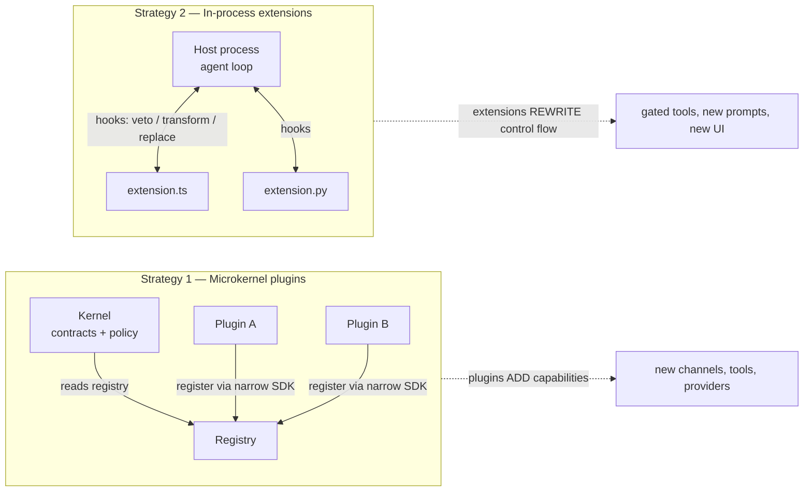
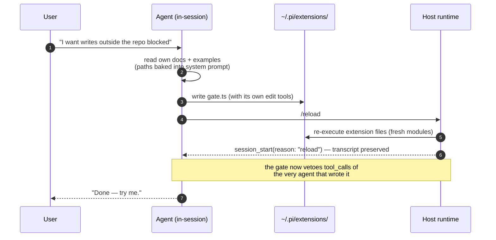

> Sources: distilled POCs in `architecture-poc` (`plugin-microkernel-app` from [OpenClaw](https://github.com/openclaw/openclaw), `inprocess-extension-app` from [pi-mono](https://github.com/badlogic/pi-mono)) · Date: 2026-08-15
> Companion case studies: [OpenClaw Architecture](../../case-studies/systems/openclaw_system_architecture.md), [pi-mono](../../case-studies/systems/pi-mono.md) · Prerequisite concept: [Microkernel / Plugin Architecture](./microkernel-plugin-architecture.md)

## The Core Idea

Every extensible program draws a line through itself: on one side, the part that is *fixed* — compiled, shipped, owned by the vendor; on the other, the part a user may *replace while the software is installed on their machine*. Where you draw that line, and what crosses it, is one of the most consequential architectural decisions a system makes.

This chapter is about two strategies for drawing that line, studied through two real systems:

1. **Plugin / microkernel architecture** (OpenClaw): a kernel owns contracts, discovers plugins through manifests, and lets them **add** capabilities behind a narrow, stable door.
2. **In-process extension mechanism** (Pi, a coding agent): plain source files loaded into the host process that can **rewrite** the host's control flow — veto its tool calls, replace its context, swap its model.

The one-line contrast that organizes everything below:

> **Plugins add; extensions rewrite.**

And then the twist that makes this worth a chapter of its own. Both systems host an AI agent, and both extension mechanisms are *file-based*. An agent that can write files can therefore write its own extensions, reload them, and use them — in the same session. The extension seam, designed for human power users, quietly becomes something else: **a self-modification loop**. The software can grow new behavior at the request of a conversation with itself.



## An Old Idea Wearing New Clothes

Neither strategy is new. What is new is *who holds the pen*.

| System | Mechanism | School |
|---|---|---|
| **Emacs** | Elisp evaluated in-process; nearly everything advisable/replaceable; no sandbox | Extensions rewrite |
| **Smalltalk / Lisp machines** | The running image *is* the program; editing it is using it | Extensions rewrite |
| **VS Code** | Extension host process, `package.json` manifest with `contributes`, marketplace review | Plugins add |
| **Web browsers** | Extension manifest, declared permissions, store review | Plugins add |
| **Eclipse, Photoshop, OsiriX** | Classic microkernel: stable core, feature plugins behind a contract | Plugins add |
| **Excel** | VBA macros running fully trusted in-process | Extensions rewrite |
| **Linux kernel** | Loadable modules — in-process power, admission-controlled by signing | A hybrid of both |

Emacs users have lived the self-modification loop for forty years: notice friction, write ten lines of Elisp, `eval-buffer`, and the editor is now a different editor — no restart, no build. The cost was always the same: you had to *be* the kind of person who writes Elisp.

The LLM agent removes that cost. When the host of the agent is itself the extensible program, the loop closes autonomously: the user states an intent in natural language, and the agent — using nothing more exotic than its ordinary file-editing tools — becomes the Elisp hacker. Pi's documentation states this in one sentence, which may be the shortest possible summary of this chapter:

> *"pi can create extensions. Ask it to build one for your use case."*

## Strategy 1 — Microkernel Plugins: Adding Behind a Contract

OpenClaw is a self-hosted personal AI assistant whose Gateway daemon speaks ~20 messaging platforms (WhatsApp, Telegram, Discord, Signal, …). Its headline decision: **everything vendor- or platform-specific is a plugin; core owns only contracts and orchestration.** Roughly 80 bundled plugins — every channel, every model provider — go through the same public Plugin SDK offered to third parties.

The distilled POC (`clawkit`, ~500 lines of Python) reduces this to its load pipeline:

```
                    ┌────────────────────────────────────────────────┐
                    │              KERNEL  (src/clawkit)             │
 plugins/console ──▶│  discovery ─▶ manifest ─▶ loader ─▶ registry   │
 plugins/file_inbox▶│    (reads plugin.json, NO code executed)       │
 plugins/broken  ──▶│                                                │
                    │  inbound ─▶ policy ─▶ routing ─▶ responder ─▶  │
                    │            (allowlist,  (session   ("agent")   │
                    │             pairing)     key)                  │
                    │            ─▶ outbound delivery (degradation)  │
                    └────────────────────────────────────────────────┘
```

Five mechanisms do the real work:

**1. Manifest-first discovery — metadata before code.** A plugin is a directory with a `plugin.json`. The kernel can list, validate, and configure plugins *without executing a single line of plugin code* — untrusted code is inspected before it runs. The POC pins this with a test: a plugin whose entry file is `raise RuntimeError("plugin code executed!")` loads cleanly in metadata mode.

```json
{ "id": "file-inbox", "kind": "channel", "entry": "channel.py",
  "label": "File Inbox" }
```

OpenClaw's real manifest (`openclaw.plugin.json`) extends the same idea: a required inline JSON config schema, declared capability ownership, auth metadata readable without booting the plugin, and a compatibility range (`compat.pluginApi`) — all consumable as pure data.

**2. A narrow SDK door.** Plugin code imports only `clawkit.sdk` (in OpenClaw: `openclaw/plugin-sdk/<subpath>`), never kernel internals. The docstring says why: *"Keeping the door this narrow is what lets the kernel refactor freely without breaking plugins."* A complete, working channel plugin is one screen:

```python
from clawkit.sdk import create_channel_plugin

def register(api) -> None:
    outbox = api.state_dir() / "outbox.txt"

    def send_text(peer: str, text: str) -> None:
        with outbox.open("a") as f:
            f.write(f"{peer}\t{text}\n")

    api.register_channel(create_channel_plugin(
        id="file-inbox", label="File Inbox",
        send_text=send_text, max_text_len=40,
        describe=lambda: {"transport": f"file:{outbox}"},
    ))
```

The `api` object handed to `register()` is the *only* runtime door, and it is tiny: `plugin_id`, `config`, `state_dir()`, and the `register_*` methods. Registrations flow one way, into a registry the kernel reads; plugins never call the kernel, and the kernel never imports a plugin by name.

**3. Capability flags, never identity checks.** The kernel branches on *declared capabilities*, not plugin ids. Outbound delivery degrades gracefully — rich rendering if the channel declared `rich_text`, otherwise chunked plain text — and the decision code contains no channel names:

```python
def deliver(plugin: ChannelPlugin, peer: str, payload: ReplyPayload) -> DeliveryResult:
    ob = plugin.outbound
    if payload.rich is not None and plugin.capabilities.rich_text and ob.send_rich:
        ob.send_rich(peer, payload.rich)
        return DeliveryResult(ok=True, via="send_rich")
    for chunk in chunk_text(payload.text, ob.max_text_len):
        ob.send_text(peer, chunk)
    return DeliveryResult(ok=True, via="send_text")
```

This is what keeps N channels × M responders at N + M integrations instead of N × M: both sides only ever see the kernel's frozen envelope types.

**4. Policy lives in the kernel, once.** Allowlists, pairing codes, and command gating are written once and enforced identically for every channel. A plugin *declares* its allowlist; it cannot skip the check. When inbound messages come from untrusted strangers on the public internet, this is non-negotiable.

**5. Diagnostics over crashes.** Every plugin failure — bad manifest, entry that throws on import, duplicate id — becomes a diagnostic record, never an exception. The kernel always boots; `doctor` reports the casualties. A broken plugin can never take down the host that thirty healthy plugins depend on.

The design carries its own falsifiable test, worth stealing for any plugin system you build:

> *Add a new plugin without touching the kernel's source. If you have to edit the kernel, you've found a leak in the design — fix the seam, not the symptom.*

## Strategy 2 — In-Process Extensions: Rewriting the Host

Pi is a terminal coding agent with a radically minimal core and a maximal extension seam. Its README lists what it *doesn't* have — no MCP client, no built-in sub-agents, no permission popups, no plan mode, no to-do lists — and answers every omission the same way: *build it with an extension, or install one.* The omissions are the extension system's reason to exist. This is **omission as architecture**: the feature list is small precisely because the seam is powerful.

An extension is a plain TypeScript file dropped into `.pi/extensions/` (per-project) or `~/.pi/extensions/` (global). No manifest, no build step, no package: **the file is the extension.** At load time, pi executes it with a runtime TypeScript loader (`jiti`, with module caching disabled) and calls its default export — a factory that receives the full extension API:

```typescript
export default function (pi: ExtensionAPI) {
    pi.registerTool(helloTool);
}
```

Unlike a microkernel plugin, an extension imports the *whole host package* — deliberately not a narrow SDK door. Since the code is trusted and in-process anyway, an interface-hygiene layer would buy nothing but friction. What an extension can reach is startling: register or **replace** built-in tools, add slash commands, register whole LLM providers, rewrite the system prompt, replace the compaction strategy, intercept raw terminal input, or overlay arbitrary UI (one shipped example runs DOOM in the TUI at 35 FPS).

### The event taxonomy by power

The heart of the design — and the distilled POC's stated centerpiece — is that pi's ~24 hook events collapse into **five semantic classes**, each with its own dispatch shape *and* its own error semantics:

| Class | Example event | Dispatch semantics | On handler crash |
|---|---|---|---|
| **Veto** | `tool_call` | First `block` wins, short-circuits; handlers may mutate args in place | **Not caught** — escapes, host blocks the tool (*fails closed*) |
| **Chain** | `tool_result` | Middleware: each handler patches fields; `None` = "no opinion" | Isolated, becomes a diagnostic |
| **Transform** | `input` | Rewrite or swallow the user's prompt before the model sees it | Isolated |
| **Replace** | `context` | Wholesale replacement of the messages sent to the LLM (over a deep copy) | Isolated |
| **Observe** | `turn_end`, `session_start` | Fan-out; return values ignored | Isolated |

The asymmetry in the last column is the sharpest single design decision in either system. Every dispatcher wraps handlers in try/except — *except the veto class*:

```python
def emit_tool_call(self, event: ToolCallEvent) -> ToolCallResult | None:
    """Deliberately NO try/except: an escaping handler error must reach the
    session, which blocks the tool."""
    for _ext, handler in self._handlers("tool_call"):
        r = handler(event, self._ctx)          # may raise — on purpose
        if isinstance(r, ToolCallResult) and r.block:
            return r                            # first veto wins
```

Why? Because a broken permission gate that got *skipped* would approve everything. **Guardrails fail closed; everything else fails open** — an observer crashing costs you a statistic, a gate crashing must cost the tool call. Note what this implies: in this architecture, safety features like permission gates are themselves *extensions*, not host code. The host guarantees only that a crashed gate blocks rather than passes.

```python
def gate(event: ToolCallEvent, ctx: ExtensionContext) -> ToolCallResult | None:
    if event.tool_name != "write":
        return None                            # no opinion — other gates still run
    target = resolve_write_target(event.input.get("text", ""), ctx.workspace)
    if not target.is_relative_to(ctx.workspace):
        return ToolCallResult(block=True, reason=f"write outside workspace: {target}")
    return None
```

### Hot reload — the mechanism that enables the loop

Reload is a slash command (`/reload`), *deliberately* not a file watcher — a watcher would re-execute factories mid-turn, yanking hooks out from under a running agent call. The sequence: emit `session_shutdown(reason="reload")` → invalidate every old extension handle (a captured stale `api` raises an instructive error instead of acting silently) → re-execute the files from disk as fresh modules, bypassing every module and bytecode cache → rebuild the runtime → emit `session_start(reason="reload")`.

**The conversation transcript survives.** That single property is what makes it a *reload* and not a *restart* — and what makes the self-modification loop possible within one session.

## Closing the Loop: The Agent as Author

Everything above is respectable extensible-software design. This section is where it becomes something genuinely new.

Three deliberate choices in pi conspire to let the agent extend the software it is running inside:

1. **Extensions are interpreted source, not compiled artifacts** — the agent's ordinary `write`/`edit` tools are sufficient to author one. No build step, no toolchain, no restart.
2. **The authoring manual ships inside the product** — pi's npm package includes its extension docs and 78 example extensions, and the *default system prompt points at their resolved on-disk paths*. The agent doesn't need to search the web to learn its own extension API; it reads its own documentation like any other file.
3. **Reload is in-process** — the entire write → reload → use feedback cycle stays inside a single conversation.



The distilled POC pins the loop as a deterministic three-turn test — the same session gains a tool it did not boot with:

```python
def test_grow_installs_a_new_tool_into_the_running_session(session):
    assert session.turn("shout: hi") == "I have no tool named 'shout'."
    assert "grown.py" in session.turn("/grow")   # writes extension file + reloads
    assert session.turn("shout: hi") == "HI"     # same session, new capability
```

The header comment of the generated file states the philosophical punchline plainly: *"the session that wrote this file is the session now running it."*

OpenClaw climbs the same ladder from the plugin side. Its **skills** are agent-facing capability packages — a directory with a `SKILL.md` — and creating one is just writing files, well within any agent's reach. A bundled `skill-creator` skill teaches the agent to make skills; a `clawhub` skill lets it search, install, *and publish* skill packages at runtime. Plugins can ship skills too, so one artifact delivers both the machine capability (tools) and the agent-readable instructions for using it. Even the agent-editable live Canvas fits the theme: the agent rewriting its own UI surface.

### Governing the loop: escape-hatch asymmetries

Both systems, having opened this door, immediately install asymmetric locks on it — and the asymmetries are more instructive than the locks:

- **In pi, only *commands* may reload — never LLM-invoked tools.** A tool receives a context without `reload()`; a slash command receives one with it. An agent that wants a reload must queue `/reload` as a *follow-up user message* — the reload happens between turns, never re-entrantly in the middle of a tool execution the runtime is about to rebuild.
- **In OpenClaw, chat-native plugin management (`/plugins install …`) is off by default and owner-only for writes** — a compromised or manipulated agent cannot silently install its own code.
- **OpenClaw's `before_install` hook can veto plugin installation** — governance of the extension mechanism, implemented *with* the extension mechanism.
- **`requireApproval` from a tool-call hook pauses the agent** and routes an approval prompt to a human on any connected channel. The human-in-the-loop gate is itself a hook decision.

The pattern: the agent may *author* capability freely, but the transitions that change what code is running — install, reload, enable — are pinned to an explicit human act, or at least a human-owned identity.

## Trust: Admission Control, Not Containment

Here both systems make the same honest, uncomfortable choice: **extension code runs in-process, fully trusted, with the host's OS privileges. There is no sandbox — explicitly.**

Pi's security docs argue that a partial in-process sandbox would be *worse* than none: easy to mistake for a security boundary while the host still shares a shell, filesystem, credentials, and package managers with the extension. *"Real isolation needs to come from the operating system or a virtualization/container boundary."* The trust model for extensions is the same as for shell dotfiles: you get an extension because you (or something you trusted) placed its source in your config directory. OpenClaw's SECURITY.md says the same: *"Installing or enabling a plugin grants it the same trust level as local code running on that gateway host."*

What separates the two strategies is everything that happens *before* the code runs:

| Control | Microkernel (OpenClaw) | In-process (pi) |
|---|---|---|
| Inspection before execution | Manifest-first: validate, list, configure with zero code run | None — the file is the extension |
| Admission | `allow`/`deny` pinning; workspace plugins off by default; path-safety gates; world-writable paths blocked; `before_install` veto | Project-trust prompt gates loading a repo's `.pi/extensions/` |
| Blast radius on failure | Diagnostic; kernel boots without the plugin | Diagnostic for most hooks; **fail-closed** for tool-call gates |
| Containment | None (in-process) | None (in-process) |

The tension to sit with: once the agent can author and install extensions, **the extension mechanism is simultaneously the system's greatest power and its largest attack surface** — and every mitigation above is admission-shaped, not containment-shaped. A prompt-injected agent with authoring rights is exactly as dangerous as the escape-hatch asymmetries are strong. That is why "only the owner installs," "only commands reload," and "a crashed gate blocks" are not conveniences — they are the security model.

## Choosing a Strategy

The two POCs were built as a deliberate contrast, and the contrast is the decision table:

| Dimension | Plugins (microkernel) | Extensions (in-process) |
|---|---|---|
| One-line role | **Add** capabilities behind kernel contracts | **Rewrite** the host's control flow |
| Unit | Directory + manifest + entry module | A single source file |
| Contract | Narrow SDK door; kernel-owned types | The whole host API, imported directly |
| Discovery | Manifest scanned, code not executed | File presence; code *is* the metadata |
| Versioning | Declared compat ranges, deprecation cycles, contract test suites | Curated evolution; migration notes; no formal policy |
| Failure posture | Diagnostics over crashes, uniformly | Fail-open observers, fail-closed guardrails |
| Serves | Third-party ecosystem, marketplace, many authors | Power users and the agent itself |
| Self-modification grain | Agent-authored *capabilities* (skills, tools) | Agent-authored *behavior* (gates, prompts, providers, UI) |

Guidance, not law:

- **Building an ecosystem?** Microkernel. You need admission control, inspectable metadata, versioned contracts, and the guarantee that one author's mistake never takes down another's plugin. The cost is the contract itself — once public, every change is a breaking-change negotiation.
- **Building a power tool for a trusted operator (human or agent)?** In-process extensions. You get replacement, not just addition; zero friction between "I wish it did X" and "it does X." The cost is that trust becomes binary — there is no partial admission of an extension that imports your whole runtime.
- **These compose.** OpenClaw *embeds* pi's agent runtime: a microkernel plugin host whose brain is an extension-based agent. The stable, contract-governed surface faces the ecosystem; the trusted, rewrite-everything surface faces the operator. Deciding *which seam faces whom* is the actual architectural act.

## Key Takeaways

1. **The seam is the product.** Pi's feature list is short because its extension seam is deep — every "missing" feature is an extension someone (or the agent) can write. Designing what you *omit*, and making the seam strong enough to carry it, is architecture.
2. **Plugins add; extensions rewrite.** Two ends of one spectrum, distinguished by what crosses the line: registrations flowing into kernel-owned contracts, versus hooks reaching into host-owned control flow.
3. **Match error semantics to hook power.** Observers may fail open; vetoes must fail closed. The most important line in pi's dispatcher is the try/except that isn't there.
4. **Self-modification is a property of file-based seams plus an agent with file tools.** Nobody had to build "self-modifying software" — it emerged the moment the extension format (plain source), the documentation (shipped in-product, referenced by the system prompt), and the reload path (in-process, transcript-preserving) all landed inside the agent's reach.
5. **Govern the loop with asymmetry.** Authoring is cheap; *activation* is guarded — owner-only installs, command-only reloads, install vetoes, human approval gates. Admission control is the security model; don't pretend an in-process seam is a sandbox.
6. **Keep a falsifiable test of the seam.** "Add a plugin/extension without editing the host — if you can't, fix the seam, not the symptom." Both POCs treat this as the design's unit test.

## Where to Go Deeper

- [Microkernel / Plugin Architecture](./microkernel-plugin-architecture.md) — the underlying pattern, contract design, and classic examples.
- [OpenClaw — System Architecture](../../case-studies/systems/openclaw_system_architecture.md) and [Messaging Channels Integration](../../case-studies/systems/openclaw_messaging_channels_integration.md) — the production microkernel this chapter distills, including the channel plugin contract with ~25 optional adapter slots.
- [pi-mono](../../case-studies/systems/pi-mono.md) — the full class-level walkthrough of pi, especially §7a on hot-reload extensions.
- [MONAI Deploy Plugin Architecture](../../case-studies/patterns-in-the-wild/monai-deploy-plugin-architecture.md) — the same plugin pattern in a medical-imaging pipeline.
