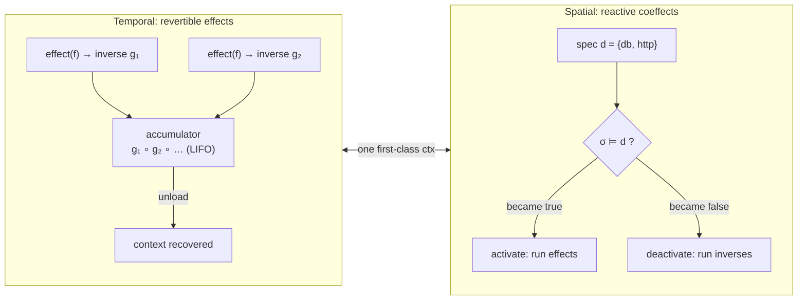
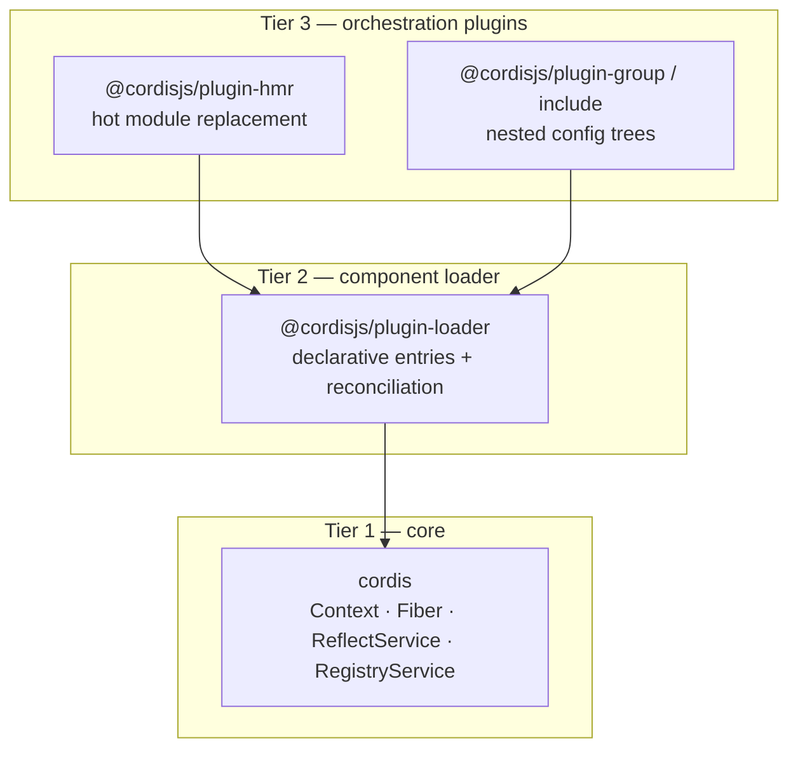

> Source: Shi, Zhang, Cui — *A Programming Paradigm for Spatiotemporal Composability* (Peking University / DeepSeek-AI), and its reference implementation [Cordis](https://github.com/cordiverse/cordis) (`4.0.0-rc.8`) · Date: 2026-08-24
> Prerequisite concepts: [Microkernel / Plugin Architecture](./microkernel-plugin-architecture.md), [Self-Modifying Software](./self-modifying-software.md) · Runnable POC: [`spatiotemporal-composition-app`](https://github.com/Lightbridge-KS/architecture-poc/tree/main/examples/spatiotemporal-composition-app) (atrium) in `architecture-poc`; contrasted with `plugin-microkernel-app` (clawkit) and `inprocess-extension-app` (pistil)

## The Core Idea

The microkernel chapter drew a line between a stable core and replaceable plugins. The self-modifying-software chapter showed what happens when an agent holds the pen and rewrites plugins at runtime. Both chapters quietly assumed something neither of them delivered: that a component can be **added and removed while the system runs**, and that the system will be *correct* afterwards.

Look at what the two distilled POCs actually do when a plugin goes away:

- **clawkit** (microkernel): `Registry.register_channel()` exists; `unregister` does not. There is no unload at all — to remove a channel you restart the process.
- **pistil** (in-process extensions): `/reload` throws away the *entire generation* — every extension's handlers, tools, and commands — invalidates the old handles so stale captures raise, and re-executes every file from disk. It preserves the transcript, but it cannot remove *one* extension; it can only rebuild all of them.

This is what the paper calls the **coarse-grained workaround**: operating systems give you "remove and clean up" at the granularity of a *process*, container orchestrators give you "depend on and re-wire" at the granularity of a *service*, and almost all software tolerates the lack of anything finer by restarting. VS Code, the paper's running example, cannot unload a single extension's code either — 87 of its top-100 extensions require a host restart to remove — and only 7 of those 100 declare a dependency on another extension, because the API gives them no safe way to.

The paper names the two things that are missing, proves they are orthogonal, and then makes them *structural*:

| Dimension | The question | Static answer (compile-time) | Dynamic answer (this paradigm) |
|---|---|---|---|
| **Temporal** | When a component is removed, does every side effect it made get reversed? | RAII, `bracket`, lexical scope | **Revertible effects** — every mutation carries its inverse; the runtime tracks and replays them |
| **Spatial** | Can a component declare what it needs, and be re-wired when that changes? | `import` resolution, DI at startup | **Reactive coeffects** — a component declares a spec; every context change is classified against it and drives activation/deactivation |

The one-line summary the rest of this chapter unpacks:

> **Load = run a component's effects and keep their inverses. Unload = run the inverses. Dependencies decide *when* both happen — automatically.**



Both dimensions live on **one object** — the *context* — and that unification is what the paper claims as a programming paradigm.

## Why It Is Hard: Plug-In Metaphor Taken Literally

The classic microkernel diagram shows plugins "plugging in" to a core. Unplugging is drawn as the same arrow reversed. In real systems it never is:

- **Effects are scattered and their cleanup is separate.** A VS Code extension's `activate()` registers commands, spawns processes, opens sockets; `deactivate()` is a *different* function, hand-written, that must remember every one of them. The paper calls this a violation of *locality of concern*. A forgotten line leaks silently.
- **Dependencies are implicit.** Extension A reads `vscode.extensions.getExtension('B').exports` — typed `any` — and nobody re-runs A when B is disabled. Spring's `getBean()`, service locators, module-level singletons: same shape.
- **Order matters and nobody owns it.** Who unloads first when B depends on A? Can B's teardown still call A? Who arranges the *load* order for 4,000 plugins?

The paper's claim is that all three are consequences of treating effects and dependencies as *developer discipline* rather than *runtime structure*. Classical effect systems (what a computation *does* to its environment) and coeffect systems (what it *needs* from it) already give the vocabulary — but as compile-time annotations over lexically fixed scopes. No lexical scope can bound a plugin loaded after deployment. So the paper **lifts both to runtime mechanisms** and reifies the context they act on as a first-class value.

## Mechanism 1 — Revertible Effects (Temporal)

### The shape of a revertible effect

An ordinary side effect is a transformation of the world: `f : Γ → Γ`. A *revertible* effect returns the transformed world **together with the function that undoes it**:

```
effect : Γ → (Γ, Γ → Γ)
         γ ↦ (δ, g)      where g(δ) = γ   ← the "witness": g reverts f where f was applied
```

The runtime keeps an **accumulator** `φ : Γ → Γ`, the composite of every inverse so far. Applying an effect does two things — transform the state, and prepend its inverse onto the accumulator:

```
track(f, g) : (γ, φ) ↦ (f(γ), φ ∘ g)
recover     : (γ, φ) ↦ (φ(γ), id)
```

Because inverses accumulate in the *opposite* order of the forward maps (the paper calls this *twisted composition*: `(f₁,g₁)∘(f₂,g₂) = (f₁∘f₂, g₂∘g₁)`), recovery runs them **last-in, first-out** — exactly the order in which a stack of resources should be released. The two theorems that matter for a practitioner:

1. **Tracking preserves composition.** `track` is a monoid homomorphism: the inverse of a composite effect *is* the composite of the inverses. You write an inverse for each *atomic* effect; every composite gets its inverse for free.
2. **Recovery is exact.** After any sequence of tracked effects, `recover` returns the initial context (Theorem 7); reverting in LIFO order hands each inverse exactly the state its own application produced (Theorem 16).

That second point is the whole difference from `deactivate()` hooks, sagas, or the Command pattern's `undo()`: there the inverse is an unenforced duty decoupled from the operation. Here **the inverse is returned at the point of the effect**, so there is nowhere to forget it. React's `useEffect` cleanup is the closest mainstream precedent — and the paper's critique of it is instructive: hooks may not be conditional, looped, async, or nested, so effects cannot be assembled from effects, and no composite inverse can be derived.

### In code

Cordis exposes exactly one primitive for mutating a context, and everything else is built on it. The callback returns its own inverse:

```ts
// The only sanctioned way to change the world: return how to undo it.
const dispose = ctx.effect(() => {
  const timer = setInterval(tick, 1000)
  return () => clearInterval(timer)
}, 'ctx.interval()')
```

A component whose startup has several stages *yields* inverses as it goes — a generator. This is the paper's **effect iterator**: a reified delimited continuation, so the runtime can stop between any two yields and unwind only what has run so far:

```ts
// From @cordisjs/plugin-hmr — the inverse is registered before the resource is even used.
async* [Service.init]() {
  yield () => this.watcher?.close()
  this.watcher = watch(this.root, { ignored: this.config.ignored })
  yield this.ctx.on('internal/update', (fiber) => this.onUpdate(fiber))
  // ...
}
```

And the crucial consequence — **teardown is derived, not written**. A component that registers three event listeners, opens a connection, and provides a service never writes an `unload()`. The Cordis test for this is one screen:

```ts
const dispose = root.effect(function* () {
  yield dispose1
  yield root.on('custom-event', () => {})   // ctx.on is itself a tracked effect
  yield dispose2
  yield root.effect(function* () {           // effects nest: the child's inverse
    yield dispose3                            // is an effect on the parent
  })
})
dispose()
expect(seq).to.deep.equal([3, 2, 1])          // LIFO, through the nesting
dispose()
expect(seq).to.deep.equal([3, 2, 1])          // idempotent: fires at most once
```

### Independence — when can one component be pulled from the middle?

LIFO recovery of *one* component's effects needs no assumption. But in a running system, component B's effects are interleaved *after* A's, and you want to remove A without touching B. The paper's answer is **independence** (Definition 19): A's forward maps and inverses must commute with B's, and neither may disturb the inverse the other yields. Under independence, inverses may be applied in *any* order and still reach the initial state (Corollary 21).

The engineering reading of this is a design rule for the *keys* components share:

| Key whose value is… | Commutes? | Example | Consequence |
|---|---|---|---|
| A **table** of independently added/removed entries | ✅ | route table, event-listener set, service registry | Any component may register or withdraw in any order |
| An **ordered chain** | ❌ | middleware pipeline, where position changes what each stage sees | Order must be imposed from outside — by a declared dependency |

The paper puts it precisely: the *commuting* part of a computation is carried by effects, and the *order-sensitive* part by coeffects. Where order matters, make it a dependency; that is what the next mechanism is for.

## Mechanism 2 — Reactive Coeffects (Spatial)

### A dependency table where `set` is itself a revertible effect

The coeffect context is a typed partial map from keys to values — an IoC container, formalized:

```
Σ := (k : K) ⇀ V_k
get(k)     : Σ ⇀ V_k
set(k, v)  : Σ ⇀ (Σ, Σ ⇀ Σ)          = (σ[k ↦ v],  σ' ↦ σ' \ k)
```

Look at the type of `set`: it returns the new table **and the function that removes the binding**. `set` is a revertible effect. This is the *synergy* the paper builds everything on — **coeffect operations are effects, and effects are revertible** — so providing a service is tracked and recovered by the exact machinery of Mechanism 1. No special case.

### Specification, satisfaction, notification

A component declares what it needs as a set of keys — its **coeffect specification** `d ⊆ K`. Satisfaction is a decidable predicate:

```
σ ⊨ d  :=  ∀ k ∈ d.  k ∈ dom(σ)
```

Since *every* change to `σ` passes through an effect, every change is observable at an effect boundary. The runtime classifies each transition `σ → σ'` against each component's spec:

```
notify_d(σ, σ') :=  activating     if  σ ⊭ d  ∧  σ' ⊨ d
                    deactivating   if  σ ⊨ d  ∧  σ' ⊭ d
                    neutral        otherwise
```

An *activating* transition runs the component's effects (tracked); a *deactivating* one applies its accumulator. This gives you, for free:

- **No load order to arrange.** A component whose dependency is missing does not error — it sits inactive and activates by itself the moment the provider appears.
- **Withdrawal cascades.** Remove a provider, and every dependent deactivates (running its own inverses), and every dependent *of those* likewise.
- **Replacement propagates.** Swap a provider and only the components that resolved *that* key re-run.

```mermaid
sequenceDiagram
    autonumber
    participant O as Orchestrator
    participant RT as Runtime (notify)
    participant DB as database (provides db)
    participant API as api (needs db, provides http)
    participant ADM as admin (needs http)

    O->>RT: use(admin), use(api), use(database) — any order
    Note over API,ADM: inactive: specs not satisfied
    RT->>DB: activate → set(db) → notify(db)
    RT->>API: db now provided → activate → set(http) → notify(http)
    RT->>ADM: http now provided → activate
    O->>RT: retire(database)
    RT->>DB: leave (stop providing; bindings still in place)
    RT->>API: db no longer provided → deactivate
    RT->>ADM: http no longer provided → deactivate (may still read http)
    RT->>DB: dependents drained → run inverses → inactive
```

### Isolation and interception

Two refinements extend the flat table without changing its algebra:

- **Isolation (realms).** Add an indirection `ρ : K ⇀ R` so the same key resolves to *different bindings in different contexts*: `get(k) = σ(ρ(k))`. Two tenants, or two test cases, each get their own `db` without renaming anything. Cordis: `ctx.isolate('db')`. Note the *realization*: isolation derives a child context that shadows one entry of `ρ` — so its "inverse" is simply discarding the child. Nothing in the shared table changes, nothing to track.
- **Interception (metadata).** Attach a monoid of metadata per key, merged from the component's declaration and the enclosing context's, and hand the merge to the provider *when the binding is used*. Cordis: `ctx.intercept('fs', { allow: ['/tmp'] })`. Because it is consulted at read time, changing it never triggers a reload — and because the context's metadata is right-biased, an orchestrator can constrain a component's use of a dependency without touching the component.

## The Unified Context — a Paradigm, Not a Library Trick

The paper folds the effect context and the coeffect context into one recursive type:

```
Γ∞ := μΓ. Γ × (Γ → Γ) × Σ
           │      │        └─ the dependency table
           │      └─ this level's accumulator
           └─ the (recursive) state below
```

Every interaction between a component and its environment passes through this single value. Because `V_k` is unconstrained, *any* shared mutable state can be modelled as a coeffect at some key — which is the discipline that makes the whole system's effects independent (Theorem 42): if every shared location is a key, and every key you share is commutative, any two components' effects commute.

This is where the paper situates itself among paradigms — and the table is worth internalizing:

| Paradigm | Effects | Dependencies | Cost |
|---|---|---|---|
| **Functional state threading** (State monad, ZIO, Effect-TS) | Explicit in types; equational reasoning | Explicit in types (`R` channel) | Every function threads the state; monadic embedding required |
| **Implicit mutation** (imperative/OOP; `useEffect`, `getBean()`) | Hidden; identified by call position or global | Hidden; service-locator lookups scattered through code | Understanding `f()` means reading it transitively |
| **The context paradigm** | Explicit *parameter*, attributable to a component; inverse supplied per atomic op, derived for composites | Declared once as a spec; runtime resolves and re-wires | One `ctx` argument; the tracking is an overlay on ordinary host code |

*Traceability of the functional approach, ergonomics of the imperative approach.* The context is the mechanism that buys both.

## Components, Fibers, and the Lifecycle Calculus

Section 4 of the paper turns the two mechanisms into a **component** and gives its lifecycle an operational semantics. The vocabulary is what you need to read Cordis:

| Term | Definition | Cordis |
|---|---|---|
| **Component** `(d, p, e)` | spec `d` (what it reads), provision `p` (which keys it may write), witnessed effect function `e` | a plugin function/class with `inject` and a body |
| **Fiber** | one *instantiation* of a component, carrying its own lifecycle state, accumulator `g`, committed view `ω`, parent, and retirement flag | `Fiber` (`fiber.ts`, 486 lines) |
| **Registry** | the tree of fibers; the coeffect context is *derived* from it — the union of what **Active** fibers provide | `ctx.registry` |
| **Target view** `target_n(γ)` | for each declared key, *which fiber* currently provides it — or ⊥ if retired/unsatisfied | `Fiber._runner.epoch`, a string digest `":<uid>:<uid>…"` |
| **Committed view** `ω` | the resolution the fiber *activated against*, held until its inverses have run | `Fiber.store` |

Two details decide everything downstream:

1. **A binding is identified by its *provider*, not its value.** A fiber reloads precisely when one of its keys comes to be provided by a *different fiber*. Two providers with equal values are still distinguishable, so a swap propagates; a provider that overwrites its own value in place is *not* observed. (To publish a replacement: withdraw and re-install.)
2. **The coeffect context unions over Active fibers only.** A fiber that has *begun* leaving already stops providing — before any of its inverses run.

```mermaid
stateDiagram-v2
    [*] --> Inactive: O-Insert
    Inactive --> Reloading: L-Begin (target ≠ ⊥)
    Reloading --> Reloading: L-Iter (one yield; target unchanged)
    Reloading --> Active: L-Finish
    Reloading --> Unloading: L-Divert (target changed) / L-Raise (iteration threw)
    Active --> Unloading: L-Leave (target ≠ committed)
    Unloading --> Inactive: L-Unload (no dependent relies on me; run accumulator)
    Inactive --> [*]: O-Remove
```



The base two-state calculus (Inactive ⇄ Active) is atomic, immediate, and infallible. The four refinements each drop one idealization, and each corresponds to a named implementation concern:

| Refinement | What it admits | The rule | Why it matters |
|---|---|---|---|
| **Withdrawal** | A deactivation spread over an interval its dependents occupy | **L-Leave** marks the fiber `Unloading` (stops providing); **L-Unload** runs the accumulator only when `¬relied(n)` — no installed fiber's committed view names `n` | A consumer's *teardown code* can still call the very service whose disappearance triggered it (closing a pool means handing connections back) — Theorem 63 |
| **Iteration** | Multi-step activation via effect iterators | **L-Iter** per yield; **L-Divert** aborts at a yield boundary if the target changed, unwinding only what ran | Partial rollback inside a single transition |
| **Asynchrony** | Each step returns a `Future`; state moves during flight | *Inertia*: an in-flight step always lands; a changed target is answered *after* landing by chaining into unload | Transitions never interleave; rapid config churn collapses into a well-defined sequence |
| **Failure** | An iteration may throw | **L-Raise** routes through `Unloading` with the error as outcome → `Inactive(ξ)`; not retried against an unchanged environment | A failing plugin installs *nothing* and leaves its siblings running |

The metatheory (§4.4) is what licenses treating a Cordis application as if it were statically assembled:

- **Recovery exactness** (Theorem 61): applying a fiber's accumulator withdraws *its* contribution and nothing else, whatever other fibers did in between.
- **Ordering** (Theorem 63): a provider outlives its consumers; a consumer reads the same binding for its whole loaded life, teardown included.
- **Progress** (Theorem 66): the withdrawal guard always releases; every sequence quiesces — bounded by `(K + 4)(V + 1)` steps per fiber.
- **Confluence** (Theorem 73): *the state a system quiesces at is the one a from-scratch load of the final configuration would have produced* — regardless of the history of adds, removes, and swaps. The dynamic history leaves no trace.

The last one is the payoff. It is the dynamic-composition analogue of "incremental computation agrees with from-scratch evaluation," and it is what makes a declarative loader sound.

## Implementing It — Cordis in Three Tiers

Cordis is a *meta*-framework: it prescribes no domain and supplies exactly one thing, the composition semantics above. Application frameworks (Koishi — a chatbot framework with 4,000+ community plugins — is the case study) contribute only domain vocabulary.



### Tier 1: the core, in one plugin

A provider is a class extending `Service` (its constructor *is* the `provide`); a consumer declares `inject`; every mutation goes through `ctx.effect`:

```ts
import { Context, Service } from 'cordis'

declare module 'cordis' {                       // type-level: the key's value type
  interface Context { db: Database }
}

class Database extends Service {
  constructor(ctx: Context) {
    super(ctx, 'db')                            // provides "db" — a tracked effect
  }
  async* [Service.init]() {                     // effect iterator: yield inverses as you go
    const pool = await connect(this.config.url)
    yield () => pool.end()
  }
}

function admin(ctx: Context) {                  // a plain-function component
  ctx.on('request', handleAdmin)                // ctx.on is a tracked effect
  ctx.timer.interval(flushAudit, 60_000)        // so is a timer; disposed with the fiber
}
admin.inject = ['db', 'timer']                  // coeffect specification d

const root = new Context()
root.plugin(admin)                              // sits inactive — db not yet provided
root.plugin(Database, { url: 'pg://…' })        // → db provided → admin activates
```

Read the last two lines against the paper: load order is *irrelevant*. `admin` waits at its L-Begin until `db` has an Active provider.

The four algorithms that realize this are short enough to internalize. **Effect tracking** (Algorithm 1) drives a callback as an iterator, folding each yielded inverse into one composite, with a *guard* consulted before each step and an `armed` flag so disposal fires at most once and halts an in-flight iteration:

```
execute(callback, guard):
    iter ← callback();  inverse ← id
    while guard():
        (value, done) ← await iter.next()
        if value: inverse ← value ∘ inverse        ← prepend: LIFO on recovery
        if done: break
    return inverse
```

**Coeffect provision** (Algorithm 2) is `ctx.effect` applied to a store write — the inverse deletes the binding, and both directions call `notify`. **Notification** (Algorithm 3) walks the live fibers, and for each one whose `inject` names a changed key *in the same realm*, calls `refresh`. **The lifecycle** (Algorithm 5) is the inertial state machine: `refresh` recomputes the target and, if no transition is in flight, starts `reload` or `unload`; each of those re-checks the target on completion and chains into the other if it changed.

One implementation choice carries the ordering theorem, and it is worth seeing in the source. `Fiber._setEpoch` sets `UNLOADING` and fires `notify` *synchronously*, while the actual inverses are deferred behind `await Promise.resolve()`; `provide`'s inverse drains dependents *before* deleting the binding:

```ts
// packages/core/src/reflect.ts — provide()'s inverse
return async () => {
  await Promise.allSettled(this.notify([name], ...).map(f => f.await()))  // drain dependents
  delete this.ctx.fiber.store![name]   // ensure self access before dependencies cleanup
}
```

That comment is Theorem 63 in one line.

### Proxy-mediated access — capability by construction

`ctx.db` is not a property; it is a `Proxy` trap that walks the fiber chain upward (Algorithm 6): return the binding at the first fiber whose *committed view* has it; throw `INACTIVE_ACCESS` if a fiber declares the key but is not loaded; throw `UNDECLARED_ACCESS` at the root. You cannot read what you did not declare. The paper reads this as capability-based security: `inject` is a capability *request*, the proxy a capability *mediator*, and since requests are static an orchestrator can review them before load.

### Tier 2: the declarative loader

Component developers get imperative primitives; *orchestrators* want a persistent description. An **entry** records `{ id, url, config, isolate, intercept, disabled }` — and the paper shows this is a *faithful* specification because the support set (what ends up Active) reads exactly `τ, π, d, p`, which an entry supplies through `disabled`, its parent, and the component `url` selects. The loader reconciles per field with the **least disruptive** operation:

| Field changed | Operation |
|---|---|
| `id`, `url` | rebuild the fiber |
| `isolate` | reassign realms (Algorithm 7 — delimiter tags decide whether a binding is the entry's own and must move with it) |
| `intercept` | swap the table in place — **no reload**, it is read at use time |
| `config` | hand to the component; it diffs and decides |
| `disabled` | dispose / re-instantiate |

Confluence is what makes incremental reconciliation sound: however the loader sequences these, the system quiesces where a from-scratch load would.

### Tier 3: hot module replacement without accept boundaries

Webpack and Vite HMR need you to write `module.hot.accept(...)` — a hand-drawn boundary saying which state migrates. Cordis needs none, because **a fiber already bounds everything its component installed**. Replace a module = dispose the old fiber (recovers everything) + instantiate a fresh one from the re-imported module. Three phases: classify changed modules by fixed point over the import graph (a module is accepted once one import is accepted, declined once all are); find stale entries whose dependency tree intersects the accepted set; reload them *transactionally* — on any import error, restore the module caches from backup and re-instantiate every stale entry from its previous module.

### A language-agnostic sketch (verified)

The paradigm is not TypeScript-specific — §6.4 lists the requirements: closures (to capture inverses), a way to introduce and retract code at runtime (module registry, `dlopen`, Wasm instances), and a way to mediate dependency access (Proxy, Python descriptors, macros). To make that concrete, here is the *entire* core in ~90 lines of synchronous Python — no inertia, no iterators, no realms — with the three load-bearing decisions marked:

```python
@dataclass
class Fiber:
    name: str
    inject: tuple[str, ...]                 # coeffect specification d
    apply: Callable[["Ctx"], None]          # effect function e
    state: str = "INACTIVE"
    committed: dict[str, "Fiber"] = field(default_factory=dict)   # key -> provider
    inverses: list[Inverse] = field(default_factory=list)         # accumulator g

@dataclass
class Ctx:
    store: dict[str, tuple[Fiber, object]]  # shared: key -> (provider fiber, value)
    fibers: list[Fiber]
    fiber: Fiber                            # the fiber this ctx is scoped to

    def effect(self, run: Callable[[], Inverse]) -> Inverse:   # (1) the ONLY way to mutate
        inverse = run()
        self.fiber.inverses.append(inverse)
        return inverse

    def provide(self, key, value) -> Inverse:                  # set IS a revertible effect
        def run():
            self.store[key] = (self.fiber, value); self._notify(key)
            def inverse():
                del self.store[key]; self._notify(key)
            return inverse
        return self.effect(run)

    def _target(self, fiber):
        view = {}
        for k in fiber.inject:
            provider = self.store.get(k, (None,))[0]
            if provider is None or provider.state != "ACTIVE":   # (2) union over ACTIVE only
                return None
            view[k] = provider                                   # identify by PROVIDER
        return view

    def _refresh(self, fiber):                                   # notify_d classification
        target = self._target(fiber)
        if fiber.state == "INACTIVE" and target is not None:
            self._activate(fiber, target)
        elif fiber.state == "ACTIVE" and target != fiber.committed:
            self._deactivate(fiber)
            if target is not None: self._activate(fiber, target)   # provider swapped → chain

    def _deactivate(self, fiber):
        fiber.state = "UNLOADING"                                # L-Leave: stop providing
        for key, (provider, _) in list(self.store.items()):
            if provider is fiber: self._notify(key)              # (3) drain dependents FIRST
        while fiber.inverses: fiber.inverses.pop()()             # L-Unload: LIFO
        fiber.committed, fiber.state = {}, "INACTIVE"
```

Run against a three-component chain (`database` provides `db`; `api` needs `db`, provides `http`; `admin` needs `http`, registers a route and *reads `http` in its own teardown*), loaded in the **wrong** order:

```text
load           : ['+database', '+api', '+admin'] | store ['db', 'http'] | routes ['/admin']
retire database: ['-database', '-api', '-admin', 'admin bye (server on pg://primary)'] | store [] | routes []
add replica    : ['+replica', '+api', '+admin'] | http = 'server on pg://replica' | routes ['/admin']
```

Three properties, each visible in one line: activation in dependency order regardless of load order; cascade teardown with the dependency *still readable* during the consumer's cleanup; and full re-activation against a new provider with no code in any component knowing that anything happened.

The sketch grew into a full POC, [`spatiotemporal-composition-app`](https://github.com/Lightbridge-KS/architecture-poc/tree/main/examples/spatiotemporal-composition-app) (package `atrium`, ~500 lines, 28 tests): it adds generator effects with divert at a yield boundary, per-fiber failure that unwinds partial work, isolation realms, and a declarative loader whose reconciliation is confluent — `snapshot(v1 → v2) == snapshot(scratch → v2)` is a test. Its first CLI scenario prints the three lines above character-for-character:

```bash
uv run app run "load admin" "load api" "load database" "retire database" "load replica"
```

## Use Cases

**1. Plugin ecosystems that never restart.** Koishi disables a plugin from its web console and the plugin's effects are withdrawn in place; during development, HMR re-applies edited plugins on save while every other plugin's caches and live connections survive. Plugin authors write no uninstall path. Across 4,000+ independently authored plugins, IM adapters provide platform access, database drivers provide storage, and feature plugins declare both as coeffects — reconfiguring the storage backend re-activates *only* the dependents whose resolution changed.

**2. Self-evolving agent harnesses.** The paper names this as its most compelling future validation, and it is exactly the loop the [Self-Modifying Software](./self-modifying-software.md) chapter closes. Today that loop is coarse: pistil's `/reload` rebuilds the whole extension generation, and OpenClaw's plugin install is process-scoped. With revertible effects, an agent that writes a new tool component could swap *that component* while the session serves requests — and a faulty self-modification is recovered by running one accumulator rather than by a restart that might disable the very process needed to recover. Spatially, a tool that depends on a provider the agent just replaced re-activates against the new one instead of holding a stale reference.

**3. Service multiplexing — blue-green as a composition pattern.** Put a *broker* component behind a key; backing providers register with it through revertible effects (unload = automatically dropped from the routing set). Rolling update: load the new provider as an additional fiber, shift weights, unload the old once it carries no in-flight requests. What is normally an infrastructure operation (container orchestration, blue-green deployment) becomes an application-level composition — and the broker absorbs the perturbation, so consumers see no dependency change and no reload.

**4. Multi-tenancy and testing via isolation realms.** Same component code, `ctx.isolate('db')` per tenant or per test — independent bindings, no renaming, no global state to reset between tests.

**5. Access control without touching either party.** `ctx.intercept('fs', { readOnly: true })` on a community plugin's context: the provider checks each call against merged metadata; the orchestrator adjusts it at runtime; nothing reloads. Undeclared access throws at the proxy.

**6. Dependency cycles that fail loud, early, and locally.** Two components that need each other's keys simply never activate — predictable from declarations alone, reportable at load time. The paper's decomposition recipe: split each bidirectional interaction into two cores plus one integration component per direction (server-core, access-control-core, request-mediation, policy-management). More components, but each integration is independently loadable.

## Back to the POCs — What the Paradigm Would Change

The two distilled examples make good "before" pictures:

| Concern | clawkit (microkernel) | pistil (in-process) | Under the paradigm |
|---|---|---|---|
| Unit of removal | the process | the whole extension *generation* (`/reload`) | **one fiber**; siblings untouched |
| Cleanup | none — `register_channel` has no inverse | none — old handles invalidated so stale captures *raise* | derived from load; the staleness guard becomes unnecessary because a dead fiber's inverses have already run |
| Inter-plugin dependency | none (like VS Code: kernel-owned extension points only) | none | `inject` spec; resolution re-runs on every change |
| Failure | diagnostic; kernel boots | diagnostic; host boots | same — per-fiber `Inactive(ξ)`, siblings running |
| Load order | discovery order | file order | irrelevant — dependents wait |
| Policy / gating | written once in the kernel | an extension (fail-closed veto) | a coeffect with interception metadata; the orchestrator adjusts it without reload |

The smallest concrete step for clawkit: make `api.register_channel()` return its inverse and track it on a per-plugin accumulator. That alone yields per-plugin unload. The next step — `responder` declaring `inject = ["channel:console"]` — yields reactive re-wiring. Neither requires changing the manifest-first discovery, the narrow SDK door, or the capability-flag design; the paradigm sits *under* those, not instead of them.

## Limits — What the Guarantee Does Not Cover

The paper is unusually clear about its boundary, and these are the points to hold onto:

- **The system boundary.** An effect is revertible only for locations the system can modify *exclusively* and *restore*. `open`/`close`, `malloc`/`free`, `fork`/`kill` — the *acquisition* is inside and tracked. The *emission* — bytes written to a socket, a datagram on the wire — is outside, and its "inverse" is `id`. What remains is *withholding* (the output-commit problem) or *compensation* (delete the file you created, refund the charge), which composes in the same LIFO order but is proved against a coarser equivalence.
- **Inverse correctness is an author obligation.** The runtime tracks the inverse you return; it does not verify that it reverts what it accompanies. Composition of correct inverses is guaranteed; correctness of the atomic ones is on you.
- **Not a sandbox.** Access control via declared `inject` is language-level; a malicious component with host access bypasses it. Untrusted code needs an execution boundary (process, Wasm, container) with a *bridge* fiber on the host side — the same conclusion the self-modifying-software chapter reached.
- **Nominal linking only.** A key is a name. Interface drift and key collision across independently built components are not caught by `k ∈ dom(σ)`. Cordis leans on npm peer-dependency ranges; structural compatibility checking is an open problem.
- **In-memory state does not survive a reload.** Cordis reverts the old fiber and reapplies the new from a clean slate; DSU-style forward migration (Erlang's `code_change/3`, webpack's `module.hot.data`) is more graceful for that one case and is future work. Put long-lived state in a longer-lived dependency.
- **Granularity has a cost.** Eliminating mutual dependencies can grow integration components quadratically. Bundling, convention-based wiring, and scaffolding are the mitigations.
- **Evidence is observational.** One ecosystem, one host language, no controlled comparison. Take Koishi as an existence-and-adoption proof of the *model*, not as a benchmark.

## Choosing It

Reach for spatiotemporal composability when **components must come and go while the process runs and other components must keep working** — long-running hosts with an open plugin ecosystem, agent harnesses that modify themselves, dev loops where a restart discards seconds-to-minutes of rebuilt state, or systems where inter-plugin dependencies are real (adapters → drivers → features) rather than a fixed set of kernel extension points.

Do not reach for it when the coarse-grained workaround is actually fine: a CLI tool that loads plugins at startup and exits, a batch pipeline, or any system where "restart the process" costs nothing. A plain microkernel with manifest-first discovery and a narrow SDK door is simpler, and the paradigm adds a runtime and a discipline (every shared location behind a key, an inverse for every atomic effect) that only pay off once removal and re-wiring are frequent.

And note what composes with what: the paradigm is orthogonal to the *plugins-add vs. extensions-rewrite* axis. Either kind of seam can be made spatiotemporally composable; the question it answers is not *what may cross the line* but *what happens when it crosses back*.

## Key Takeaways

1. **Two orthogonal dimensions.** Temporal — can a component's effects be fully reversed on removal? Spatial — can dependencies be declared and re-resolved as components change? Most plugin systems answer both with "restart."
2. **Return the inverse where you make the effect.** `effect : Γ → (Γ, Γ→Γ)`. Tracking is a homomorphism, so composite inverses are derived; recovery is LIFO and exact. Teardown becomes structure, not discipline.
3. **`set` is an effect.** Providing a dependency is itself revertible, so the two mechanisms need no special glue — that synergy is the paper's central move.
4. **Classify every change against every spec.** *Activating / deactivating / neutral* is the whole of reactivity; load order disappears, withdrawal cascades, replacement propagates.
5. **Identify bindings by provider, and stop providing before you tear down.** These two implementation choices carry the ordering guarantee: a consumer's teardown can still use what it is losing.
6. **Confluence is the licence.** Whatever the history of adds, removes, and swaps, the system quiesces where a from-scratch load would — so an orchestrator can reconcile a declarative config incrementally and a component author can reason about the quiescent state alone.
7. **Know the boundary.** Acquisition is inside and revertible; emission is outside and at best compensated. The runtime tracks inverses, it does not verify them; it mediates access, it does not sandbox.

## Where to Go Deeper

- [Microkernel / Plugin Architecture](./microkernel-plugin-architecture.md) — the pattern this generalizes; contract design and classic examples.
- [Self-Modifying Software](./self-modifying-software.md) — the agent-as-author loop that most needs fine-grained temporal composability, and the two POCs contrasted above.
- [OpenClaw (Architecture)](../../case-studies/systems/openclaw_system_architecture.md) and [pi-mono](../../case-studies/systems/pi-mono.md) — the production systems the POCs distil.
- [`spatiotemporal-composition-app`](https://github.com/Lightbridge-KS/architecture-poc/tree/main/examples/spatiotemporal-composition-app) — the runnable Python distillation (atrium): read `components/admin.py` → `effect.py` → `context.py` → `fiber.py` in that order; every mechanism in this chapter maps to a file in its README's technique table.
- Cordis source: `packages/core/src/context.ts` (78 lines) → `fiber.ts` → `reflect.ts` is the entire paradigm; `packages/timer/src/index.ts` is the canonical worked example of effect-tracked resources.
- Related work worth reading against this chapter: OSGi Declarative Services / iPOJO (availability-reactive components with hand-written deactivate callbacks), Kramer & Magee's *quiescence* for dynamic change, and Nooks / shadow drivers (interposed reclamation at the kernel boundary).
