> **Repository:** [Project-MONAI/monai-deploy-informatics-gateway](https://github.com/Project-MONAI/monai-deploy-informatics-gateway)
> **Tech Stack:** .NET 8 / ASP.NET Core / C# / Entity Framework Core / MongoDB / fo-dicom 5.x
> **License:** Apache 2.0

---

## Table of Contents

- [1. Executive Summary](#1-executive-summary)
  - [1.1 High-Level Architecture](#11-high-level-architecture)
- [2. System Context](#2-system-context)
- [3. Solution Structure](#3-solution-structure)
- [4. Core Domain Model](#4-core-domain-model)
- [5. Service Architecture](#5-service-architecture)
- [6. Data Flow](#6-data-flow)
- [7. Repository Pattern](#7-repository-pattern)
- [8. Plugin System](#8-plugin-system)
- [9. Configuration Architecture](#9-configuration-architecture)
- [10. REST API Controllers](#10-rest-api-controllers)
- [11. Dependency Injection](#11-dependency-injection)
- [12. Design Patterns Catalog](#12-design-patterns-catalog)
- [13. SOLID Principles Mapping](#13-solid-principles-mapping)
- [14. External Dependencies](#14-external-dependencies)

---

## 1. Executive Summary

The **MONAI Deploy Informatics Gateway** (MIG) is a medical imaging data gateway that bridges clinical systems (PACS, RIS, FHIR servers) with AI inference workflows. It ingests data via four healthcare protocols, batches files into payloads, uploads them to object storage, and publishes workflow events to a message broker for downstream consumption.

| Metric | Value |
|--------|-------|
| Projects in solution | 14 |
| Hosted services (background workers) | 11 |
| Ingestion protocols | DICOM DIMSE (SCP), DICOMweb (STOW-RS), HL7/MLLP, FHIR |
| Export protocols | DICOM DIMSE (SCU), DICOMweb, HL7/MLLP, External App |
| Database backends | SQLite (EF Core), MongoDB |
| Object storage | MinIO (S3-compatible) |
| Message broker | RabbitMQ |

**Architecture style:** Modular monolith with hexagonal (ports & adapters) influence. All external systems are accessed through abstraction interfaces, and the core domain has no direct dependency on infrastructure.

### 1.1 High-Level Architecture

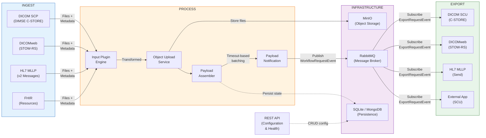

The gateway operates as a **three-phase pipeline**: Ingest, Process, and Export.

**Ingest** -- Four protocol-specific services (DICOM SCP, DICOMweb STOW-RS, HL7 MLLP, FHIR) accept data from clinical systems. Each service creates a `FileStorageMetadata` record for every file received. Despite the different protocols, all ingestion paths converge into the same processing pipeline -- this is the key architectural insight. A CT scanner sending via DIMSE and a web client posting via DICOMweb both end up in the same `PayloadAssembler`.

**Process** -- The Input Plugin Engine runs per-AE-Title plugin chains (e.g., anonymization, metadata enrichment) on each file. The `ObjectUploadService` uploads files to MinIO. The `PayloadAssembler` groups files by a correlation key (typically DICOM Study Instance UID) and uses timeout-based batching -- it waits for a configurable quiet period (default 5 seconds) before transitioning the Payload through its state machine (`Created` → `Move` → `Notify`). The `PayloadNotificationService` publishes a `WorkflowRequestEvent` to RabbitMQ, making the data available to downstream systems like the MONAI Workflow Manager.

**Export** -- Export services subscribe to `ExportRequestEvent` messages from RabbitMQ. Each export type (DICOM SCU, DICOMweb, HL7, External App) extends `ExportServiceBase`, which provides a 4-stage TPL Dataflow pipeline: Download → Output Plugins → Export → Report. This decoupled, event-driven design means the export path operates independently of ingestion -- they communicate only through the message broker.

**Infrastructure** cuts across all phases: MinIO stores file content, RabbitMQ decouples ingestion from export, and the database (SQLite or MongoDB, selected at deployment) persists configuration entities and payload state. The REST API provides CRUD operations for AE Titles, destinations, and health monitoring.

---

## 2. System Context

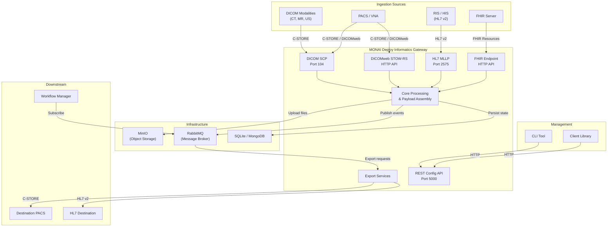

---

## 3. Solution Structure

### 3.1 Project Dependency Map

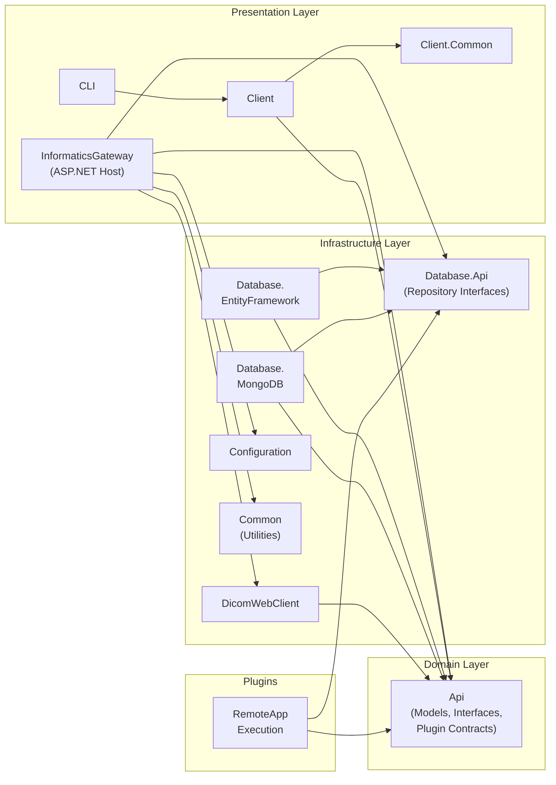

### 3.2 Dependency Inversion at Database Boundary

A key architectural decision: the host project (`InformaticsGateway`) and domain (`Api`) never reference a concrete database implementation. The `Database.Api` project defines repository interfaces, and the actual ORM is selected at runtime via configuration.

```mermaid
flowchart TB
    HOST["InformaticsGateway\n(Composition Root)"]
    DB_API["Database.Api\n(IPayloadRepository,\nIMonaiApplicationEntityRepository, ...)"]
    DB_EF["Database.EntityFramework\n(EF Core + SQLite)"]
    DB_MONGO["Database.MongoDB\n(MongoDB Driver)"]

    HOST -->|depends on| DB_API
    DB_EF -.->|implements| DB_API
    DB_MONGO -.->|implements| DB_API
    HOST -.->|runtime selection\nvia ConfigureDatabase()| DB_EF & DB_MONGO

    style DB_API fill:#e1f5fe,stroke:#0288d1
    style DB_EF fill:#fff3e0,stroke:#ef6c00
    style DB_MONGO fill:#fff3e0,stroke:#ef6c00
```

---

## 4. Core Domain Model

### 4.1 Application Entity Hierarchy

These entities represent the DICOM and virtual application entities that the gateway manages. Note that `MonaiApplicationEntity` and `VirtualApplicationEntity` extend `MongoDBEntityBase` directly (not `BaseApplicationEntity`), because they are MONAI-specific concepts rather than standard DICOM AEs.

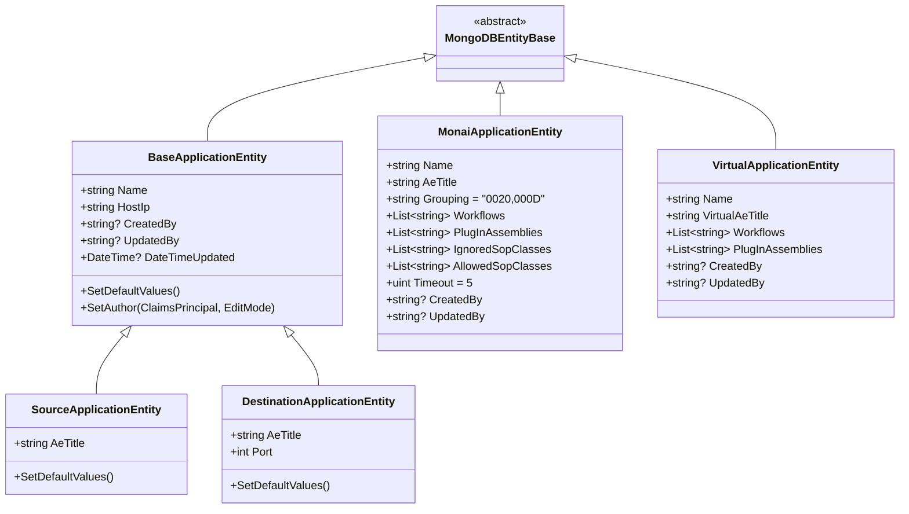

**Key distinction:**
- `SourceApplicationEntity` / `DestinationApplicationEntity` -- standard DICOM AE concepts (remote systems the gateway talks to)
- `MonaiApplicationEntity` -- the gateway's own SCP AE title, with workflow mapping and plugin configuration
- `VirtualApplicationEntity` -- DICOMweb-only virtual AE for STOW-RS endpoints

### 4.2 File Storage Metadata Hierarchy

`FileStorageMetadata` is an abstract record (value-type semantics) that tracks each ingested file. Subtypes add protocol-specific fields.

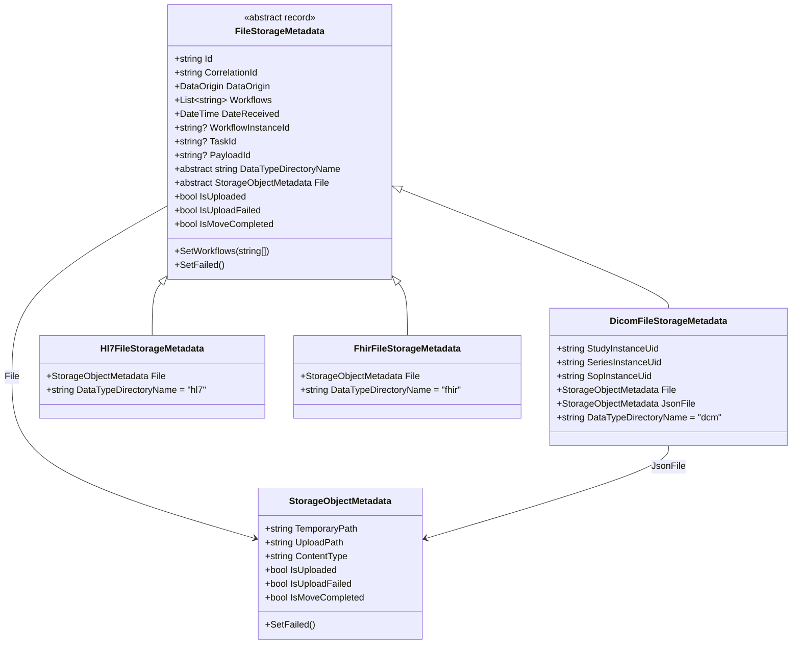

### 4.3 Payload -- State Machine

The `Payload` is the central batching unit. All ingestion protocols converge here. Files are grouped by a correlation key (e.g., DICOM Study UID), and a timeout triggers state transitions.

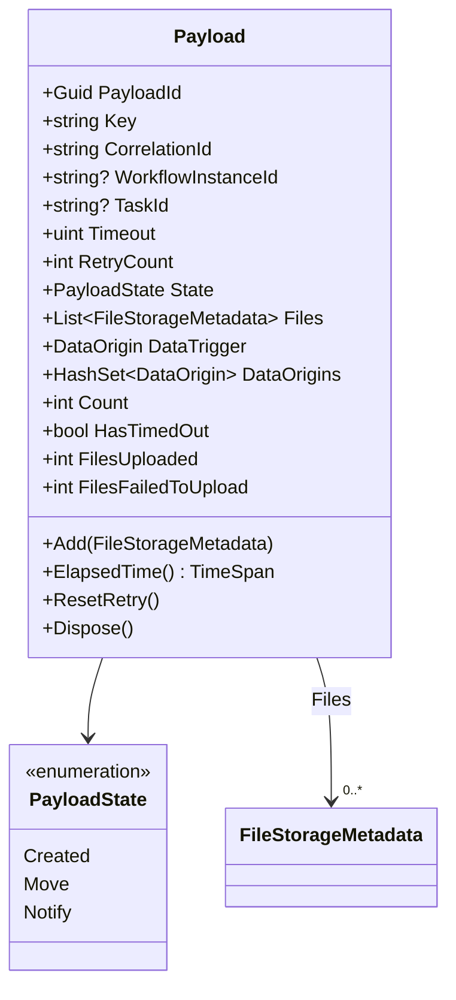

**State Transitions:**

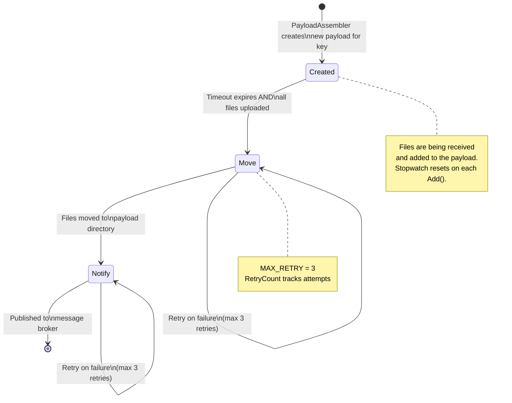

### 4.4 Export Domain Model

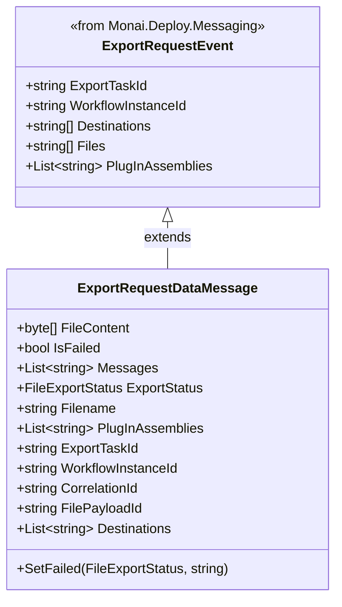

---

## 5. Service Architecture

### 5.1 Hosted Services Topology

All background services implement `IHostedService` and `IMonaiService` (which adds `ServiceStatus` and `ServiceName`). They are registered in `Program.cs` (lines 157-167).

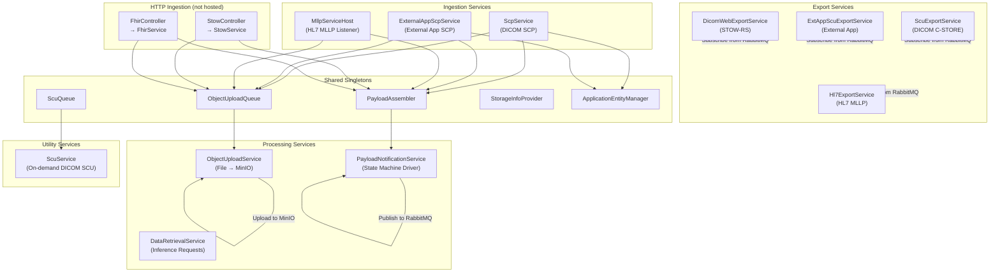

### 5.2 SCP Service Inheritance (Template Method)

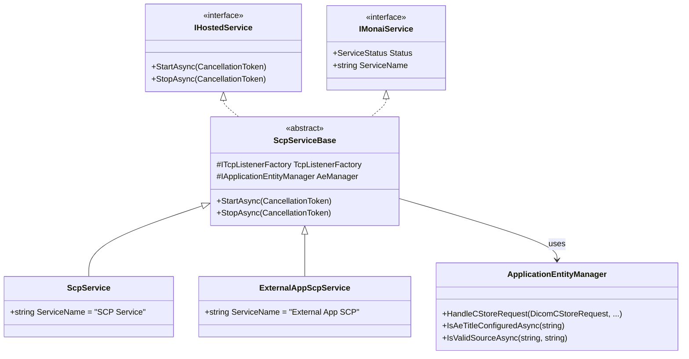

### 5.3 Export Service Inheritance (Template Method + TPL Dataflow)

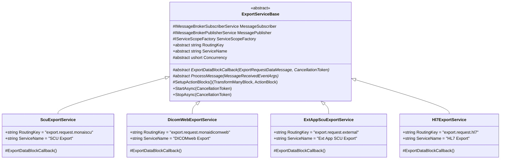

**TPL Dataflow Pipeline** (inside `SetupActionBlocks()`):

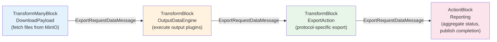

Each block runs with `MaxDegreeOfParallelism = Concurrency`. If a file fails at any stage, `IsFailed` is set and subsequent blocks skip processing (pass-through).

---

## 6. Data Flow

### 6.1 DICOM SCP Ingestion

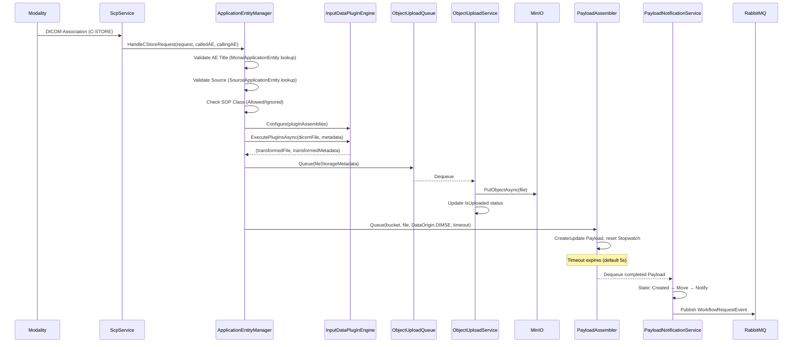

### 6.2 DICOMweb STOW-RS Ingestion

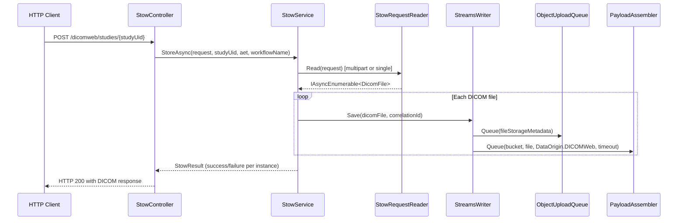

### 6.3 Export Flow (SCU Example)

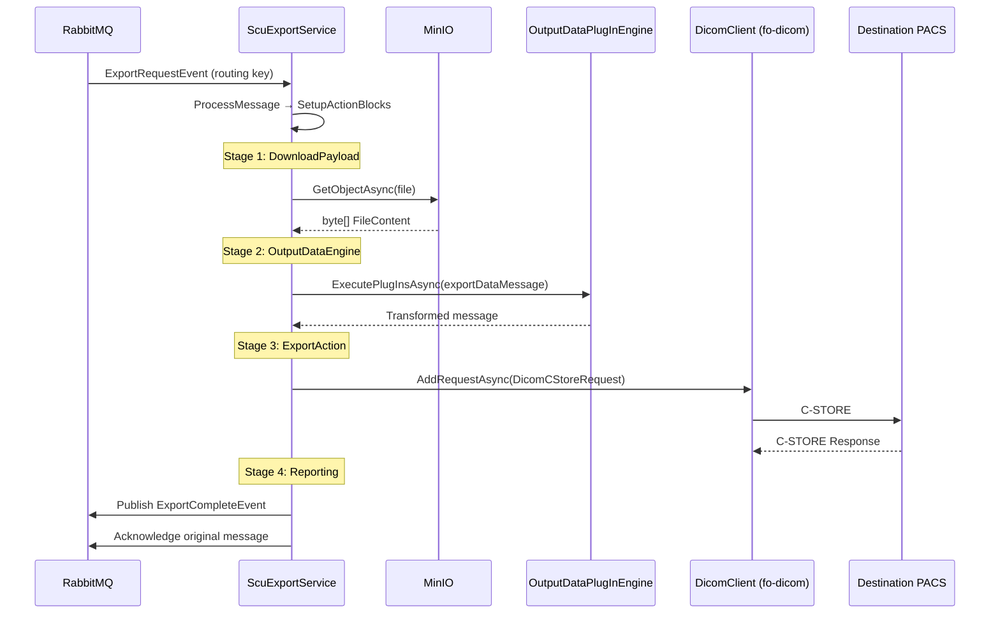

---

## 7. Repository Pattern

### 7.1 Dual ORM Implementation

Each repository interface has two implementations. Only 3 representative interfaces are shown below; the full system has **12 repository interfaces**.

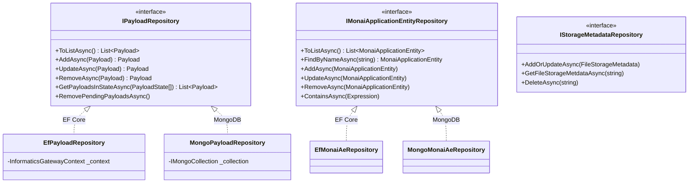

### 7.2 Database Provider Selection

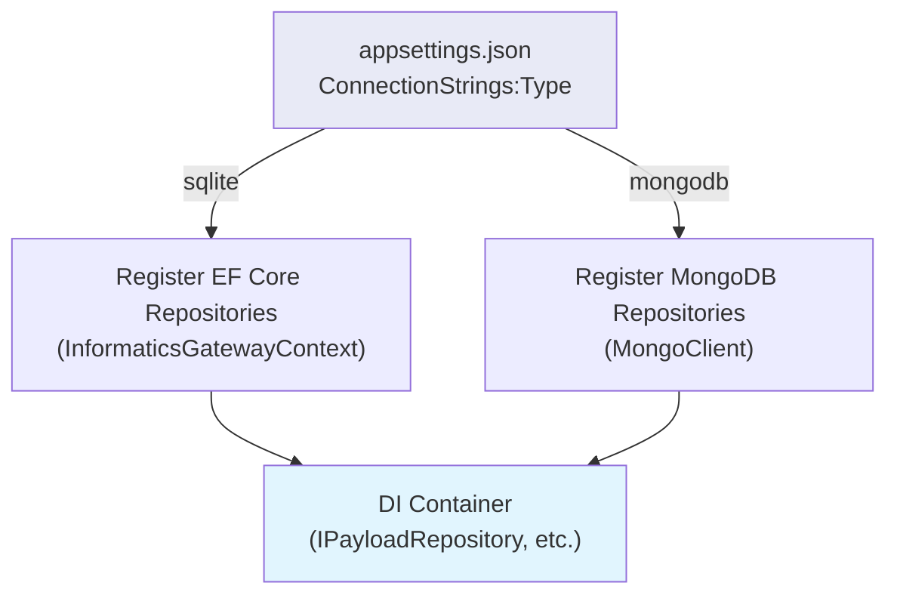

**All 12 repository interfaces:**

| Interface | Entity |
|-----------|--------|
| `IPayloadRepository` | Payload |
| `IMonaiApplicationEntityRepository` | MonaiApplicationEntity |
| `ISourceApplicationEntityRepository` | SourceApplicationEntity |
| `IDestinationApplicationEntityRepository` | DestinationApplicationEntity |
| `IVirtualApplicationEntityRepository` | VirtualApplicationEntity |
| `IInferenceRequestRepository` | InferenceRequest |
| `IStorageMetadataRepository` | FileStorageMetadata |
| `IDicomAssociationInfoRepository` | DicomAssociationInfo |
| `IHL7ApplicationConfigRepository` | Hl7ApplicationConfigEntity |
| `IHL7DestinationEntityRepository` | HL7DestinationEntity |
| `IExternalAppDetailsRepository` | ExternalAppDetails |
| `IRemoteAppExecutionRepository` | (Plugin-specific) |

---

## 8. Plugin System

Plugins provide a **Chain of Responsibility** pattern for data transformation. Each plugin receives the output of the previous one, enabling composable processing pipelines.

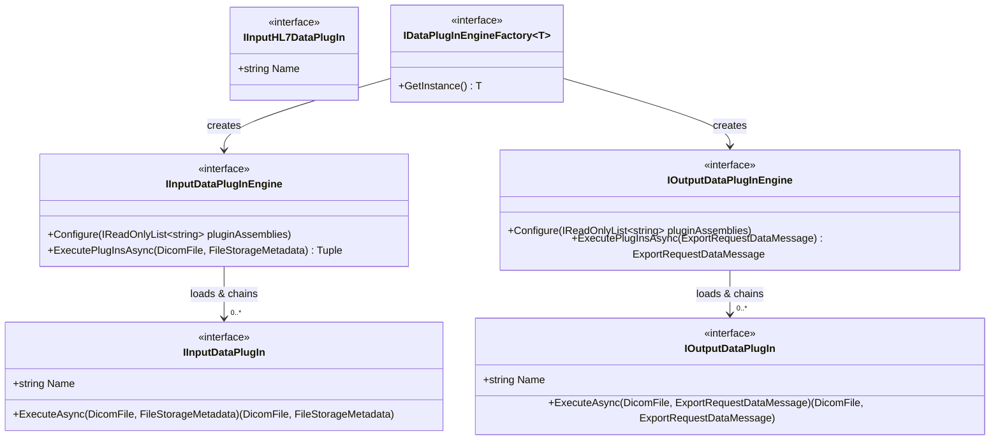

**Plugin execution flow:**
1. `Configure(assemblyNames)` -- dynamically loads plugin types from assembly names
2. `ExecutePlugInsAsync()` -- chains plugins sequentially, passing the transformed `(DicomFile, metadata)` tuple through each

**Built-in plugin:** `RemoteAppExecution` (in `src/Plug-ins/RemoteAppExecution/`) provides DICOM de-identification and re-identification for external AI applications.

---

## 9. Configuration Architecture

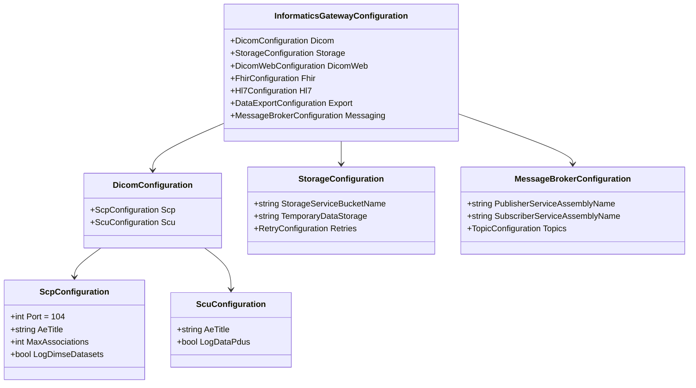

**Bound in `Program.cs` via:**
```csharp
services.AddOptions<InformaticsGatewayConfiguration>()
    .Bind(hostContext.Configuration.GetSection("InformaticsGateway"));
```

Validated at startup by `ConfigurationValidator` (implements `IValidateOptions<InformaticsGatewayConfiguration>`).

---

## 10. REST API Controllers

```mermaid
flowchart LR
    subgraph ae_config["AE Configuration"]
        MONAI_CTRL["MonaiAeTitleController\n/config/monai"]
        SRC_CTRL["SourceAeTitleController\n/config/source"]
        DEST_CTRL["DestinationAeTitleController\n/config/destination"]
        VAE_CTRL["VirtualAeTitleController\n/config/virtual"]
    end

    subgraph hl7_config["HL7 Configuration"]
        HL7_CFG["Hl7ApplicationConfigController\n/config/hl7"]
        HL7_DEST["HL7DestinationController\n/config/hl7/destination"]
    end

    subgraph operations["Operations"]
        INF_CTRL["InferenceController\n/inference"]
        ASSOC_CTRL["DicomAssociationInfoController\n/dicom/associations"]
    end

    subgraph data_ingestion["Data Ingestion"]
        STOW_CTRL["StowController\n/dicomweb"]
        FHIR_CTRL["FhirController\n/fhir"]
    end

    subgraph health["Health"]
        HEALTH_CTRL["HealthController\n/health"]
    end
```

All controllers follow standard ASP.NET Core patterns with constructor-injected dependencies, `[ApiController]` attribute, and model validation.

---

## 11. Dependency Injection

All services are registered in `Program.cs` (the **composition root**). Lifetimes are chosen based on service statefulness.

### Transient Services (new instance per injection)

| Interface | Implementation | Purpose |
|-----------|---------------|---------|
| `IFileSystem` | `FileSystem` | File I/O abstraction |
| `IDicomToolkit` | `DicomToolkit` | fo-dicom wrapper |
| `IStowService` | `StowService` | DICOMweb STOW-RS |
| `IFhirService` | `FhirService` | FHIR resource handling |
| `IStreamsWriter` | `StreamsWriter` | DICOM stream persistence |
| `IApplicationEntityHandler` | `ApplicationEntityHandler` | Per-association DICOM handler |
| `IMllpExtract` | `MllpExtract` | HL7 message extraction |

### Scoped Services (per-request / per-scope)

| Interface | Implementation | Purpose |
|-----------|---------------|---------|
| `IPayloadMoveActionHandler` | `PayloadMoveActionHandler` | Move payload files |
| `IPayloadNotificationActionHandler` | `PayloadNotificationActionHandler` | Publish payload events |
| `IInputDataPlugInEngine` | `InputDataPlugInEngine` | Input DICOM plugin chain |
| `IOutputDataPlugInEngine` | `OutputDataPlugInEngine` | Output plugin chain |
| `IInputHL7DataPlugInEngine` | `InputHL7DataPlugInEngine` | Input HL7 plugin chain |
| `IDataPlugInEngineFactory<T>` | `*PlugInEngineFactory` | Plugin engine creation |
| All repository interfaces | EF/MongoDB implementations | Data access |

### Singleton Services (one instance, application lifetime)

| Interface | Implementation | Purpose |
|-----------|---------------|---------|
| `IObjectUploadQueue` | `ObjectUploadQueue` | File upload work queue |
| `IPayloadAssembler` | `PayloadAssembler` | In-memory payload batching |
| `IMonaiServiceLocator` | `MonaiServiceLocator` | Service discovery |
| `IStorageInfoProvider` | `StorageInfoProvider` | Disk space monitoring |
| `IMonaiAeChangedNotificationService` | `MonaiAeChangedNotificationService` | AE change events |
| `ITcpListenerFactory` | `TcpListenerFactory` | TCP socket factory |
| `IMllpClientFactory` | `MllpClientFactory` | MLLP client factory |
| `IApplicationEntityManager` | `ApplicationEntityManager` | AE validation & routing |
| `IScuQueue` | `ScuQueue` | SCU work queue |
| `IMllpService` | `MllpService` | HL7 MLLP server |

### Hosted Services (11 background workers)

| Service | Category |
|---------|----------|
| `ObjectUploadService` | Processing |
| `DataRetrievalService` | Processing |
| `ScpService` | Ingestion |
| `ExternalAppScpService` | Ingestion |
| `ScuService` | Utility |
| `ExtAppScuExportService` | Export |
| `ScuExportService` | Export |
| `DicomWebExportService` | Export |
| `PayloadNotificationService` | Processing |
| `MllpServiceHost` | Ingestion |
| `Hl7ExportService` | Export |

---

## 12. Design Patterns Catalog

| Pattern | Where Applied | Key Classes |
|---------|---------------|-------------|
| **Template Method** | SCP and Export service hierarchies | `ScpServiceBase`, `ExportServiceBase` |
| **Repository** | Dual ORM data access | `Database.Api` interfaces, EF/MongoDB impls |
| **Chain of Responsibility** | Plugin execution pipelines | `IInputDataPlugIn`, `IOutputDataPlugIn` |
| **Factory** | Plugin engines, TCP listeners, MLLP clients | `IDataPlugInEngineFactory<T>`, `ITcpListenerFactory` |
| **State Machine** | Payload lifecycle | `Payload.PayloadState` (Created → Move → Notify) |
| **Observer** | AE configuration change notifications | `IMonaiAeChangedNotificationService` |
| **TPL Dataflow Pipeline** | Export processing with backpressure | `ExportServiceBase.SetupActionBlocks()` |
| **Dependency Injection** | All service composition | `Program.cs` (composition root) |
| **Strategy** | Database provider selection | `ConfigureDatabase()` selects EF or MongoDB |
| **Adapter** | Network abstractions | `ITcpClientAdapter`, `ITcpListenerFactory` |

---

## 13. SOLID Principles Mapping

### S -- Single Responsibility

Each hosted service has one focused responsibility. For example:
- `ObjectUploadService` -- only uploads files to MinIO
- `PayloadNotificationService` -- only drives the Payload state machine and publishes events
- `ExportServiceBase` handles pipeline orchestration; subclasses implement only protocol-specific export logic

### O -- Open/Closed

- **Plugin system:** New data transformations are added by implementing `IInputDataPlugIn` or `IOutputDataPlugIn` -- no modification to existing code required
- **Database providers:** New ORM backends can be added by implementing `Database.Api` interfaces without changing consumers

### L -- Liskov Substitution

- `SourceApplicationEntity` and `DestinationApplicationEntity` are fully substitutable for `BaseApplicationEntity` in repository and controller operations
- All `FileStorageMetadata` subtypes (`Dicom`, `Hl7`, `Fhir`) are handled uniformly by `ObjectUploadService` and `PayloadAssembler`

### I -- Interface Segregation

- Separate repository interfaces per aggregate root (`IPayloadRepository`, `IMonaiApplicationEntityRepository`, etc.) rather than one mega-repository
- Plugin interfaces are split by direction and protocol: `IInputDataPlugIn`, `IOutputDataPlugIn`, `IInputHL7DataPlugIn`

### D -- Dependency Inversion

- All services depend on abstractions registered in the DI container
- `Database.Api` defines interfaces; `Database.EntityFramework` and `Database.MongoDB` provide implementations
- External systems accessed via `IStorageService` (MinIO) and `IMessageBrokerPublisherService` / `IMessageBrokerSubscriberService` (RabbitMQ) -- the gateway never references concrete SDK types

---

## 14. External Dependencies

```mermaid
flowchart TB
    MIG["MONAI Deploy\nInformatics Gateway"]

    subgraph dicom["DICOM Protocol"]
        FODICOM["fo-dicom 5.x\n(FellowOakDicom)"]
    end

    subgraph messaging["Messaging"]
        MSG_LIB["Monai.Deploy.Messaging\n(abstraction)"]
        RABBIT_IMPL["Monai.Deploy.Messaging.\nRabbitMQ"]
    end

    subgraph storage["Storage"]
        STG_LIB["Monai.Deploy.Storage\n(abstraction)"]
        MINIO_IMPL["Monai.Deploy.Storage.\nMinIO"]
    end

    subgraph data["Data Access"]
        EF["Microsoft.\nEntityFrameworkCore 8.x"]
        MONGO_DRV["MongoDB.Driver"]
    end

    subgraph health_proto["Healthcare Protocols"]
        HL7["HL7-dotnetcore"]
    end

    subgraph web["Web Framework"]
        ASPNET["ASP.NET Core 8"]
        SWAGGER["Swashbuckle\n(Swagger/OpenAPI)"]
    end

    subgraph utilities["Utilities"]
        NLOG["NLog"]
        POLLY["Polly\n(Resilience)"]
        GUARD["Ardalis.GuardClauses"]
    end

    MIG --> FODICOM & MSG_LIB & STG_LIB & EF & MONGO_DRV & HL7 & ASPNET & SWAGGER & NLOG & POLLY & GUARD
    MSG_LIB --> RABBIT_IMPL
    STG_LIB --> MINIO_IMPL
```

---

*Document generated from source code analysis of the MONAI Deploy Informatics Gateway repository.*
