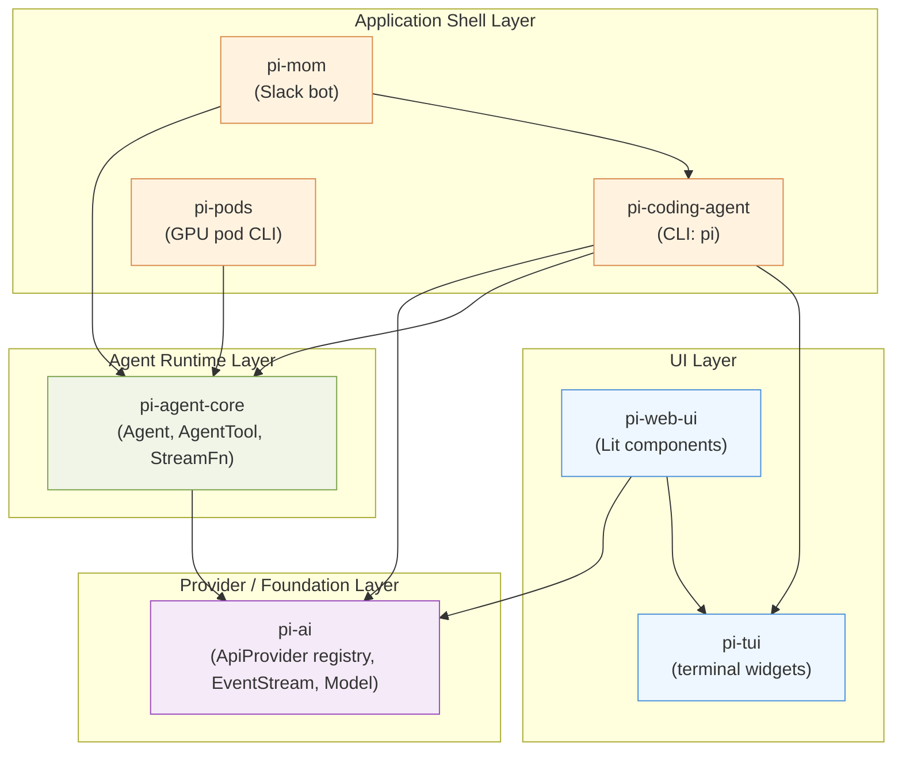
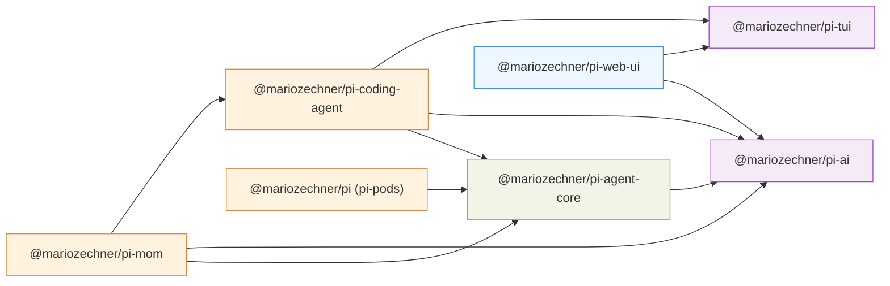
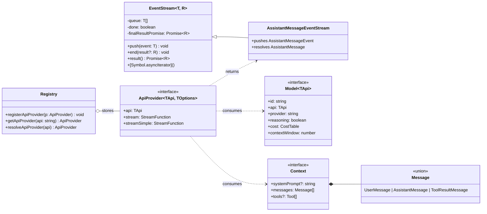
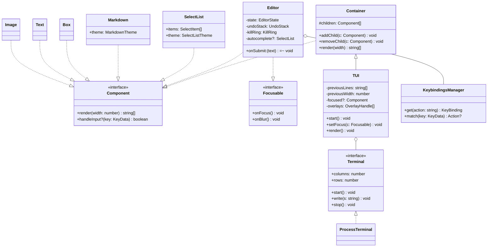
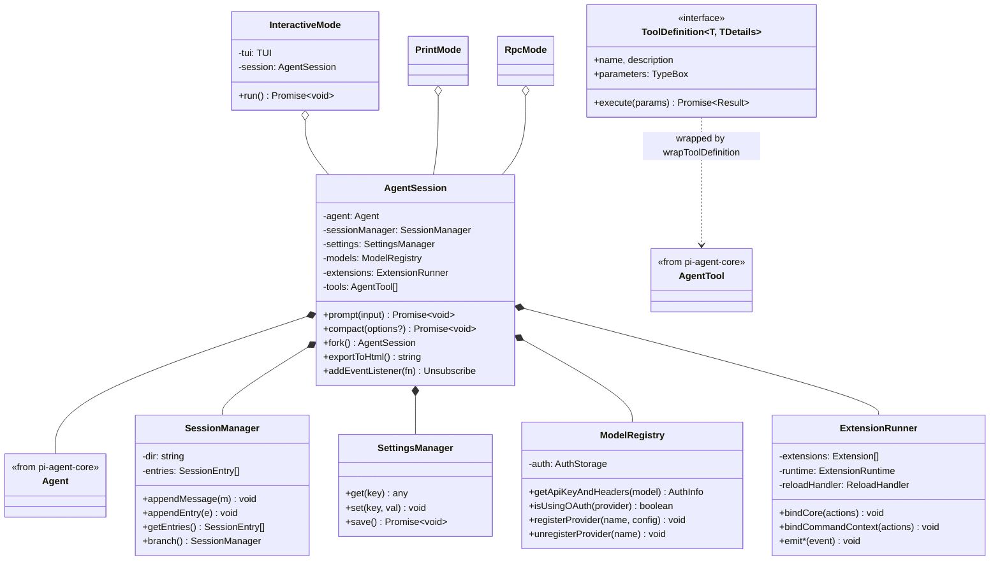
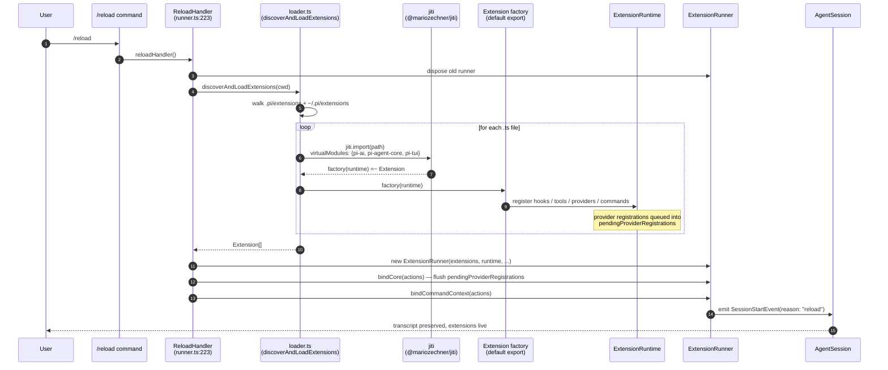
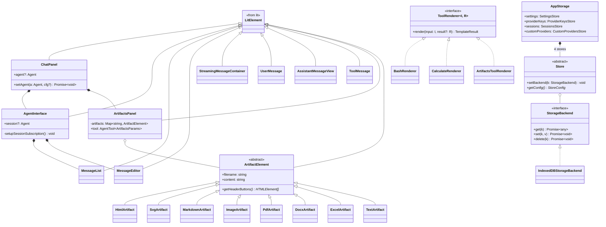
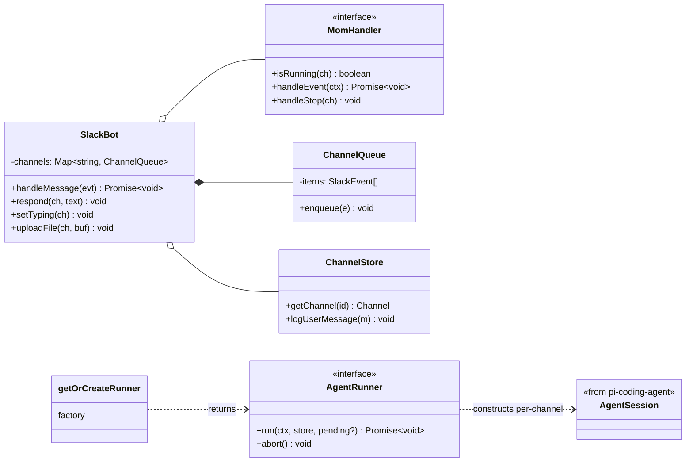
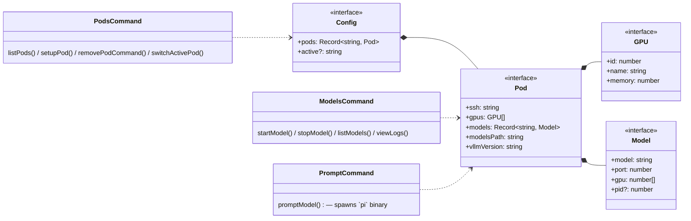
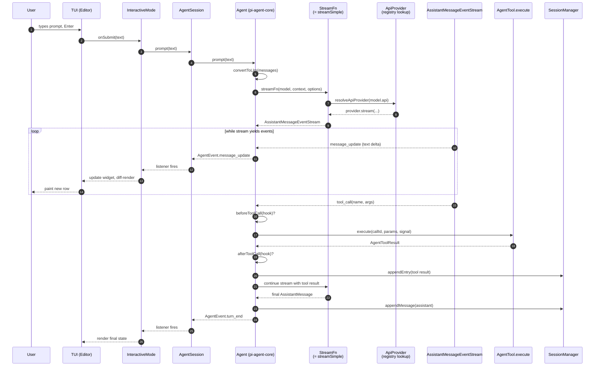

> An educational walkthrough of the class-level design of [pi-mono](https://github.com/badlogic/pi-mono), a TypeScript monorepo implementing a general-purpose LLM agent platform. Each section pairs prose that explains *why* an abstraction exists with a Mermaid diagram of the *shape* of that abstraction.

## Table of contents

- [Table of contents](#table-of-contents)
- [1. Overview](#1-overview)
- [2. Layered architecture (C4 component view)](#2-layered-architecture-c4-component-view)
- [3. Package dependency graph](#3-package-dependency-graph)
- [4. Foundation — `pi-ai`](#4-foundation--pi-ai)
  - [Class diagram](#class-diagram)
  - [Why function-based polymorphism?](#why-function-based-polymorphism)
  - [Stub Code Example (TS)](#stub-code-example-ts)
- [5. Foundation — `pi-tui`](#5-foundation--pi-tui)
  - [Class diagram](#class-diagram-1)
  - [Why dependency-injected themes?](#why-dependency-injected-themes)
- [6. Agent runtime — `pi-agent-core`](#6-agent-runtime--pi-agent-core)
  - [Class diagram](#class-diagram-2)
  - [Why composition over inheritance here?](#why-composition-over-inheritance-here)
- [7. Coding agent — `pi-coding-agent`](#7-coding-agent--pi-coding-agent)
  - [Class diagram](#class-diagram-3)
  - [Why one `AgentSession` and three modes?](#why-one-agentsession-and-three-modes)
  - [7a. Hot-reload user-configurable extensions](#7a-hot-reload-user-configurable-extensions)
    - [The whole pipeline in one sequence](#the-whole-pipeline-in-one-sequence)
    - [The six mechanisms behind the diagram](#the-six-mechanisms-behind-the-diagram)
    - [What an extension can do](#what-an-extension-can-do)
    - [Security model](#security-model)
- [8. Web UI — `pi-web-ui`](#8-web-ui--pi-web-ui)
  - [Class diagram](#class-diagram-4)
  - [Why Lit + abstract `ArtifactElement`?](#why-lit--abstract-artifactelement)
- [9. Application shells — `pi-mom` \& `pi-pods`](#9-application-shells--pi-mom--pi-pods)
  - [pi-mom: Slack → AgentSession](#pi-mom-slack--agentsession)
  - [pi-pods: Pod/Model/GPU as plain types](#pi-pods-podmodelgpu-as-plain-types)
- [10. End-to-end flow (sequence diagram)](#10-end-to-end-flow-sequence-diagram)
- [11. Recurring design patterns](#11-recurring-design-patterns)
- [12. Reading-the-code map](#12-reading-the-code-map)

---

## 1. Overview

**pi-mono** is a monorepo of seven npm workspaces that together form a layered LLM agent platform. From bottom up:

| Package | npm name | Role |
|---|---|---|
| `ai` | `@mariozechner/pi-ai` | Unified LLM API with pluggable provider registry and streaming event abstraction |
| `tui` | `@mariozechner/pi-tui` | Component-based terminal UI library with differential rendering |
| `agent` | `@mariozechner/pi-agent-core` | Stateful `Agent` runtime with swappable transport, tool hooks, and event lifecycle |
| `coding-agent` | `@mariozechner/pi-coding-agent` | CLI coding agent (`pi`) with sessions, extensions, and interactive/print/RPC modes |
| `web-ui` | `@mariozechner/pi-web-ui` | Lit-based web components for chat UI, artifact rendering, and IndexedDB storage |
| `mom` | `@mariozechner/pi-mom` | Slack bot that delegates channel messages to a coding-agent session |
| `pods` | `@mariozechner/pi` | CLI for managing vLLM deployments on GPU pods (`pi-pods`) |

**Recommended reading order**: start with §2-§3 for the macro picture, then §4-§6 for the foundation, then §7 (and especially §7a on extensions — the system's most distinctive feature), and finally §8-§10 for the application shells and end-to-end flow. §11-§12 are reference material.

---

## 2. Layered architecture (C4 component view)

The seven packages cluster into four architectural layers. Each layer depends only on layers below it; the `ai` package has no internal dependencies at all.



**Why this shape?** The `ai` package deliberately exposes *no* base `Provider` class — instead it owns a registry of `ApiProvider<TApi>` records whose behavior is encoded in plain functions (see §4). Because it is function-valued, not class-valued, every upstream package can consume a new provider without subclassing. The `agent` layer then elevates those stream functions into a single type alias `StreamFn`, which `coding-agent` and `pods` and `mom` pass around without knowing how it routes under the hood. That is the entire substance of the layering: *data flows up by types, plugins flow in by registration*.

---

## 3. Package dependency graph

The same information as §2 but restricted to runtime `dependencies` declared in each `package.json`, so you can verify it by hand:



Two observations worth internalising:

- `pods` depends *only* on `agent-core` for types — it invokes the `pi` binary as a subprocess rather than linking against `pi-coding-agent`. Infrastructure tooling stays decoupled from interactive tooling.
- `mom` is the only package that reaches across *three* layers (`ai` + `agent-core` + `coding-agent`). It pays that cost because it must reuse the coding agent's persistence, settings, and tool set while also speaking the agent-event vocabulary directly to stream replies back to Slack.

---

## 4. Foundation — `pi-ai`

`pi-ai` answers the question *"how do I talk to a dozen different LLM APIs with one code path?"* It chooses two non-obvious answers:

1. **No base `Provider` class.** Each provider module (Anthropic, OpenAI, Google, Mistral, Bedrock, …) exports two plain functions: `streamX()` and `streamSimpleX()`. A central registry maps API identifier strings (`"anthropic-messages"`, `"openai-completions"`, …) to an `ApiProvider<TApi, TOptions>` record that holds those functions. Callers invoke `stream(model, context, options)`, which looks up the provider by `model.api` and calls its `stream` function.

2. **`EventStream<T, R>` as a shared async-iterable primitive.** Every provider returns an `AssistantMessageEventStream` — a subclass of the generic `EventStream<AssistantMessageEvent, AssistantMessage>` — so consumers only ever write one kind of `for await` loop regardless of which provider is underneath.

### Class diagram



Breif Diagram

```
Architecture Overview (from diagram):

  Registry ◇--stores--> ApiProvider<TApi, TOptions>
                             |
                 +-----------+-----------+
                 |                       |
            consumes                consumes
                 |                       |
          Model<TApi>              Context ◆--> Message (union)
                                   
  ApiProvider --returns--> AssistantMessageEventStream
                                   |
                              extends
                                   |
                           EventStream<T, R>
```

How the component fits:

```
                        main()
                          |
           1. registerApiProvider(anthropicProvider)
                          |
                      Registry
                     /providers/
                          |
           2. resolveApiProvider("anthropic")
                          |
                    ApiProvider
                     .stream()
                       |   |
                 Model<>  Context{ messages, tools }
                       |
            AssistantMessageEventStream
                       |
          +------------+-------------+
          |                          |
   for await (event)          await .result()
   (text-delta, done)        → AssistantMessage

```

### Why function-based polymorphism?

An abstract `Provider` base class would have forced every provider to share a lifecycle (`constructor`, `dispose`, etc.) and a single inheritance root. In practice, providers differ wildly: Anthropic streams typed events, OpenAI Chat Completions streams SSE chunks, Bedrock requires AWS SigV4 signing. By making the *unit of polymorphism* a function pair rather than a class, each provider module is free to organise its internals however it wants — and adding a new provider is a single call to `registerApiProvider()` (see `providers/register-builtins.ts:345`) with no class hierarchy to slot into.

The `EventStream<T, R>` primitive is the dual insight: different providers produce very different raw wire formats, but they all *consume the same way* — push-into-queue, await-on-iterator, resolve-a-final-result. Encoding that shape once means the `Agent` runtime never branches on provider identity.

### Stub Code Example (TS)

```ts
// ============================================================
// pi-ai Architecture — Stub Implementation
// ============================================================

// ------------------------------------------------------------
// 1. Message (Union Type)
// ------------------------------------------------------------

interface UserMessage {
  role: "user";
  content: string;
}

interface AssistantMessage {
  role: "assistant";
  content: string;
  toolCalls?: ToolCall[];
}

interface ToolResultMessage {
  role: "tool";
  toolCallId: string;
  result: unknown;
}

/** Union of all message types flowing through the system */
type Message = UserMessage | AssistantMessage | ToolResultMessage;

// ------------------------------------------------------------
// 2. Supporting Types
// ------------------------------------------------------------

interface Tool {
  name: string;
  description: string;
  parameters: Record<string, unknown>;
}

interface ToolCall {
  id: string;
  name: string;
  arguments: Record<string, unknown>;
}

interface CostTable {
  inputPerToken: number;
  outputPerToken: number;
}

/** Events emitted while streaming an assistant response */
interface AssistantMessageEvent {
  type: "text-delta" | "tool-call-delta" | "done";
  delta?: string;
}

// ------------------------------------------------------------
// 3. Context (Interface)
// ------------------------------------------------------------

interface Context {
  systemPrompt?: string;
  messages: Message[];
  tools?: Tool[];
}

// ------------------------------------------------------------
// 4. Model<TApi> (Interface)
// ------------------------------------------------------------

interface Model<TApi extends string = string> {
  id: string;
  api: TApi;
  provider: string;
  reasoning: boolean;
  cost: CostTable;
  contextWindow: number;
}

// ------------------------------------------------------------
// 5. EventStream<T, R> — Generic async-iterable stream
// ------------------------------------------------------------
//
//  Producers call:   push(event)  → enqueue an event
//                    end(result?) → signal completion
//
//  Consumers use:    for await (const event of stream) { ... }
//                    const final = await stream.result();
//

class EventStream<T, R> {
  // --- private state ---
  private queue: T[] = [];
  private done: boolean = false;
  private finalResultPromise: Promise<R>;

  private resolveResult!: (value: R) => void;
  private waiting: ((value: IteratorResult<T>) => void) | null = null;

  constructor() {
    this.finalResultPromise = new Promise<R>((resolve) => {
      this.resolveResult = resolve;
    });
  }

  // --- public API ---

  /** Enqueue an event for consumers */
  push(event: T): void {
    if (this.done) return;

    // If a consumer is already waiting, deliver immediately
    if (this.waiting) {
      const resolve = this.waiting;
      this.waiting = null;
      resolve({ value: event, done: false });
    } else {
      this.queue.push(event);
    }
  }

  /** Signal that the stream is complete */
  end(result?: R): void {
    this.done = true;

    // Resolve the final-result promise
    this.resolveResult(result as R);

    // If a consumer is waiting, tell it we're done
    if (this.waiting) {
      const resolve = this.waiting;
      this.waiting = null;
      resolve({ value: undefined as any, done: true });
    }
  }

  /** Await the final aggregated result after the stream ends */
  result(): Promise<R> {
    return this.finalResultPromise;
  }

  /** Makes the stream usable with  `for await...of` */
  [Symbol.asyncIterator](): AsyncIterator<T> {
    return {
      next: (): Promise<IteratorResult<T>> => {
        // Drain buffered events first
        if (this.queue.length > 0) {
          return Promise.resolve({
            value: this.queue.shift()!,
            done: false,
          });
        }
        // Stream already finished
        if (this.done) {
          return Promise.resolve({
            value: undefined as any,
            done: true,
          });
        }
        // Park until push() or end() is called
        return new Promise((resolve) => {
          this.waiting = resolve;
        });
      },
    };
  }
}

// ------------------------------------------------------------
// 6. AssistantMessageEventStream
//    — Concrete stream: pushes events, resolves a full message
// ------------------------------------------------------------

class AssistantMessageEventStream extends EventStream<
  AssistantMessageEvent,  // T  — events pushed during streaming
  AssistantMessage         // R  — final aggregated result
> {}

// ------------------------------------------------------------
// 7. StreamFunction & ApiProvider<TApi, TOptions> (Interface)
// ------------------------------------------------------------

type StreamFunction = (
  model: Model,
  context: Context,
  options?: Record<string, unknown>
) => AssistantMessageEventStream;

interface ApiProvider<
  TApi extends string = string,
  TOptions = Record<string, unknown>
> {
  api: TApi;
  stream: StreamFunction;
  streamSimple: StreamFunction;
}

// ------------------------------------------------------------
// 8. Registry — Stores and resolves ApiProviders
// ------------------------------------------------------------

class Registry {
  private providers = new Map<string, ApiProvider>();

  registerApiProvider(p: ApiProvider): void {
    this.providers.set(p.api, p);
  }

  getApiProvider(api: string): ApiProvider {
    const provider = this.providers.get(api);
    if (!provider) {
      throw new Error(`No provider registered for api "${api}"`);
    }
    return provider;
  }

  resolveApiProvider(api: string): ApiProvider {
    // Could add fallback / alias logic here
    return this.getApiProvider(api);
  }
}

// ============================================================
// EXAMPLE USAGE
// ============================================================

// --- Define a concrete provider (e.g. Anthropic) ---

const anthropicProvider: ApiProvider<"anthropic"> = {
  api: "anthropic",

  stream(model, context, _options) {
    const eventStream = new AssistantMessageEventStream();

    // Simulate async streaming from an API
    setTimeout(() => {
      eventStream.push({ type: "text-delta", delta: "Hello, " });
    }, 50);
    setTimeout(() => {
      eventStream.push({ type: "text-delta", delta: "world!" });
    }, 100);
    setTimeout(() => {
      eventStream.push({ type: "done" });
      eventStream.end({
        role: "assistant",
        content: "Hello, world!",
      });
    }, 150);

    return eventStream;
  },

  streamSimple(model, context, _options) {
    return this.stream(model, context, _options);
  },
};

// --- Define a model descriptor ---

const claude: Model<"anthropic"> = {
  id: "claude-sonnet-4-20250514",
  api: "anthropic",
  provider: "anthropic",
  reasoning: true,
  cost: { inputPerToken: 0.003, outputPerToken: 0.015 },
  contextWindow: 200_000,
};

// --- Wire it all together ---

async function main() {
  // 1. Registry setup
  const registry = new Registry();
  registry.registerApiProvider(anthropicProvider);

  // 2. Build a Context
  const context: Context = {
    systemPrompt: "You are a helpful assistant.",
    messages: [{ role: "user", content: "Say hello!" }],
    tools: [],
  };

  // 3. Resolve the provider and stream
  const provider = registry.resolveApiProvider(claude.api);
  const stream = provider.stream(claude, context);

  // 4. Consume events as they arrive
  for await (const event of stream) {
    if (event.type === "text-delta") {
      process.stdout.write(event.delta ?? "");
    }
  }

  // 5. Get the final assembled message
  const finalMessage = await stream.result();
  console.log("\n\nFinal:", finalMessage);
}

main().catch(console.error);
```

---

## 5. Foundation — `pi-tui`

`pi-tui` is a component-oriented terminal-UI library in the spirit of React or Flutter, but rendered by writing ANSI directly to stdout. Two design choices dominate:

1. **`Component` is an interface, not a class.** Widgets declare what they render (`render(width): string[]`) and optionally opt into focus via a `Focusable` mixin. There is no giant base class with lifecycle hooks — concrete components compose other components and store their own state.

2. **Differential rendering in `TUI`.** The top-level `TUI` container keeps the previous frame's rendered lines and, on each repaint, writes only the rows that changed. This keeps flicker away and makes streaming output cheap.

### Class diagram



### Why dependency-injected themes?

Each styling-aware component (`Editor`, `SelectList`, `Markdown`, `Box`, …) accepts its own theme object at construction. There is no global theme singleton. This makes it trivial for a coding-agent extension to spin up an overlay widget with bespoke colours without polluting the rest of the UI, and it keeps the library usable as a plain component toolkit rather than an opinionated framework.

The `Focusable` *interface mixin* (not a superclass) captures the fact that focus behaviour is orthogonal to rendering — a `Text` widget renders but cannot hold focus, an `Editor` does both. Mixin-style interfaces avoid the classic multi-inheritance problem without losing the type signalling.

---

## 6. Agent runtime — `pi-agent-core`

This is where a chat turn becomes a state machine. The `Agent` class wraps a transcript of `AgentMessage`s, a list of `AgentTool`s, and a current `Model`, and exposes methods to `prompt()`, `continue()`, `steer()`, and `followUp()`. Everything else — transport, persistence, UI — is passed in from the outside.

The key abstraction is **`StreamFn`**: a type alias matching the signature of `streamSimple` from `pi-ai`. The default value *is* `streamSimple` (direct API calls); an alternative `streamProxy` routes through an HTTP proxy server. Because the transport is a plain function value on an `Agent` instance, swapping transports is one assignment, not a subclass.

### Class diagram

```mermaid
classDiagram
    direction TB

    class Agent {
        -_state: MutableAgentState
        -listeners: Set~AgentListener~
        -steeringQueue: PendingMessageQueue
        -followUpQueue: PendingMessageQueue
        +streamFn: StreamFn
        +convertToLlm: (AgentMessage[]) Message[]
        +transformContext?: (AgentMessage[]) Promise~AgentMessage[]~
        +beforeToolCall?: BeforeToolCallHook
        +afterToolCall?: AfterToolCallHook
        +prompt(m, images?) Promise~void~
        +continue() Promise~void~
        +subscribe(listener) Unsubscribe
        +steer(m) void
        +followUp(m) void
        +abort() void
        +waitForIdle() Promise~void~
        +reset() void
        +state: AgentState
    }

    class AgentState {
        <<interface>>
        +systemPrompt: string
        +model: Model~any~
        +thinkingLevel: string
        +tools: AgentTool[]
        +messages: AgentMessage[]
        +isStreaming: boolean
        +streamingMessage?: AgentMessage
        +pendingToolCalls: ReadonlySet~string~
        +errorMessage?: string
    }

    class MutableAgentState {
        +tools (copy-on-assign)
        +messages (copy-on-assign)
    }
    AgentState <|.. MutableAgentState

    class PendingMessageQueue {
        -items: AgentMessage[]
        -mode: "all" | "one-at-a-time"
        +enqueue(m) void
        +drain() AgentMessage[]
    }
    Agent *-- MutableAgentState
    Agent *-- PendingMessageQueue

    class StreamFn {
        <<type>>
        (model, context, options?) AssistantMessageEventStream
    }
    Agent ..> StreamFn : calls

    class AgentTool~TParams, TDetails~ {
        <<interface>>
        +name: string
        +label: string
        +description: string
        +parameters: TParams
        +prepareArguments?(args) TParams
        +execute(id, params, signal?, cb?) Promise~AgentToolResult~
    }
    class PiAiTool {
        <<from pi-ai>>
    }
    PiAiTool <|-- AgentTool
    Agent o-- AgentTool

    class AgentEvent {
        <<union>>
        agent_start | agent_end | turn_start | turn_end | message_start | message_update | message_end | tool_execution_start | tool_execution_update | tool_execution_end
    }
    Agent ..> AgentEvent : emits

    class ProxyMessageEventStream {
        reconstructs AssistantMessage from proxy deltas
    }
    class AssistantMessageEventStream
    AssistantMessageEventStream <|-- ProxyMessageEventStream
```

### Why composition over inheritance here?

The `Agent` class has no subclasses anywhere in the monorepo. Instead, every variable thing (transport, message conversion, tool-call hooks, custom message types) is injected as a field. That design pays off in three places:

- **Transport swapping** — `agent.streamFn = streamProxy` is enough to route all subsequent calls through the proxy server, with zero `if (proxy) …` branching.
- **Custom message types** via TypeScript declaration merging: apps extend the `CustomAgentMessages` interface, and `AgentMessage` becomes their union automatically (`types.ts:245`). `pi-web-ui` uses this to introduce `ArtifactMessage`.
- **Tool hooks** — `beforeToolCall` / `afterToolCall` let an extension veto, rewrite, or augment a tool call without the `Agent` knowing that the hook exists.

Contrast this with a hypothetical `class ProxyAgent extends Agent`: it would have locked transport into the inheritance axis and prevented independent variation along the message-type and hook axes.

---

## 7. Coding agent — `pi-coding-agent`

The coding agent is a node/bun CLI whose binary name is `pi`. Its public type is **`AgentSession`**, a higher-level orchestrator that composes:

- an `Agent` from `pi-agent-core` (the turn-level state machine),
- a `SessionManager` that appends events to a JSONL file under `~/.pi/sessions/<id>/`,
- a `SettingsManager` for hierarchical (global/project) config,
- a `ModelRegistry` that resolves API keys and OAuth tokens,
- an `ExtensionRunner` (see §7a),
- a set of built-in `AgentTool`s (Read, Bash, Edit, Write, Grep, Find, Ls) wrapped from `ToolDefinition`s via `wrapToolDefinition`.

Three UI-driven **modes** (`InteractiveMode`, `PrintMode`, `RpcMode`) share one `AgentSession` and differ only in how they pump input in and paint output out. That is the single most important decision in this package: business logic lives in `AgentSession`; modes are thin I/O adapters.

### Class diagram



### Why one `AgentSession` and three modes?

Three outputs (rich TUI, plain stdout JSON, JSON-RPC stdio server) sounds like three programs. Pulling the shared concerns — persistence, settings, tool registry, extension lifecycle — into `AgentSession` means tests, session files, and extensions behave identically regardless of which mode boots the process. This is textbook **strategy pattern**: the session is the context, the modes are the strategies.

---

### 7a. Hot-reload user-configurable extensions

Every feature beyond the minimum coding-agent loop — custom tools, custom providers, overlays, slash commands, compaction strategies — is implemented as an **extension**: a TypeScript file dropped into `.pi/extensions/` (per-project) or `~/.pi/extensions/` (global). Extensions are compiled **at runtime** by `@mariozechner/jiti`, which means users edit `.ts` files and run them with *zero build step*. The same source runs unmodified under `node` in dev and under the compiled Bun single-file binary in production.

#### The whole pipeline in one sequence



#### The six mechanisms behind the diagram

1. **Discovery** — `discoverExtensionsInDir()` (`loader.ts:474`) enumerates `.ts` files in the per-project and global extensions directories. The aggregator `discoverAndLoadExtensions()` (around `loader.ts:532`) merges both lists and hands them to `loadExtensions()`.

2. **JIT TypeScript via jiti with `virtualModules`** — `loadExtensionModule()` (`loader.ts:292`) creates a `jiti` instance using the `@mariozechner/jiti` fork and passes `tryNative: false` so jiti handles *every* import inside the extension, not just the entry file. The critical knob is `virtualModules`: in the compiled Bun single-file binary, there is no `node_modules/@mariozechner/pi-ai` on disk — those foundation packages are *baked into the binary* and exposed as virtual modules to jiti. Extensions therefore can `import { Agent } from "@mariozechner/pi-agent-core"` identically in dev and prod. In plain-node dev mode, jiti instead uses normal aliases (`loader.ts:55`).

3. **Factory contract** — each extension's `default` export is a factory of type `(runtime: ExtensionRuntime) => Extension` (see `loadExtensionFromFactory` at `loader.ts:357`). The factory is synchronous with respect to registration: it wires hooks, tools, commands, widgets, or providers onto the shared `runtime` object and returns a manifest.

4. **The runtime is a shared mutable seam** — `ExtensionRuntime` is a plain object passed by reference to every factory. `ExtensionRunner.bindCore()` (`runner.ts:243`) is what fills it with the *real* action callbacks once the core of `AgentSession` is ready. During load time the runtime is intentionally partial: if an extension calls `runtime.registerProvider(name, config)` before `bindCore`, the call is queued into `pendingProviderRegistrations`. Once `bindCore()` runs, the queue drains (`runner.ts:279-295`) and — per the comment at `runner.ts:297` — from that moment on, `registerProvider` / `unregisterProvider` take effect **immediately, with no `/reload` needed**. This is why you can write an extension that adds a provider dynamically in response to a user action.

5. **Reload is user-triggered, not watched** — there is deliberately *no* filesystem watcher. Reload is a slash command (`/reload`) wired to `reloadHandler` (`runner.ts:223`, bound at line 322, exposed to extensions via `types.ts:1411`). When a user invokes it, the old runner is disposed, `discoverAndLoadExtensions()` runs again with a fresh jiti cache, every factory re-executes, the runtime is rebuilt, and extensions receive a `SessionStartEvent` whose `reason` field (`types.ts:448`) is `"reload"` rather than `"startup"`. The transcript is preserved across the reload; only the extension graph is rebuilt.

6. **Why not a file watcher?** A watcher would re-run factories in the middle of a turn, breaking referential integrity of hooks that the active `Agent` call has already closed over — and potentially replacing a tool mid-execution. Tying reload to an explicit command gives extensions a clean boundary to observe (`agent_end` / `session_end` fires, then `reload` happens, then `session_start(reason:"reload")` fires) and makes the system predictable to reason about.

#### What an extension can do

From `extensions/types.ts`:

- **Event hooks** — `before_agent_start`, `agent_start`, `message_start`, `message_update`, `tool_call`, `tool_execution_start`, `tool_execution_end`, `agent_end`, `session_start`, `session_end`, …
- **Tool registration** — `runtime.registerTool(def)` adds an `AgentTool` to the session.
- **Slash command registration** — `runtime.registerCommand({ name, handler })`.
- **Provider registration** — `runtime.registerProvider(name, config)` adds a custom LLM endpoint (see the `custom-provider-anthropic`, `custom-provider-gitlab-duo`, `custom-provider-qwen-cli` example workspaces listed in the root `package.json`).
- **UI** — `runtime.setWidget()`, `runtime.setFooter()`, `runtime.setHeader()`, `runtime.confirm()`, overlays.
- **Transcript surgery** — `sendMessage`, `sendUserMessage`, `appendEntry`, custom compaction.

See the 70+ example extensions under `packages/coding-agent/examples/extensions/` for idioms. `reload-runtime.ts` is the reference example for the reload lifecycle itself.

#### Security model

Extensions run in the main process with full Node privileges. The trust model is *same as shell dotfiles*: you only get an extension if you placed its source under your own config directory. There is no sandbox, no permission prompt on install, no signature check. This is a deliberate trade-off for power-user ergonomics — worth knowing before you `curl | sh` somebody else's extension.

---

## 8. Web UI — `pi-web-ui`

The web UI is a set of Lit custom elements that can be composed into an agent chat application. It is a **consumer** of `pi-ai` types (`Message`, `AssistantMessage`, `ToolCall`, `Usage`, `Model`) and `pi-agent-core` types (`Agent`, `AgentTool`, `AgentEvent`) — it does not reimplement the agent loop. The signature entry point is `ChatPanel`, which you inject an `Agent` into and which then renders transcripts, streams, tool calls, and artifacts.

### Class diagram



### Why Lit + abstract `ArtifactElement`?

Lit is chosen over React because the package wants to be drop-in into *any* web host (a documentation site, an Electron shell, a VS Code webview) with no framework coupling — a custom element works anywhere the DOM does.

`ArtifactElement` is the one *abstract class* in the entire monorepo that is used as a real inheritance root. Each artifact type (HTML, SVG, PDF, DOCX, …) has genuinely different rendering requirements — PDF needs `pdfjs-dist`, DOCX needs `docx-preview`, HTML needs a sandboxed iframe — and they all share the same panel contract (filename, header buttons, content accessor). Inheritance earns its keep here because the *axis of variation is single* (file format) and the shared surface is non-trivial.

`AppStorage` is a **facade over four stores**, each of which is an abstract repository over a pluggable `StorageBackend` (only `IndexedDBStorageBackend` is shipped, but the abstraction is there for Electron/file-system backends).

---

## 9. Application shells — `pi-mom` & `pi-pods`

### pi-mom: Slack → AgentSession



A Slack message enters `SlackBot.handleMessage()`, gets queued per channel (to keep responses sequential), and dispatched through `MomHandler.handleEvent()` into an `AgentRunner` returned by the `getOrCreateRunner()` factory. The runner owns a long-lived `AgentSession` per channel, persisted under `~/.mom/<workspace>/channels/<channel-id>/`. Mom's custom tools (e.g. `uploadFile`) are mixed in alongside the built-in coding-agent tools when the session is created.

### pi-pods: Pod/Model/GPU as plain types

`pi-pods` is the simplest package — it is a CLI wrapper around SSH-to-GPU-box operations. It uses plain types and free functions, not classes, because there is no long-lived object graph to reason about; each CLI invocation reads `~/.pi/pods.json`, performs a single action, and exits.



Note that `PromptCommand` shells out to the `pi` coding-agent binary rather than importing it — this is how the pods CLI stays a thin infrastructure tool without pulling in the entire agent runtime.

---

## 10. End-to-end flow (sequence diagram)

One picture tying §4-§7 together: a user types a prompt in the TUI, a tool call fires, and the streamed result lands back on screen.



Three things to notice in this picture:

- **The only package-specific participants are `TUI` and `InteractiveMode`.** Swap them for a Lit `AgentInterface` or a Slack `SlackBot`, and the rest of the sequence is byte-identical. That is what the layer separation buys.
- **Persistence is a passive observer.** `SessionManager.appendEntry` is called from the agent loop; it never drives the flow. Replaying a session is therefore just replaying its JSONL.
- **Hooks (`beforeToolCall` / `afterToolCall`) are the extension seam** for tool-level policy — permission prompts, argument rewriting, result augmentation — all without the agent loop needing to know about it.

---

## 11. Recurring design patterns

Five patterns appear in every package and are worth naming explicitly:

1. **Registry-based plugin pattern.** Providers (`registerApiProvider`), tools (`runtime.registerTool`), extensions (`ExtensionRunner`), tool renderers (`ToolRenderer` registry), sandbox runtime providers — all follow the same shape: a central map keyed by string, callers register, lookups are O(1), and the registry has no knowledge of implementations.

2. **`EventStream<T, R>` as a shared async-iterable primitive.** Any time the system has "stream of events terminated by a final result", it reaches for this class. Provider streams, proxy streams, tool execution updates — same ergonomic model everywhere.

3. **Transport abstraction as a function value.** `StreamFn` is a type alias, not an interface — you swap transports by reassigning a field. No subclass, no factory.

4. **Composition over inheritance.** `Agent` has no subclasses; `AgentSession` composes it. `TUI` extends `Container` extends `Component` — one level of inheritance to share rendering infrastructure, then composition the rest of the way. The only genuine inheritance root used for polymorphism is `ArtifactElement`, and that is justified by a single well-defined axis of variation.

5. **Declaration-merging extension points.** `CustomAgentMessages` (in `pi-agent-core`) and `Keybindings` (in `pi-tui`) are interfaces that downstream code extends via `declare module`, so `AgentMessage` and known key actions automatically widen to include custom types. Zero runtime cost, full type safety.

---

## 12. Reading-the-code map

Fastest path from a diagram to the authoritative source:

| Abstraction | File | Line |
|---|---|---|
| `ApiProvider<TApi, TOptions>` | `packages/ai/src/api-registry.ts` | 23 |
| `EventStream<T, R>` | `packages/ai/src/utils/event-stream.ts` | 4 |
| `AssistantMessageEventStream` | `packages/ai/src/utils/event-stream.ts` | 68 |
| `Model<TApi>` | `packages/ai/src/types.ts` | 316 |
| `Context` | `packages/ai/src/types.ts` | 223 |
| Built-in provider registration | `packages/ai/src/providers/register-builtins.ts` | 345 |
| Provider resolution | `packages/ai/src/stream.ts` | 25 |
| `Agent` class | `packages/agent/src/agent.ts` | 157 |
| `PendingMessageQueue` | `packages/agent/src/agent.ts` | 112 |
| `StreamFn` type | `packages/agent/src/types.ts` | 24 |
| `AgentState` interface | `packages/agent/src/types.ts` | 253 |
| `AgentTool<TParams, TDetails>` | `packages/agent/src/types.ts` | 292 |
| `AgentEvent` union | `packages/agent/src/types.ts` | 326 |
| `ProxyMessageEventStream` | `packages/agent/src/proxy.ts` | 20 |
| `Component` / `Focusable` / `Container` / `TUI` | `packages/tui/src/tui.ts` | — |
| `Editor` | `packages/tui/src/components/editor.ts` | 217 |
| `Terminal` interface | `packages/tui/src/terminal.ts` | 12 |
| `KeybindingsManager` | `packages/tui/src/keybindings.ts` | 155 |
| `AgentSession` | `packages/coding-agent/src/core/agent-session.ts` | 232 |
| `SessionManager` | `packages/coding-agent/src/core/session-manager.ts` | 100 |
| `ExtensionRunner` class | `packages/coding-agent/src/core/extensions/runner.ts` | 202 |
| `ExtensionRunner.reloadHandler` | `packages/coding-agent/src/core/extensions/runner.ts` | 223 |
| `ExtensionRunner.bindCore` | `packages/coding-agent/src/core/extensions/runner.ts` | 243 |
| "immediately without requiring a /reload" comment | `packages/coding-agent/src/core/extensions/runner.ts` | 297 |
| `createJiti` import (fork) | `packages/coding-agent/src/core/extensions/loader.ts` | 12 |
| `loadExtensionModule` (jiti + virtualModules) | `packages/coding-agent/src/core/extensions/loader.ts` | 292 |
| `loadExtensionFromFactory` | `packages/coding-agent/src/core/extensions/loader.ts` | 357 |
| `loadExtensions` | `packages/coding-agent/src/core/extensions/loader.ts` | 373 |
| `discoverExtensionsInDir` | `packages/coding-agent/src/core/extensions/loader.ts` | 474 |
| `runtime.reload()` type | `packages/coding-agent/src/core/extensions/types.ts` | 323 |
| `SessionStartEvent { reason }` | `packages/coding-agent/src/core/extensions/types.ts` | 448 |
| `reload` action exposed to extensions | `packages/coding-agent/src/core/extensions/types.ts` | 1411 |
| `reload-runtime.ts` reference extension | `packages/coding-agent/examples/extensions/reload-runtime.ts` | — |
| `wrapToolDefinition` | `packages/coding-agent/src/core/tools/tool-definition-wrapper.ts` | 4 |
| `InteractiveMode` | `packages/coding-agent/src/modes/interactive/interactive-mode.ts` | — |
| `ChatPanel` LitElement | `packages/web-ui/src/ChatPanel.ts` | 56 |
| `AgentInterface` | `packages/web-ui/src/components/AgentInterface.ts` | — |
| `AppStorage` facade | `packages/web-ui/src/storage/app-storage.ts` | — |
| `Store` abstract base | `packages/web-ui/src/storage/store.ts` | — |
| `ArtifactElement` | `packages/web-ui/src/tools/artifacts/ArtifactElement.ts` | — |
| `ArtifactsPanel` | `packages/web-ui/src/tools/artifacts/artifacts.ts` | — |
| `SlackBot` | `packages/mom/src/slack.ts` | 125 |
| `MomHandler` | `packages/mom/src/slack.ts` | 68 |
| `AgentRunner` interface | `packages/mom/src/agent.ts` | 36 |
| `getOrCreateRunner` factory | `packages/mom/src/agent.ts` | 398 |
| `Pod` / `GPU` / `Model` / `Config` | `packages/pods/src/types.ts` | 3-27 |

---

*End of document. For contribution guidelines, release process, and OSS-weekend mode, see `AGENTS.md` and `CONTRIBUTING.md`.*
