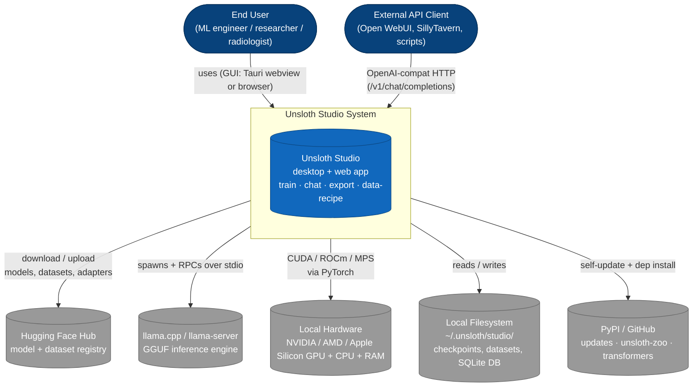
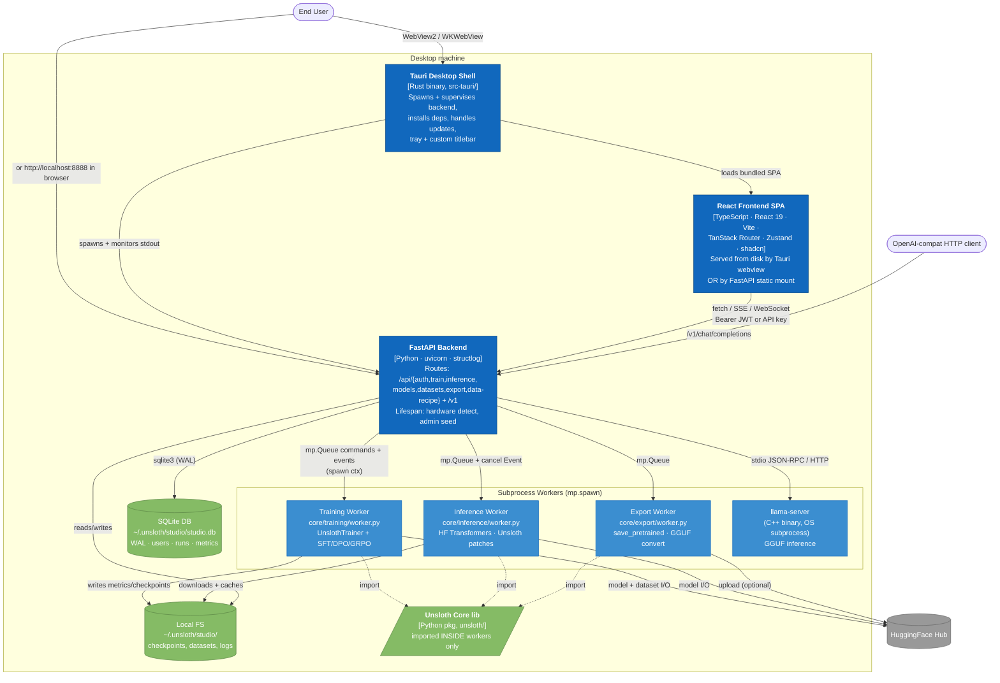
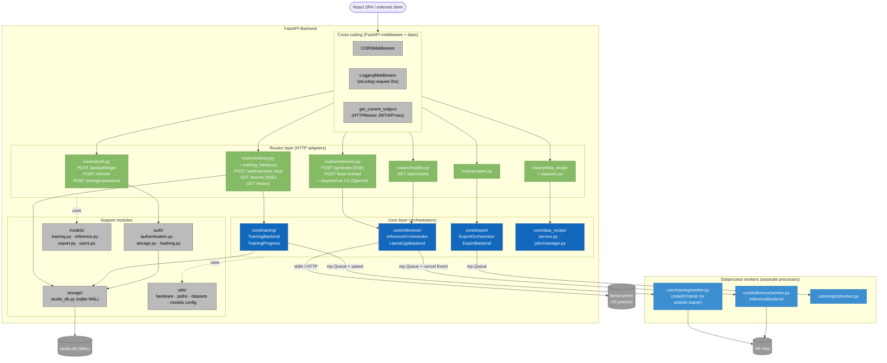
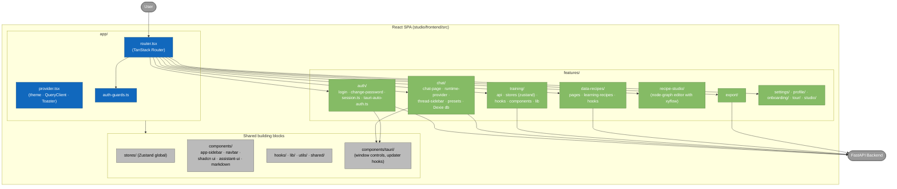

> **Repo:** `unsloth` (cloned). Two intertwined products live here:
>
> 1. **Unsloth Core** — a Python library (`unsloth/`) that patches `transformers` / `trl` / `peft` at import-time to make LLM fine-tuning ~2× faster with up to 70% less VRAM.
> 2. **Unsloth Studio** — a desktop/web app (`studio/`) that wraps Unsloth Core behind a FastAPI backend, a React UI, and a Tauri native shell. This is the "Unsloth Web UI" the user is interested in.
>
> This report follows Simon Brown's **C4 model** (Context → Containers → Components), then adds a **Class-level UML** diagram for the most architecturally significant Python classes. All diagrams use Mermaid.

---

## 0. Bird's-eye repository map

```
unsloth/                          ← repo root
├── cli.py                        ← thin shim → unsloth_cli.app
├── unsloth_cli/                  ← Typer CLI (train/inference/export/studio)
│   └── commands/
│       ├── train.py
│       ├── inference.py
│       ├── export.py
│       └── studio.py             ← `unsloth studio …` subcommands
│
├── unsloth/                      ← Unsloth Core (Python library)
│   ├── models/                   ← FastLlamaModel, FastQwen3Model, …
│   ├── kernels/                  ← Triton kernels (rope, rms_norm, …)
│   ├── trainer.py                ← UnslothTrainer (extends SFTTrainer)
│   ├── dataprep/, registry/, optimizers/, utils/
│   ├── save.py, chat_templates.py, tokenizer_utils.py
│   └── _auto_install.py
│
├── studio/                       ← Unsloth Studio (full-stack app)
│   ├── backend/                  ← FastAPI server (Python)
│   │   ├── main.py, run.py
│   │   ├── routes/               ← HTTP adapters
│   │   ├── core/                 ← Domain orchestration (training/inference/export/data_recipe)
│   │   ├── models/               ← Pydantic DTOs
│   │   ├── auth/                 ← JWT + API key + bootstrap admin
│   │   ├── storage/studio_db.py  ← SQLite (WAL) for training history
│   │   ├── utils/                ← hardware, datasets, paths, …
│   │   └── plugins/              ← seed plugins for data-designer
│   ├── frontend/                 ← React 19 + Vite + TanStack Router
│   │   └── src/
│   │       ├── app/              ← router, provider
│   │       ├── features/{auth,chat,training,data-recipes,export,…}
│   │       ├── stores/           ← Zustand
│   │       ├── components/       ← shadcn/Radix + assistant-ui
│   │       └── hooks/, lib/, shared/
│   └── src-tauri/                ← Rust desktop shell (Tauri 2)
│       └── src/{main.rs, process.rs, install.rs, update.rs, …}
│
├── tests/                        ← pytest suites
└── scripts/                      ← housekeeping (formatters, install helpers)
```

> **Architectural read:** The codebase is a **layered, subprocess-isolated, hexagonal-ish system**. The Python backend acts as the *application core*; routes are *driving adapters* (HTTP), and `core/{training,inference,export,data_recipe}` orchestrators are *driven adapters* that talk to long-lived subprocesses where the heavy ML lives. The frontend and the Tauri shell are independent UIs over the same FastAPI surface.

---

## 1. C4 Level 1 — System Context

### What's at stake
A radiologist or ML engineer sits in front of Unsloth Studio. They want to **download a model, fine-tune it on their own dataset, chat with it, and export it** — all without leaving the app. The system has to talk to the local GPU, Hugging Face Hub, and (optionally) a llama.cpp inference server.

### Diagram (C1)



### Actors and external systems

| Actor / System | Role |
|---|---|
| **End User** | Interacts via the Tauri desktop app or the browser-served React UI. |
| **External API Client** | Any tool that speaks the OpenAI HTTP schema; Studio mounts its inference router at `/v1` so they "just work". See `studio/backend/main.py:215-220`. |
| **Hugging Face Hub** | Source of truth for base models, LoRA adapters, GGUFs, and datasets. Pulled via `huggingface_hub` and exposed in the UI as a search/download flow. |
| **llama.cpp / llama-server** | Spawned as a child process for GGUF inference (see `core/inference/llama_cpp.py:LlamaCppBackend`). Runs in its own subprocess so its lifecycle is decoupled from the Python Transformers backend. |
| **Local hardware** | Detected at startup by `utils/hardware/` — sets a `DEVICE` global that flows through the whole system. Determines whether Studio runs in `CHAT_ONLY` mode (e.g. CPU/macOS without MLX) or full-training mode. |
| **Local filesystem** | Studio writes everything user-related under `~/.unsloth/studio/` (PID file, bootstrap password, SQLite DB). |
| **PyPI / GitHub** | Source for self-update and dependency installs (`src-tauri/src/install.rs`, `update.rs`, plus `unsloth_cli/commands/studio.py`). |

---

## 2. C4 Level 2 — Containers

A "container" here is a **separately deployable / runnable process**. Studio has four runtime containers plus the on-disk database.

### Diagram (C2)



### Containers explained

| Container | Tech | Responsibility | Key files |
|---|---|---|---|
| **Tauri Desktop Shell** | Rust 2024-edition + Tauri 2 | Boots the desktop window; supervises a Python backend child process; performs first-run install (Python venv, llama-cpp prebuilt, etc.); handles auto-updates; system tray. Sits between the user and the backend. Also implements **desktop auto-auth** by sharing a generated secret with the backend so the webview can skip the login screen. | `studio/src-tauri/src/{main.rs, process.rs, install.rs, update.rs, desktop_auth.rs, preflight.rs}` |
| **React Frontend SPA** | React 19 + Vite + TS strict + TanStack Router + Zustand + shadcn/Radix + Tailwind 4 + assistant-ui (chat) + xyflow (data-recipe nodes) | Five top-level features: `auth`, `chat`, `training`, `data-recipes`, `export`. Each feature has its own `api/` (typed fetch client), `stores/` (Zustand), `hooks/`, `components/`. State is mostly **per-feature local stores**; only training has a global store at `src/stores/training.ts`. | `studio/frontend/src/{app, features, stores, components}` |
| **FastAPI Backend** | Python 3.10+, uvicorn, FastAPI, structlog, pydantic v2 | The orchestration core. Boots in `main.py` via a `lifespan` context manager that detects hardware, cleans stale compiled cache, seeds the default admin, and pre-caches a helper GGUF in a daemon thread. Routes are mounted under `/api/*` (and `inference_router` is also mounted at `/v1` for OpenAI compatibility). | `studio/backend/{main.py, run.py, routes/, core/, models/, auth/, storage/, utils/}` |
| **Training / Inference / Export Workers** | Python subprocesses spawned with `mp.get_context("spawn")` | Run the heavy ML code (transformers, unsloth, peft, trl). Communicate with the parent via `mp.Queue` for events and a `mp.Event` for cancellation. Spawned **fresh per training job** but **persistent across inference requests** (with respawn on `transformers` major-version switch). | `studio/backend/core/{training,inference,export}/worker.py` |
| **llama-server (subprocess)** | C++ (external `llama.cpp`) | Backs GGUF inference. Spawned and supervised by `LlamaCppBackend`. | `studio/backend/core/inference/llama_cpp.py` |
| **SQLite DB** | sqlite3 stdlib, WAL journal | Two domains in one file: **auth** (users, refresh tokens, API keys, JWT secrets) and **studio** (training runs, per-step metrics, scan folders). Schemas are created lazily by `_ensure_schema()` under a process-wide lock. | `studio/backend/storage/studio_db.py`, `studio/backend/auth/storage.py` |
| **Unsloth Core (`unsloth/` Python pkg)** | Pure Python library | Patches `transformers`/`trl`/`peft` at import time, exposes `FastLanguageModel.from_pretrained(...)`, ships the Triton kernels, and provides `UnslothTrainer`. Imported **only inside workers**, never in the parent backend process. | `unsloth/{models, kernels, trainer.py, save.py, …}` |

### Why subprocess isolation?

`core/training/training.py:5-15` and `core/inference/orchestrator.py:5-15` both spell it out: PyTorch + transformers + unsloth's monkey-patches are essentially un-unloadable from a Python interpreter. To run a Qwen model that needs `transformers==4.57` and then a GLM model that needs `transformers==5.x`, the only workable answer is **kill the worker, spawn a new one** — even from the same parent process. The `_CTX = mp.get_context("spawn")` pattern (vs. the default fork on Linux) ensures the child starts from a clean interpreter and re-imports everything.

---

## 3. C4 Level 3 — Components (FastAPI Backend)

This zooms inside the **FastAPI Backend** container. The backend follows a clear three-layer split:

```
Routes (HTTP adapters)
    │  call into
    ▼
Core orchestrators (parent-process logic + subprocess RPC)
    │  RPC over mp.Queue
    ▼
Workers (run inside spawned subprocesses, import unsloth/transformers)
```

Cross-cutting: `auth/` (JWT bearer + API key middleware), `storage/` (SQLite), `models/` (Pydantic DTOs), `utils/hardware/` (the device detector that sets `DEVICE` and `CHAT_ONLY` globals consumed everywhere).

### Diagram (C3)



### Layer-by-layer narrative

#### Routes (HTTP adapters)

Thin. They map HTTP concerns (request validation via Pydantic DTOs from `models/`, `Depends(get_current_subject)` for auth) onto a single call into the corresponding orchestrator. Example: `routes/training.py` resolves dataset paths, calls `get_training_backend().start_training(...)`, and returns a job ID.

The fact that **`inference_router` is included twice** in `main.py:215-220` — once at `/api/inference` and once at `/v1` — gives the system free OpenAI-API compatibility without duplicating handlers. This is a clean example of FastAPI's router composition acting as an adapter.

#### Core (orchestrators)

This is the layer that *actually owns the domain logic*. Each `core/<feature>/` folder follows a consistent pattern:

```
core/<feature>/
├── orchestrator.py   # parent-process class: lifecycle + RPC
├── worker.py         # child-process entrypoint: heavy ML
├── <feature>.py      # shared types, enums, helpers
└── (sometimes) trainer.py / inference.py / export.py — domain code
```

The `*Backend` / `*Orchestrator` classes (`TrainingBackend`, `InferenceOrchestrator`, `ExportOrchestrator`) all share a consistent interface:

- `__init__` sets up `_lock`, `_proc`, `_event_queue` / `_cmd_queue` / `_resp_queue`, `_pump_thread` / `_dispatcher_thread`, `_cancel_event`.
- A start method spawns or reuses a worker.
- A pump/dispatcher thread routes events back to per-request mailboxes (notably `InferenceOrchestrator._mailboxes`, which lets the **compare-mode** UI run multiple in-flight requests against one worker).
- A `force_terminate` / `_shutdown_subprocess` is called by the global `_graceful_shutdown` handler in `run.py:185`.

#### Support modules

- **`auth/authentication.py`** issues short-lived access JWTs (1 h) and longer refresh tokens (7 d), plus an API-key path. The bootstrap admin is auto-seeded on first launch and its password is written to a file under `~/.unsloth/studio/.bootstrap_password`. The HTML index injects `window.__UNSLOTH_BOOTSTRAP__` with these credentials *only* until the user changes the password (see `main.py:349-374`).
- **`storage/studio_db.py`** owns one SQLite file in WAL mode; tables include `training_runs` and a metrics table that captures `loss`, `lr`, `grad_norm`, and `eval_loss` per step. `cleanup_orphaned_runs()` runs at startup to mark crashed runs as failed.
- **`utils/hardware/`** sets the device backend (`cuda` / `rocm` / `mps` / `cpu`) into a module global early. Routes read it via `get_device()` to decide whether to allow training endpoints at all.

---

## 4. C4 Level 3 — Components (React Frontend)

The frontend follows a **feature-based architecture** (sometimes called "screaming architecture"): the top-level folder names tell you what the app *does*, not what tech it *uses*.



### Notes on the frontend pattern

- Each feature is **self-contained**: `features/training/` ships its own `api/`, `stores/`, `hooks/`, `components/`, `types/`. Cross-feature reuse goes through `shared/` or `components/ui` — there is no "global service registry".
- **State**: Zustand for app state (e.g. `stores/training.ts`, `features/training/stores/training-runtime-store.ts`), Dexie/IndexedDB for chat history (`features/chat/db.ts`), plain `useState` for purely-local UI state. There is **no Redux**, **no React Query** in the deps — fetches go through hand-rolled typed clients.
- **Routing** is type-safe via `@tanstack/react-router` with code-split route files in `app/routes/`.
- **Tauri integration** is *additive*: any code that needs the desktop bridge guards on `window.__TAURI__` and falls back to web behavior, so the same SPA bundle runs in both Tauri and a vanilla browser.

---

## 5. Class-level UML — Python OOP backbone

Two related class hierarchies dominate the Python side: the **Studio orchestrators** in the parent process and the **Unsloth `Fast*` model family** that the workers actually use. The diagram below merges both.

```mermaid
classDiagram
    %% ============== Studio backend orchestrators ==============
    class TrainingProgress {
        +epoch: float
        +step: int
        +total_steps: int
        +loss: Optional[float]
        +learning_rate: Optional[float]
        +is_training: bool
        +is_completed: bool
        +error: Optional[str]
        +eta_seconds: Optional[float]
    }

    class TrainingBackend {
        -_proc: mp.Process
        -_event_queue: mp.Queue
        -_stop_queue: mp.Queue
        -_pump_thread: Thread
        -_lock: Lock
        -_progress: TrainingProgress
        -_metric_buffer: list
        +current_job_id: str
        +loss_history: list
        +lr_history: list
        +start_training(config, dataset, ...) str
        +stop(save: bool) None
        +get_progress() TrainingProgress
        +get_metrics() dict
        +force_terminate() None
        -_pump_events() void
        -_flush_metrics() void
    }

    class InferenceOrchestrator {
        -_proc: mp.Process
        -_cmd_queue: mp.Queue
        -_resp_queue: mp.Queue
        -_cancel_event: mp.Event
        -_lock: Lock
        -_gen_lock: Lock
        -_mailboxes: dict
        -_dispatcher_thread: Thread
        -_current_transformers_major: str
        +active_model_name: str
        +models: dict
        +load_model(name, ...) LoadResult
        +unload_model() None
        +generate(prompt, ...) Generator
        +cancel(request_id) None
        +default_models() list
        -_ensure_subprocess(major) None
        -_shutdown_subprocess(timeout) None
    }

    class LlamaCppBackend {
        -_proc: subprocess.Popen
        -_port: int
        -_model_path: Path
        +load(gguf_path, ...) None
        +generate(...) Generator
        +unload() None
        -_kill_process() None
    }

    class ExportOrchestrator {
        -_proc: mp.Process
        +export_merged(...) JobId
        +export_lora_adapter(...) JobId
        +export_gguf(...) JobId
        +get_status(job_id) ExportStatus
        -_shutdown_subprocess(timeout) None
    }

    class ExportBackend {
        +run_export(request) None
    }

    %% ============== Pydantic DTOs (selected) ==============
    class TrainingStartRequest {
        <<Pydantic>>
        +model_name: str
        +dataset_paths: list[str]
        +config: dict
    }
    class TrainingJobResponse {
        <<Pydantic>>
        +job_id: str
        +status: str
    }
    class GenerateRequest {
        <<Pydantic>>
        +prompt: str
        +messages: list
        +max_tokens: int
        +temperature: float
    }

    %% ============== Auth ==============
    class AuthStorage {
        <<module>>
        +ensure_default_admin() bool
        +get_user_and_secret(name) tuple
        +save_refresh_token(...) None
        +verify_refresh_token(...) bool
        +validate_api_key(key) Optional[str]
    }
    class Authentication {
        <<module>>
        +create_access_token(subject) str
        +create_refresh_token(subject) str
        +get_current_subject() str
    }

    %% ============== Unsloth Core: Fast* model family ==============
    class FastBaseModel {
        <<unsloth.models>>
        +from_pretrained(...) tuple[Model, Tokenizer]
        +get_peft_model(...) Model
        +for_inference(model) Model
        +for_training(model) Model
        +patch_peft_model(...) None
    }

    class FastModel {
        +from_pretrained(...) tuple
    }

    class FastLlamaModel {
        +pre_patch() None
        +post_patch(model) None
        +from_pretrained(...) tuple
    }

    class FastLanguageModel
    class FastVisionModel
    class FastTextModel
    class FastMistralModel
    class FastQwen2Model
    class FastQwen3Model
    class FastQwen3MoeModel
    class FastGraniteModel
    class FastCohereModel
    class FastFalconH1Model
    class FastSentenceTransformer

    %% ============== Trainer (HF/TRL extension) ==============
    class TrainingArguments {
        <<transformers>>
    }
    class SFTTrainer {
        <<trl>>
    }
    class UnslothTrainingArguments {
        +qgalore_config: QGaloreConfig
    }
    class UnslothTrainer {
        +train(...) None
        +_inner_training_loop(...) None
    }
    class QGaloreConfig {
        +rank: int
        +update_proj_gap: int
        +scale: float
    }

    %% ============== Relationships ==============
    TrainingBackend ..> TrainingProgress : produces
    TrainingBackend ..> AuthStorage : (via routes)
    InferenceOrchestrator ..> LlamaCppBackend : delegates GGUF to
    ExportOrchestrator ..> ExportBackend : "in worker"

    TrainingBackend o-- "1 spawned" UnslothTrainer : in worker
    InferenceOrchestrator o-- "1 spawned" FastLanguageModel : in worker

    Authentication ..> AuthStorage : reads/writes

    FastBaseModel <|-- FastModel
    FastModel <|-- FastVisionModel
    FastModel <|-- FastTextModel
    FastLlamaModel <|-- FastLanguageModel
    FastLlamaModel <|-- FastMistralModel
    FastLlamaModel <|-- FastQwen2Model
    FastLlamaModel <|-- FastQwen3Model
    FastQwen3Model <|-- FastQwen3MoeModel
    FastLlamaModel <|-- FastGraniteModel
    FastLlamaModel <|-- FastCohereModel
    FastLlamaModel <|-- FastFalconH1Model

    TrainingArguments <|-- UnslothTrainingArguments
    SFTTrainer <|-- UnslothTrainer
    UnslothTrainingArguments *-- QGaloreConfig

    TrainingStartRequest ..> TrainingBackend : parsed by route
    GenerateRequest ..> InferenceOrchestrator : parsed by route
```



> **Caveat on inheritance lines:** `FastLanguageModel` is declared as `class FastLanguageModel(FastLlamaModel)` and `FastVisionModel`/`FastTextModel` are declared as `class FastVisionModel(FastModel)` (see `unsloth/models/loader.py:16`). The diagram preserves both lineages. `FastModel` itself extends `FastBaseModel` (defined in `unsloth_zoo`), which is shown here as a stereotype.

### How the OOP fits together at runtime

```
HTTP request  ──►  routes/inference.py
                      │
                      ▼
              InferenceOrchestrator  (parent process)
                      │  mp.Queue command
                      ▼
               worker.py main loop  (child process)
                      │ instantiates
                      ▼
              FastLanguageModel.from_pretrained(...)
                      │ returns (model, tokenizer)
                      ▼
              model.generate(...)  ──► tokens stream back via mp.Queue
                                          │
                                          ▼  pump thread
                                   per-request mailbox  ──► SSE response
```

For training, replace `FastLanguageModel` with `UnslothTrainer(SFTTrainer)` driven by `UnslothTrainingArguments`, and replace the streaming response with a `TrainingProgress` event stream pumped into both the SSE channel and the SQLite metrics table.

---

## 6. Key cross-cutting design decisions

| Decision | Where | Why it matters |
|---|---|---|
| **Subprocess isolation per-feature** (`mp.get_context("spawn")`) | `core/{training,inference,export}/orchestrator|training.py` | Lets Studio swap between transformers 4.x and 5.x at runtime, recover from CUDA OOM cleanly, and keep the parent backend small enough to stay responsive while a 70 B model loads. |
| **Single FastAPI router mounted at two prefixes** | `main.py:212-220` | Free OpenAI-API compatibility (`/v1/chat/completions`) without duplicating any handler code. |
| **Bootstrap admin + one-time HTML credential injection** | `main.py:349-374`, `auth/storage.ensure_default_admin` | Solves the desktop-first UX: the user gets an instantly-logged-in webview but the credentials self-destruct from the served HTML the moment they change the password. |
| **Feature-folder frontend, no global service container** | `studio/frontend/src/features/*` | Keeps each domain (chat / training / export / data-recipes) independently shippable; the chat feature even ships its own IndexedDB schema via Dexie. |
| **Tauri-as-supervisor + browser-as-fallback** | `src-tauri/src/process.rs::BackendProcess`, `main.py::setup_frontend` | The same FastAPI server can serve the SPA over plain HTTP for browser users *or* expose a pure JSON API while Tauri loads the SPA from disk — one binary, two distribution modes. |
| **Structured logging with request middleware** | `loggers/`, `LoggingMiddleware` in `main.py` | Every log line carries a request ID; combined with `structlog` makes cross-process debugging tractable. |

---

## 7. Glossary

- **C4 model** — Hierarchical architecture-diagramming notation by Simon Brown: System Context (C1) → Containers (C2) → Components (C3) → Code (C4). UML class diagrams sit at the C4 level.
- **Container (C4 sense)** — A separately runnable unit (process, server, single-page app, database). Not a Docker container.
- **Hexagonal / Ports-and-Adapters** — Pattern where the domain core is surrounded by interchangeable adapters; here, `routes/` are driving adapters and `core/*/worker.py` are driven adapters around the ML domain.
- **Orchestrator** — Class in the parent process that owns the lifecycle of a worker subprocess and exposes a synchronous-ish API to the routes layer.
- **`Fast*` model family** — Unsloth's set of monkey-patched HF model classes that swap in faster Triton kernels and optimized LoRA paths.
- **Bootstrap admin** — The auto-created `unsloth` user whose password is generated on first launch and stored at `~/.unsloth/studio/.bootstrap_password`.
