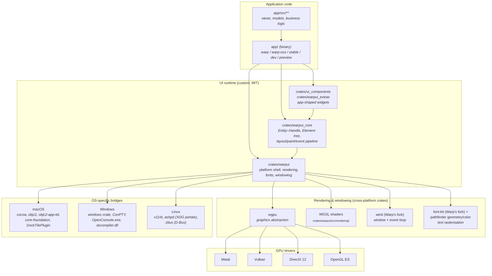

> Companion to [Warp — System Architecture (C4 Tour)](/oss/warp-system-architecture). This doc answers two practical questions:
> **(1)** *What stack draws the pixels and talks to the OS?* and
> **(2)** *How does a `cargo build` turn into a `.app` / `.exe` / `.AppImage` your users can install?*

---

## TL;DR — the stack at a glance



The mental model in one line: **everything above wgpu is portable Rust**; **only the OS-bridges layer is conditional**, and even there the per-OS crates are used for *integration* (window chrome, clipboard, IME, dock badges, file dialogs, system menus) — **not for drawing pixels**. All pixels go through `wgpu` → the OS GPU driver.

---

## Why a custom UI framework?

A reasonable question: why not use Tauri (web frontend, Rust backend), Electron, native widgets per platform, or an existing Rust UI crate (egui, iced, slint)?

The trade-offs Warp made, visible from the codebase:

| Option                   | Why Warp didn't pick it                                                                                             |
|--------------------------|---------------------------------------------------------------------------------------------------------------------|
| **Electron / Tauri (web)**     | Terminal redraw rates need *immediate* GPU access. A web compositor adds frame-time variance and memory cost — bad for a tool that's expected to feel native and respond at keystroke latency. |
| **Native widgets per platform** | Three UI codebases. Warp's UX (blocks, AI side-panel, command palette, command-corrections inline UI) is too custom to be expressed cleanly with stock widgets, and the sync cost across three platforms would be huge. |
| **egui / iced / slint**    | Reasonable, but each has constraints (egui is immediate-mode and not optimised for very large scrollback; iced/slint don't yet have the maturity Warp needed for terminal rendering, font fallback, and IME). |
| **Custom on `wgpu` + `winit`** *(Warp's choice)* | One Rust UI codebase that runs on Metal/Vulkan/DX12/GLES, plus a WASM target for free. Pays for itself once the team gets large enough — and Warp clearly studied **GPUI** (Zed) before building it. |

The cost of this choice is the team having to maintain forks of `winit`, `font-kit`, `vte`, and others (visible in the `[patch.crates-io]` table of the workspace `Cargo.toml`). They've decided that owning this slice is worth it for the product.

---

## The rendering & windowing stack

### `wgpu` — the GPU abstraction

From the workspace `Cargo.toml`:

```toml
wgpu = { version = "29.0.1", default-features = false, features = [
  "dx12", "gles", "metal", "parking_lot", "std", "vulkan", "wgsl",
] }
```

A few decisions visible here:
- **WebGPU explicitly disabled** (`default-features = false` drops the `webgpu` feature). Warp's WASM target uses `gles`, not the still-changing browser WebGPU API.
- **All four major desktop backends enabled**: Metal (macOS/iOS), Vulkan (Linux/Win), DX12 (Win), GLES (fallback / Linux fallback / WASM).
- **WGSL** is the shader language — the WGSL files live in `crates/warpui/src/rendering/` and are checked with `wgslfmt --check` in `script/presubmit`.

### `winit` — the window & event loop (forked)

`winit` is patched in `[patch.crates-io]`:
```toml
winit = { git = "https://github.com/warpdotdev/winit.git", rev = "..." }
```
Warp's fork lets them ship behaviours not yet upstream (or backported sooner). `winit` provides the cross-platform event loop and window handles; `crates/warpui/src/windowing/` adapts it to the UI runtime's lifecycle.

### `font-kit` — text & font fallback (forked)

```toml
font-kit = { git = "https://github.com/warpdotdev/font-kit", rev = "...", default-features = false, features = ["source"] }
```
Why a fork? Terminal apps stress font systems (every glyph at every size, lots of fallback for emoji/CJK/symbols, ligatures) and they need to ship custom glyphs (the Warp logo glyph patch — see `script/patch_font_with_warp_glyph`). Font fallback handling lives in `crates/warpui/src/fonts/` and `app/src/font_fallback.rs`.

### The `Scene` API and pathfinder

Inside the framework, a frame is described as a `Scene` (`crates/warpui_core/src/scene.rs`) — a layered sequence of `push_rect` / `push_glyph` / `push_image` / `push_icon` operations into z-indexed `Layer`s. The `Presenter` hands the finished `Scene` to the wgpu pipeline. Geometry math (rects, vectors, colours) goes through `pathfinder_geometry` and `pathfinder_color` (also forked at `warpdotdev/pathfinder` for consistent behaviour).

---

## Per-OS native integration layers

The cross-platform substrate (`wgpu` + `winit` + `warpui`) gets you a window with pixels in it. The per-OS layers are how Warp becomes *idiomatic* on each desktop.

### macOS

| Concern              | What Warp uses                                                           |
|----------------------|--------------------------------------------------------------------------|
| Cocoa bindings       | `cocoa`, `objc2`, `objc2-app-kit`, `objc2-foundation`, `core-foundation` |
| App menus, services  | `app/src/app_menus.rs` (NSMenu integration via objc) |
| Dock tile (icon swap) | **`app/DockTilePlugin/`** — an Objective-C `NSDockTilePlugIn` bundle |
| Login item / autostart | `app/src/login_item/` |
| Crash symbolication  | Native **sentry-cocoa** SDK (downloaded by `script/macos/update_sentry_cocoa`) alongside Rust `sentry` |
| Code signing & entitlements | `script/Entitlements.plist` (release), `script/Debug-Entitlements.plist` (dev) |

The **DockTilePlugin** is interesting: it's an out-of-process Cocoa plugin that watches `NSUserDefaults["AppIcon"]` and swaps the dock tile image dynamically when the user picks a different app icon in settings. The plugin source is at `app/DockTilePlugin/WarpDockTilePlugin.{h,m}`, with ~20 PNG variants in `app/DockTilePlugin/Resources/` (aurora, classic, comets, dev, glow, holographic, neon, …).

The release entitlements grant: AppleScript automation, microphone, camera, address book, calendars, location, photos library, and an app-group container (`2BBY89MBSN.dev.warp`) for shared state. **Hardened runtime is on; JIT is not enabled**. Debug entitlements additionally allow loading unsigned dylibs and attaching a debugger.

### Windows

| Concern                | What Warp uses                                       |
|------------------------|------------------------------------------------------|
| Win32 bindings         | `windows` crate + `windows-core`, `windows-registry` |
| Pseudo-terminal        | **ConPTY** — bundles `conpty.dll` and `OpenConsole.exe` per arch (in `app/assets/windows/`) |
| Shader compilation     | `dxcompiler.dll` + `dxil.dll` (DirectX shader compiler, bundled by `app/build.rs`) |
| PATH manipulation      | Inno Setup `[Code]` section in `script/windows/environment.iss` |

ConPTY is the Windows 10+ pseudo-console API (Build 18362+). `OpenConsole.exe` is the Microsoft-provided ConPTY backend that emulates a VT terminal so cross-platform terminal code works on Windows. Without these bundled, Warp couldn't run shells on Windows the way it does on Unix.

### Linux

| Concern               | What Warp uses                                    |
|-----------------------|---------------------------------------------------|
| X11                   | `x11rb`                                           |
| Wayland               | (via `winit` fork)                                |
| File dialogs, portals | `ashpd` (XDG Desktop Portal)                      |
| D-Bus                 | `zbus`                                            |
| Sleep prevention      | `crates/prevent_sleep/`                           |

The Linux story is the most fragmented (X11 vs Wayland, multiple package formats, distro variation). The packaging story compensates — see "Packaging" below.

---

## End-to-end build & bundle pipeline

The build entrypoint is `./script/bundle [--release]`. That dispatcher (visible in `script/bundle`) detects the OS and forwards to one of:
- `./script/macos/bundle`
- `./script/linux/bundle`
- `./script/windows/bundle.ps1`

Below is what each one actually does. (For raw `cargo run` development, no bundling is needed — see "Local dev loop" at the end.)

### Step 0 — Bootstrap

`./script/bootstrap` is the cross-platform entry. It dispatches to `script/{macos,linux,windows}/bootstrap`, which in turn install Rust (`script/install_rust`), cargo build & test deps (`script/install_cargo_build_deps`, `script/install_cargo_test_deps`), platform toolchains (Xcode CLT, MSVC, gcc/clang), and bundling helpers (`script/install_cargo_bundle`).

### Step 1 — `cargo build`

Per channel and platform, the build command picks one of the workspace's many tuned profiles (defined in the root `Cargo.toml`):

| Profile                              | Use case                                                                |
|--------------------------------------|-------------------------------------------------------------------------|
| `dev`                                | Local iteration; `debug = "line-tables-only"` + `split-debuginfo = "unpacked"` for faster builds. |
| `release`                            | Default release; debug symbols on (for Sentry); `split-debuginfo = "packed"`. |
| `release-lto` / `rlto`               | Adds Thin LTO. **`rlto`** is a shorthand to keep Windows path lengths under 255 chars. |
| `release-lto-debug_assertions` / `rltoda` | Same, but with debug asserts on (used for "preview" builds where extra invariants are useful). |
| `release-cli`                        | For the `oz` remote agent CLI: `opt-level = "s"` and `codegen-units = 1` to minimise binary size. |
| `release-wasm` / `dev-wasm`          | For the WASM target. |
| `dev-remote`                         | Like `dev` but with `strip = "symbols"` — for `rsync`-friendly remote-server deployment. |

Per-package overrides in `[profile.dev.package]` keep build times reasonable while ensuring hot-path crates (tokio, rayon-core, tikv-jemallocator, ttf-parser, image, png, miniz_oxide, eventsource-stream, memchr, nom, strsim, fdeflate, backtrace, pprof, jemalloc_pprof, pprof_util) are still optimised in dev builds. This is one of the few places where reading the `Cargo.toml` is genuinely educational.

### Step 2 — `app/build.rs` runs

Before/during `cargo build`, `app/build.rs` does platform-conditional codegen:

- **Cfg aliases** via `cfg_aliases` — `linux_or_windows`, `enable_crash_recovery`, etc., used throughout the codebase to keep `#[cfg]` expressions readable.
- **macOS Objective-C compilation**:
  - `app_bundle.m` + `services.m` → `libwarp_objc.a`
  - `crash_reporting.m` → `libwarp_sentry_objc.a`
  - **DockTilePlugin** is built and copied into the target dir.
  - The Sentry framework (sentry-cocoa) is downloaded and linked.
- **Plist embedding** (macOS): `embed_plist!` macro embeds Info.plist metadata into the binary.
- **Windows asset copying**: `conpty.dll`, `OpenConsole.exe`, `dxcompiler.dll`, `dxil.dll` copied to the target dir; a `.rc` resource file with icon + version info is generated.
- **Channel config generation** (when `release_bundle` feature is on): runs the `warp-channel-config` helper to emit `{local,dev,stable,preview}_config.json` into `OUT_DIR`, which the binary then `include_str!`s.
- **WASM async assets**: SHA256-hashed and copied to `ASSET_TARGET_DIR`.

### Step 3 — Channel binary selected

Each of the 5 binaries (`warp-oss`, `warp`, `stable`, `dev`, `preview`) is a ~30-line shim in `app/src/bin/*.rs` that:
1. Constructs a `ChannelState` with channel-specific `ChannelConfig` (server URLs, telemetry endpoint, autoupdate config, MCP defaults, log file name, app ID).
2. Calls `ChannelState::set(state)` to install it as a process-wide singleton.
3. Calls `warp::run()` (the common `pub fn run()` in `app/src/lib.rs`).

The `Channel` enum lives in `crates/warp_core/src/channel/mod.rs` with variants `{Stable, Preview, Dev, Local, Oss, Integration}`. Channel-aware methods like `is_dogfood()` and `cli_command_name()` route product behaviour without needing compile-time gates.

This design has a useful property: the OSS build literally cannot accidentally inherit a non-OSS endpoint, because the URLs are picked by the binary's `main()`, not by env vars or config files. **Configuration is code**.

### Step 4 — Platform packaging

#### macOS — `script/macos/bundle`

Toolchain: a fork of [`cargo-bundle`](https://github.com/burtonageo/cargo-bundle) (`script/install_cargo_bundle` installs it). High-level flow:

1. **`cargo bundle --bin <channel>`** produces `target/{arch}/{profile}/bundle/osx/{AppName}.app/`.
2. **Universal binary**: builds for both `x86_64-apple-darwin` and `aarch64-apple-darwin`, then `lipo`s them into a single fat binary so Warp runs natively on Intel and Apple Silicon.
3. **Sentry framework integration**: the sentry-cocoa xcframework is copied into `Contents/Frameworks/` with rpath rewritten via `install_name_tool`.
4. **DockTilePlugin**: the pre-built universal `.docktileplugin` bundle is dropped into `Contents/PlugIns/WarpDockTilePlugin.docktileplugin/`.
5. **Plist edits** via `plutil`: NSServices (so terminal "Services" menu entries appear in other apps), SMAuthorizedClients (for privileged helper launching), LSBackgroundOnly entries.
6. **CLI wrapper**: a small `oz` shell script is placed in `Resources/bin/oz` so the channel's CLI is invokable from PATH.
7. **Code signing**: `codesign` with the Apple Developer ID certificate, applying `script/Entitlements.plist`.
8. **dSYM**: a universal `.dSYM` bundle is built (`lipo` the per-arch dSYMs together) and uploaded to Sentry by `script/sentry_upload_dif.sh`.
9. **DMG**: `create-dmg` stages the app into a `.dmg` with a background image and icon positions, then codesigns and notarizes (`xcrun notarytool submit`, polled until accepted, then `xcrun stapler staple` attaches the ticket).

Final artifacts: `{AppName}.app`, `{AppName}.dmg`, `{binary}.dSYM`.

#### Linux — `script/linux/bundle`

Linux ships **four** package formats, all built from the same staged tree:

| Format        | Script                              | Tooling                          |
|---------------|-------------------------------------|----------------------------------|
| AppImage      | `script/linux/bundle_appimage`      | `linuxdeploy` + custom `linuxdeploy-plugin-warp` |
| `.deb`        | `script/linux/bundle_deb`           | `dpkg-deb` + `fakeroot`          |
| `.rpm`        | `script/linux/bundle_rpm`           | `rpmbuild` + `rpmsign` (GPG)     |
| Arch (`.pkg.tar.zst`) | `script/linux/bundle_arch`  | `makepkg`                        |

The shared **staging step** (`script/linux/bundle_install`) lays out files in the canonical Linux locations:
- Binary at `/opt/warpdotdev/{package}/{binary}` with a symlink at `/usr/bin/{binary}`.
- `.desktop` file at `/usr/share/applications/{bundle_id}.desktop`.
- Icons at `/usr/share/icons/`.
- Resources alongside the binary in `/opt/warpdotdev/{package}/resources/`.

The custom **`linuxdeploy-plugin-warp`** is what makes the AppImage layout match the deb/rpm layout — by default linuxdeploy puts the binary at `usr/bin/`, but Warp wants it under `opt/warpdotdev/{package}/` for parity. The plugin moves it and recreates the relative symlink.

Templates for the metadata files live at `resources/linux/{debian,rpm,arch}/{app,cli}/` with `@@PLACEHOLDERS@@` (CHANNEL_SUFFIX, VERSION, ARCH, BINARY_NAME, OPTDIR, REPO_NAME) substituted at build time.

RPM packages are GPG-signed in CI by `script/linux/sign_arch_packages` (using `linux-maintainers@warp.dev`). deb post-install scripts wire up the apt repository so users get updates via `apt`.

#### Windows — `script/windows/bundle.ps1`

Toolchain: **Inno Setup** (the `ISCC` compiler), driven by PowerShell.

1. **Build**: `cargo build --target {x86_64,aarch64}-pc-windows-msvc --profile {rlto[da],dev} --bin <channel>`.
2. **Resource staging**: `script/windows/prepare_bundled_resources.ps1` copies bundled assets (config, fonts, ConPTY artefacts) into `{profile_dir}/resources/`.
3. **Inno Setup compile**: `ISCC` is invoked on `script/windows/windows-installer.iss` with command-line `/D` defines for channel, exe name, target dir, app name, architecture, output name, version, and (optionally) a `signtool.exe` command for Authenticode signing.
4. The installer script `windows-installer.iss` includes `environment.iss`, which provides Inno Setup Pascal procedures to add the install path to the user or system `PATH` (depending on whether install is per-user or admin).
5. The installer bundles `conpty.dll`, the architecture-matching `OpenConsole.exe`, the Warp binary, and resources.
6. `.pdb` files are preserved for crash reporting.

Final artifact: `script/windows/Output/{AppName}Setup.exe` (or `Setup-arm64.exe`), LZMA-compressed and (optionally) Authenticode-signed.

### Step 5 — CI orchestration

GitHub Actions wires the platform scripts together. Highlights from `.github/workflows/`:

| Workflow                         | Trigger                                         | Purpose                                                |
|----------------------------------|-------------------------------------------------|--------------------------------------------------------|
| `ci.yml`                         | PR / push                                       | Compile, lint (`cargo fmt`, `cargo clippy`), test (`nextest`) |
| `create_release.yml`             | `workflow_call`                                 | Multi-platform release build & sign                    |
| `cut_new_release_candidate.yml`  | manual                                          | Tag an RC branch                                       |
| `cut_new_releases.yml`           | manual                                          | Tag stable/preview releases & publish                  |
| `populate_build_cache.yml`       | scheduled                                       | Pre-warm Namespace runner caches                       |
| `feature_flag_cleanup.yml`       | scheduled                                       | Reminder-bot / sweeper for stale feature flags         |
| `triage-new-issues-local.yml`    | `issues`                                        | Auto-triage of new issues (agent-driven)               |
| `create-spec-from-issue-local.yml` | `issues` labeled `spec`                       | Generate a `PRODUCT.md` spec from an issue             |
| `create-implementation-from-issue-local.yml` | `issues` labeled `implementation`     | Open an implementation branch from a spec              |
| `respond-to-pr-comment-local.yml`  | `issue_comment`                               | Skill-triggered AI responses to PR comments            |
| `review-pull-request.yml`        | `pull_request`                                  | Automated PR review                                    |

The `*-local.yml` workflows are particularly notable — they're how Warp's **agent-driven OSS contribution flow** (`ready-to-spec` → `ready-to-implement` issue labels, mentioned in `README.md`) is automated. The `.agents/` and `.claude/` directories at repo root configure the agents these workflows invoke.

---

## The WASM target

Why does a desktop terminal app have a WASM target? Looking at the workspace, `crates/serve-wasm`, `crates/managed_secrets_wasm`, and the `release-wasm` profile (with `lto = true`, `opt-level = "s"`, `codegen-units = 1`) hint at the answer:

- **Embedded preview surfaces.** Some Warp UI is rendered in browser-side previews (e.g., docs, marketing). The WASM build lets the same `warpui` framework render in a webpage.
- **Cross-process sandboxing for plugins or untrusted code.** `crates/managed_secrets_wasm` indicates the secrets-handling code is also compiled to WASM — likely to run untrusted scripts (auto-completion definitions, workflow steps) in a WASM sandbox without giving them filesystem/network access.
- **`crates/warp_js`** + WASM together suggest a JS-from-WASM bridge for evaluating user-supplied JavaScript safely.

The `[wgpu]` configuration explicitly disables WebGPU, so the WASM target uses **WebGL/GLES** for any rendering it does — keeping browser compatibility wide.

---

## Local dev loop (no bundling)

For day-to-day work you don't need to bundle. From the root:

```bash
./script/bootstrap                      # one-time platform setup
cargo run                               # build + run the dev binary
cargo run --features with_local_server  # talk to a local warp-server
./script/presubmit                      # fmt + clippy + tests before pushing
```

The `presubmit` script is mandatory before opening a PR (per `WARP.md`'s "Pull Request Workflow"): "ALWAYS run cargo fmt and cargo clippy … those commands must pass completely before creating or updating a pull request." The script also runs `nextest` and verifies WGSL shader formatting (`wgslfmt --check`).

---

## A contributor's first 30 minutes

If this is your first time touching the codebase, here's the shortest path that touches every layer of the stack we just described:

1. **Read** `WARP.md` (engineering guide) and `crates/warpui_core/README.md` (UI mental model).
2. **Look at** `app/src/bin/oss.rs` — the entire `main()` is ~30 lines, and it's the cleanest example of how channels work.
3. **Read** `app/src/lib.rs` `pub fn run()` — trace the boot sequence (platform init → feature flags → CLI dispatch → `run_internal` → `AppBuilder::run` → `initialize_app` → `launch`).
4. **Browse** `crates/warpui/examples/` — small, runnable examples of the UI framework standalone.
5. **Run** `cargo run` (after `./script/bootstrap`) and watch the dev binary boot.
6. **Try** `./script/macos/bundle --debug` (or your platform's equivalent) and inspect the produced `.app` / `.exe` / `.AppImage` to see all the pieces in their final layout.

If you're going to contribute code, the next stop is `CONTRIBUTING.md` (11 KB at repo root) and the GitHub issues with the `ready-to-implement` label.

---

## Summary table

| Concern                | macOS                                    | Linux                                    | Windows                                  |
|------------------------|------------------------------------------|------------------------------------------|------------------------------------------|
| **Bundler**            | `cargo-bundle` (forked) + `create-dmg`   | `linuxdeploy` + dpkg-deb / rpmbuild / makepkg | Inno Setup (`ISCC`)                      |
| **Artifact**           | `.app` + `.dmg`                          | `.AppImage`, `.deb`, `.rpm`, `.pkg.tar.zst` | `.exe` installer                         |
| **Universal arch**     | x86_64 + aarch64 via `lipo`              | Per-arch builds                          | x64 + arm64 separate installers          |
| **Code signing**       | Apple Developer ID + notarization        | GPG-signed RPM (CI only)                 | Authenticode (optional)                  |
| **Native PTY**         | OS-provided                              | OS-provided                              | ConPTY (`conpty.dll` + `OpenConsole.exe` bundled) |
| **Crash symbolication**| sentry-cocoa native + Rust sentry        | Rust sentry                              | Rust sentry + `.pdb`                     |
| **Distinctive piece**  | DockTilePlugin (Obj-C bundle for dynamic icons) | Custom `linuxdeploy-plugin-warp` for layout parity | `environment.iss` for PATH manipulation  |
