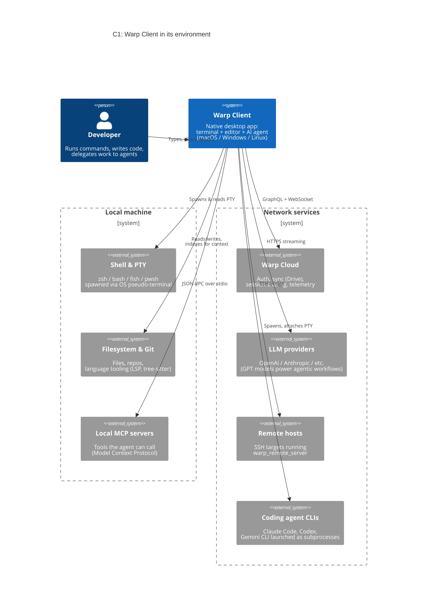
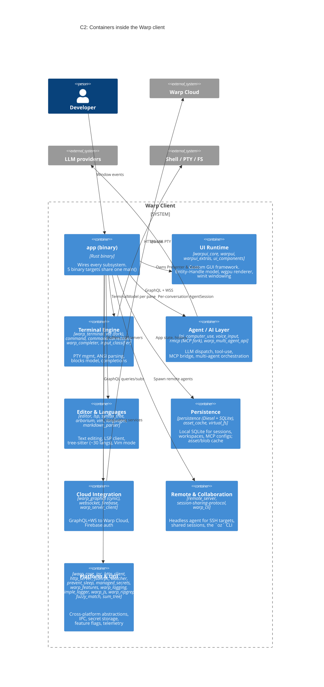
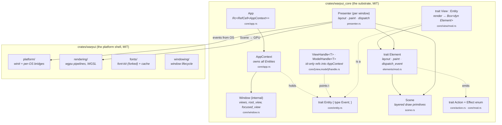
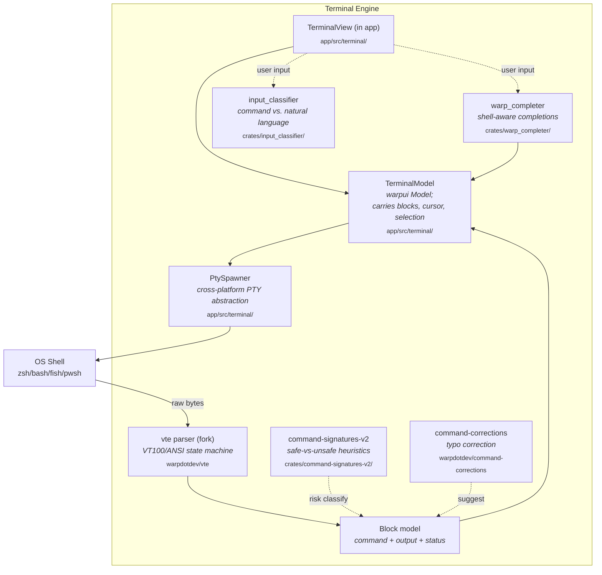
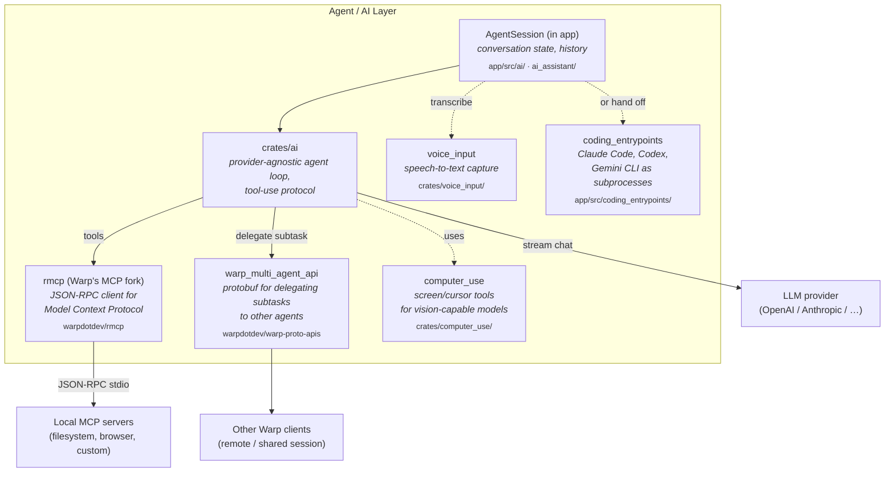
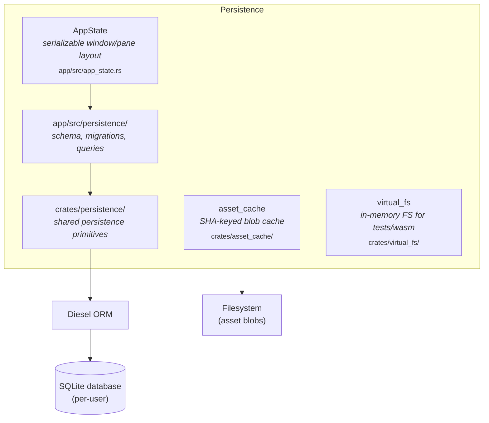
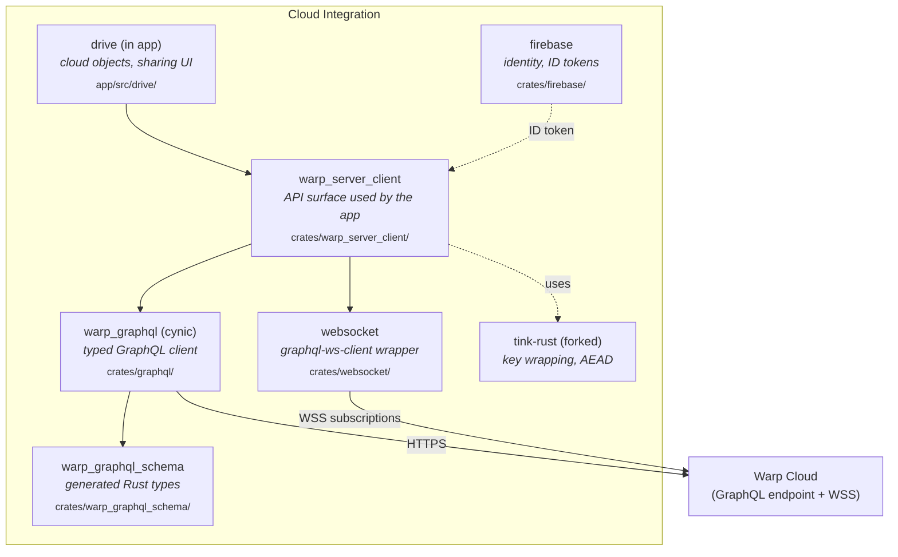
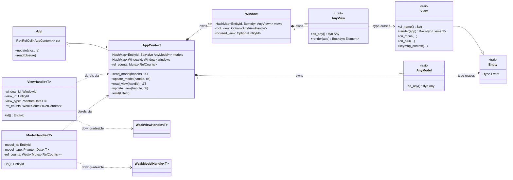
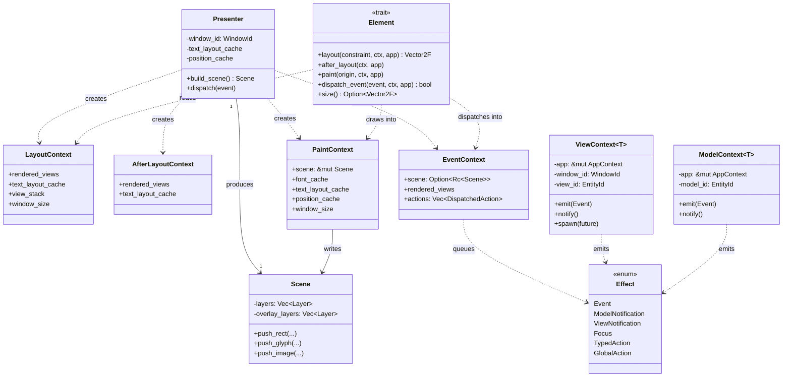
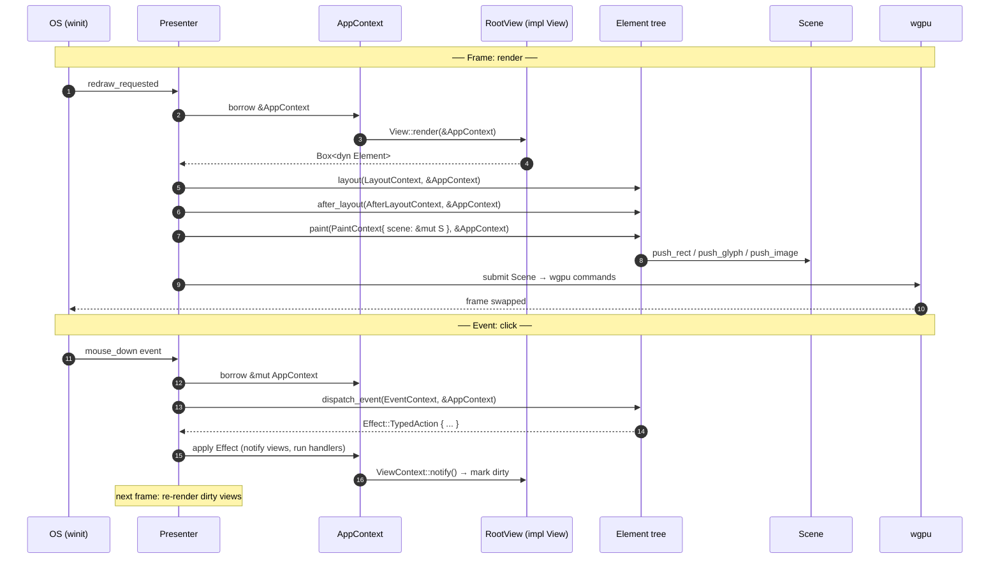

> A guided tour of the [Warp](https://github.com/warpdotdev/warp) client codebase, organized by Simon Brown's [C4 model](https://c4model.com): from the highest level (the system in its environment) down to the code level (UML for the load-bearing UI pattern).

---

## How to read this document

The C4 model has four levels of zoom. We move from broadest to narrowest:

| Level | Name             | What it shows                                                | Audience              |
|-------|------------------|--------------------------------------------------------------|-----------------------|
| **C1** | System Context  | The Warp client as a single box, surrounded by the people and external systems it interacts with. | Anyone — product, design, engineering. |
| **C2** | Containers      | The Warp client opened up: the major *runnable units* and *crate clusters* that make it work. | New engineering hires, integrators. |
| **C3** | Components      | One container opened up: the modules/subsystems inside it. We do five drill-downs: UI, Terminal, Agent, Persistence, Cloud. | Engineers working in that area. |
| **C4** | Code (OOP/UML)  | One component opened up: actual Rust types, their relationships, and a render-then-event sequence. We focus on the **Entity–Handle** pattern that underlies the entire UI. | Engineers writing or reviewing UI code. |

Repository facts to anchor the tour:
- **Language**: Rust 2021 edition; one Cargo workspace with **1 binary crate (`app/`) + 65 library crates (`crates/*`)**.
- **License split**: `crates/warpui_core` and `crates/warpui` are MIT (the UI substrate is reusable). Everything else is AGPL v3.
- **Five binary targets** all compile from `app/src/lib.rs`: `warp-oss` (default), `warp` (local dev), `stable`, `dev`, `preview` — they differ only in a small `ChannelState` shim.

Citations in this doc are **file paths only** (no line numbers — line numbers churn fast).

---

## C1 — System Context

Warp is an *agentic development environment* that lives in the terminal. The diagram below shows what it talks to.

**Key design decision visible at this level.** Warp does not *embed* an LLM — it *orchestrates* one. The same client speaks Warp's own agent protocol, Anthropic's Model Context Protocol, and can also host third-party CLI agents (Claude Code, Codex, Gemini CLI) as subprocesses. The terminal is the universal I/O surface.

---

## C2 — Containers

We "open up" the Warp client. In Rust workspace terms, *containers* map naturally onto **clusters of crates that own a coherent responsibility**, plus the binary that wires them together.

A few notes on this layering:

- **`app/` is the only binary** in the workspace. Every "container" above is a *logical* grouping of crates that the binary depends on. This is intentional — Warp is monolithic at runtime (one process), modular at compile time.
- The **UI Runtime** is the only container with both a *MIT* slice (`warpui_core` + `warpui`) and an *AGPL* surface (`warpui_extras`, `ui_components`). The dual licensing is engineered: the substrate is reusable; the product-shaped widgets stay copyleft.
- **Remote & Collaboration** ships its own binary profile (`release-cli` in `Cargo.toml`) — the `oz` CLI tarball is a smaller, headless-tuned build of the same source tree. See Doc 2 for build details.
- **Platform & Util** is wide on purpose: 65 crates need a deep bench of small utility crates (sum_tree, fuzzy_match, ripgrep wrapper, sleep prevention, etc.). Many are forked upstream libs (vte, winit, font-kit, jemallocator, objc, pathfinder, notify, yaml-rust, tink-rust) — Warp maintains a sizeable ecosystem of patched dependencies.

---

## C3 — Components

We now open five containers. Each subsection is structured the same way: a one-line purpose, a Mermaid component diagram, and a short list of "where to look first" files.

### C3a — UI Runtime

`crates/warpui_core/README.md` calls itself *"a whirlwind tour"* and is required reading. The framework is conceptually a Rust port of the GPUI design pioneered in [Zed](https://zed.dev): a global owner of all entities, with handles instead of direct references.

**Where to look first**
- `crates/warpui_core/README.md` — the conceptual primer (read this before any source file).
- `crates/warpui_core/src/lib.rs` — module roadmap and re-exports (`Presenter`, `Scene`, `Element`, `Event`, `LayoutContext`, `PaintContext`, `EventContext`, …).
- `crates/warpui_core/src/core/app.rs` — `App` and `AppContext`.
- `crates/warpui_core/src/presenter.rs` — render loop, the four phase contexts.
- `crates/warpui_core/src/elements/` — ~30 stock elements (Flex, Stack, Container, Padding, Border, Text, Image, Hoverable, Scrollable, …).
- `crates/warpui/src/rendering/` — wgpu pipelines, WGSL shaders.
- `crates/warpui/src/platform/` — per-OS adapters (macOS/Windows/Linux/WASM).

### C3b — Terminal Engine

The terminal subsystem is what makes Warp *Warp*. It's not a "thin wrapper around a PTY"; the **block model** (each command becomes a structured object) is its most distinctive design choice.

**A safety rule worth memorising** (from `WARP.md`): *never* call `model.lock()` on `TerminalModel` without checking that no caller in the current call stack already holds the lock. Re-entrant locks here cause UI freezes (the macOS spinning-beachball failure mode). Prefer passing already-locked references down.

**Where to look first**
- `crates/warp_terminal/src/` — the cross-crate terminal primitives.
- `app/src/terminal/` — the in-app view/model that uses them.
- `crates/warp_completer/` — completion engine (with a `v2` feature flag).
- `crates/input_classifier/` — disambiguates "this is a shell command" from "this is a question for the agent".

### C3c — Agent / AI Layer

Warp's agent layer is where the product distinguishes itself from a classic terminal. Three things to know:

1. The **same agent loop** can target different LLM backends.
2. It speaks **MCP** natively (via the `rmcp` fork) — your local MCP servers (filesystem, browser, etc.) are first-class tools.
3. **Multi-agent orchestration** is wired via the protobuf API in `warp_multi_agent_api` (forked from `warpdotdev/warp-proto-apis`).

**Where to look first**
- `app/src/ai/mod.rs` — the cross-cutting AI surface (conversations, models, embeddings).
- `app/src/ai_assistant/` — the side-panel assistant UI/state.
- `app/src/ai/mcp/` — MCP server discovery and management.
- `app/src/coding_entrypoints/` — handoff to external CLI agents.
- `crates/ai/` — provider-agnostic agent primitives.

### C3d — Persistence

Warp persists session state, user workspaces, MCP server configs, experiment assignments, and more in a local **SQLite** database via **Diesel ORM**. This is what lets the app restore your tabs/panes after a crash or restart.

**Where to look first**
- `app/src/persistence/` — the app's tables, migrations, query helpers.
- `crates/persistence/` — shared primitives reused by `app` and `remote_server`.
- `migrations/` (repo root) — Diesel migration files.
- `app/src/app_state.rs` — the top-level snapshot type that gets persisted/restored.

> Heads-up: `WARP.md` notes the schema lives at `app/src/persistence/schema.rs` (Diesel-generated), and `cargo nextest run --no-fail-fast --workspace --exclude command-signatures-v2` is the canonical test invocation.

### C3e — Cloud Integration

Warp Cloud provides authentication, sync (Drive), and team features. The client speaks **GraphQL** over HTTPS for queries/mutations and **WebSocket** for subscriptions. The schema lives in `crates/graphql/` and is consumed via the **`cynic`** code-generator.

**Where to look first**
- `crates/graphql/api/schema.graphql` — the source of truth (per `WARP.md`).
- `crates/warp_server_client/` — the high-level API the app calls.
- `app/src/drive/` — the consumer-side Drive UI.
- `crates/firebase/` — identity layer; pairs with `oauth2` for federated logins.

---

## C4 — Code (the Entity–Handle pattern)

This is the level where you finally see classes. We focus on the **single most important pattern** in the codebase: how the WarpUI framework reconciles Rust's "one owner per value" rule with the multi-directional reference graph that GUIs require.

### Why this pattern exists

A GUI naturally wants things like *"this tab references that terminal model"* and *"that terminal model wants to notify any tab that references it"*. In a language with a garbage collector, you'd just hand out shared pointers. In Rust, that creates a tangle of `Rc<RefCell<T>>` and lifetime puzzles.

WarpUI's solution (inherited from GPUI/Zed):

1. A single `AppContext` *owns* every model and view in the process.
2. References to those models/views are not pointers — they're **handles**: opaque IDs paired with a refcount, all going through the `AppContext` to be dereferenced.
3. The `AppContext` is only handed to your code at well-defined moments (render, event handling, async callbacks). When you have it, you can read/mutate any entity. When you don't, you can only hold handles.

The result: no shared mutability outside the framework, and no lifetime gymnastics in user code.

### Class diagram — the ownership model

The trick is the `*` (composition / strong ownership) edges from `AppContext`/`Window` to entities, contrasted with the `..>` (uses / weak reference) edges from handles. Handles never own; they're keys into a table the app exclusively owns.

### Class diagram — the render & event lifecycle

When the framework needs to draw or deliver an event, it builds one of four short-lived **phase contexts**. Each carries a mutable borrow of `AppContext` plus phase-specific scratch space.

### Sequence diagram — one frame and one event

What this teaches you about reading the codebase:

- **Render is pure**: `View::render` only *reads* `&AppContext`. To mutate state, a view must emit an `Effect` (typically by enqueuing an action), which the framework applies between frames.
- **Elements are throwaway**: each frame produces a fresh `Box<dyn Element>` tree; only the *view* persists across frames. This is why elements have no `&self` lifetime tied to the view.
- **The four phase contexts (`Layout`, `AfterLayout`, `Paint`, `Event`)** are not interchangeable. Each carries exactly the scratch space its phase needs — that's why search results may turn up four different "context" types and you need to know which.
- **`ViewContext` / `ModelContext`** are different beasts from the four phase contexts: they wrap `&mut AppContext` and are what *entities* receive when they want to mutate themselves and emit effects. The phase contexts are what *elements* receive during rendering. Don't confuse them.

---

## Cross-cutting concerns

These don't belong at any one C4 level — they cut across all of them.

### Feature flags

Warp uses **runtime-checked feature flags** (not `#[cfg]`) so flags can be flipped without recompilation. See `crates/warp_core/src/features.rs` (and the `WARP.md` "Feature Flags" section).

- Flag definition: `FeatureFlag` enum.
- Default-on sets per channel: `DOGFOOD_FLAGS`, `PREVIEW_FLAGS`, `RELEASE_FLAGS`.
- Use site: `if FeatureFlag::YourFlag.is_enabled() { ... }`.
- The `#[cfg]` directive is only used when code literally won't compile without it (platform-specific imports).

### Telemetry & crash reporting

- Rust **Sentry** SDK in every channel except OSS (gated by the `crash_reporting` cargo feature).
- macOS additionally uses native **sentry-cocoa** (downloaded by `script/macos/update_sentry_cocoa`) for symbolicating native frames.
- `warp_logging` + `simple_logger` provide structured logs.
- `app_focus_telemetry` and `traces` modules in `warpui_core` instrument render performance.

### Cross-platform compilation

- Native targets: macOS (cocoa, objc2-app-kit), Windows (`windows` crate), Linux (x11rb, ashpd, zbus).
- WASM target with its own profile (`release-wasm`, `dev-wasm`) and dedicated crates (`crates/serve-wasm`, `crates/managed_secrets_wasm`).
- Conditional compilation goes through `cfg_aliases` (set up in `app/build.rs`) so platform expressions stay readable: `#[cfg(linux_or_windows)]` instead of long boolean trees.

### Channels

The same source compiles into 5 binaries (`warp-oss`, `warp`, `stable`, `dev`, `preview`). The runtime-active channel is set by the binary's tiny `main()` shim, which calls `ChannelState::set(ChannelState::new(Channel::X, config))` and then `warp::run()`. The `Channel` enum lives in `crates/warp_core/src/channel/mod.rs`. See Doc 2 for how this affects packaging.

### Multi-process & remote

- The **plugin host** is a separate subprocess (`app/src/plugin/`) — Warp does not run plugins in-process.
- The **`oz` CLI** (`crates/warp_cli/`) is its own binary, built with the `release-cli` profile.
- The **remote server** (`crates/remote_server/`) is a headless build of the agent stack that runs on SSH targets so coding agents can act on remote machines as if they were local.
- IPC across these processes uses `crates/ipc/` and `crates/jsonrpc/`.

---

## Lineage & influences

- **GPUI / Zed.** The Entity/Handle/AppContext/View/Element vocabulary, the global app owner, the four phase contexts, and the use of `wgpu` as the rendering substrate are all directly recognisable from Zed's GPUI framework. The README of `warpui_core` even uses the same teaching device ("how do we express things like event handlers if every object has one and only one owner?"). This is convergent design — solving Rust's mutability puzzle for GUIs the same way Zed did.
- **Flutter.** The `Element` / stock-elements composition model (Padding, Container, Flex, Stack, Align, …) is openly Flutter-inspired, per the `warpui_core/README.md`.
- **Forked upstreams.** Warp maintains forks at `github.com/warpdotdev/*` for `vte`, `winit`, `font-kit`, `notify`, `pathfinder`, `objc`, `yaml-rust`, `tink-rust`, and `jemallocator`. The `[patch.crates-io]` table in the workspace `Cargo.toml` lists them all. This is a sign of a team that treats its dependency tree as part of the product.
- **Tree-sitter via `arborium`.** Syntax highlighting and structural editing for ~30 languages goes through the `arborium` crate (a tree-sitter wrapper) — see the language list in `Cargo.toml` for the supported set.
- **MCP.** The `rmcp` fork (Warp's fork of `modelcontextprotocol/rust-sdk`) makes the Anthropic Model Context Protocol a first-class part of the agent layer. This is what turns "the AI" into "the AI plus your local tools".

---

## Where to start reading

Three on-ramps depending on your interest:

| If you want to understand…                | Read in order                                                                                       |
|-------------------------------------------|------------------------------------------------------------------------------------------------------|
| **The UI framework**                      | `crates/warpui_core/README.md` → `crates/warpui_core/src/lib.rs` → `crates/warpui_core/src/core/app.rs` → `crates/warpui_core/src/presenter.rs` → an example in `crates/warpui/examples/` |
| **The terminal**                          | `WARP.md` "Terminal Model Locking" section → `app/src/terminal/` → `crates/warp_terminal/`           |
| **The agent**                             | `app/src/ai/mod.rs` → `app/src/ai_assistant/` → `app/src/ai/mcp/` → `crates/ai/`                     |

For the build & packaging side, see **[Warp — How the Desktop App Is Built](/oss/warp-desktop-app)**.
